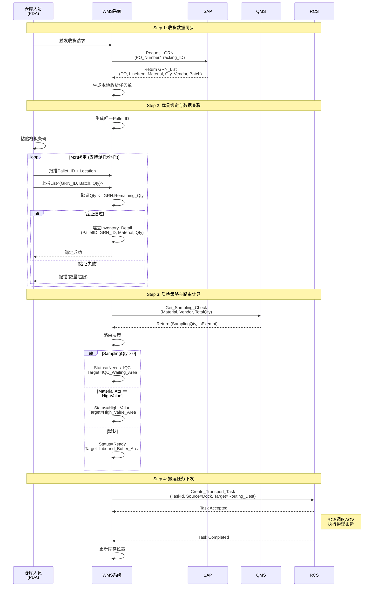
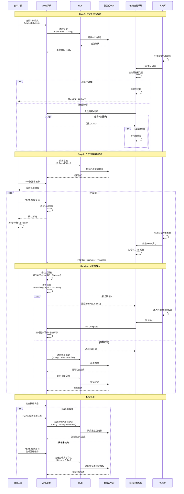
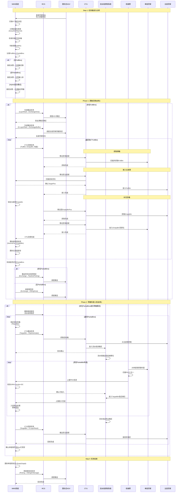
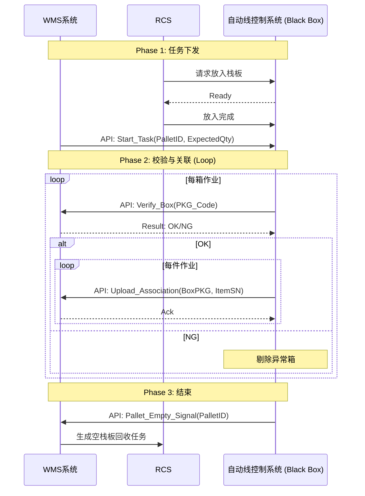

# 软件需求规格说明书 (Software Requirements Specification)

> **项目名称**: 休斯顿P9自动化仓库 (Houston P9 Automated Warehouse)
> **文档版本**: 1.0
> **日期**: 2025-12-09

## 1. 引言 (Introduction)

### 1.1 目的 (Purpose)

本文档旨在详尽描述 **休斯顿 P9 自动化仓库管理系统 (WMS)** 的功能与非功能需求。它是项目开发、系统集成、测试验收及后期运维的核心依据。

本系统旨在构建一个高度自动化、智能化的仓储管理平台，通过深度集成 AGV、机械臂及自动化流水线，实现从收货、质检、存储到产线发料的全流程自动化作业，特别针对 SMT 电子料的精细化管理（如拆盘、拼箱、防错）提供了定制化解决方案。

### 1.2 产品范围 (Scope)

本系统的核心业务范围涵盖：

* **入库管理 (Inbound Management)**: 实现从码头卸货、GRN 获取、栈板绑定、IQC 抽检路由到自动化入库的全流程数字管控。
* **智能存储 (Smart Storage)**: 管理多类型存储容器（五层货架、单层货架、各类料箱），支持动态储位分配与容量优化。
* **SMT 精细化物流 (SMT Logistics)**:
  * **自动拆包与点数**: 集成视觉识别系统。
  * **混合入库策略**: 支持满箱交换 (Full Bin Exchange) 与零散抓取 (Reel Picking) 的动态混合模式。
* **生产发料 (Production Supply)**: 基于工单 (Production Order) 的精确发料，支持首套、补料及急料插单，实现 "货到人" 或 "货到机械臂" 的精准配送。
* **设备集成 (Equipment Integration)**: 统一调度 RCS (机器人控制系统) 与 WCS (设备控制系统)，指挥 AGV (潜伏式/CTU)、机械臂及输送线协同作业。

### 1.3 定义、首字母缩写和缩写 (Definitions, Acronyms, and Abbreviations)

| 缩写 (Abbreviation) | 全称 (Full Name)            | 定义 (Definition)                                      |
| :------------------ | :-------------------------- | :----------------------------------------------------- |
| **WMS**       | Warehouse Management System | 仓库管理系统，本项目的核心软件系统。                   |
| **RCS**       | Robot Control System        | 机器人调度系统，负责路径规划与 AGV 交通管制。          |
| **WCS**       | Warehouse Control System    | 仓库控制系统，负责输送线、机械臂等固定设备的底层控制。 |
| **AGV**       | Automated Guided Vehicle    | 自动导引车，包括凡潜伏式顶升 AGV 和 CTU (料箱机器人)。 |
| **CTU**       | Container Transfer Unit     | 料箱机器人，用于存取五层货架上的料箱。                 |
| **SMT**       | Surface Mount Technology    | 表面贴装技术，本项目重点服务的生产工艺。               |
| **GRN**       | Goods Receipt Note          | 收货单，SAP 中的入库凭证。                             |
| **PDA**       | Personal Digital Assistant  | 手持终端，用于人工现场操作扫码。                       |
| **Reel**      | -                           | 料盘，SMT电子料的标准包装形式 (7寸/13寸/15寸)。        |
| **Bin**       | -                           | 料箱，存放料盘的容器，分为标准六格箱和混合箱。         |

### 1.4 参考文献 (References)

* `docs/origin/休斯顿P9自动化仓库功能分解清单_202511021.xlsx`: 原始需求功能清单。
* `GEMINI.md`: 项目核心上下文与开发规范。
* AGV/RCS 接口规范文档 (External).
* SAP/MES 接口协议文档 (External).

---

## 2. 总体描述 (Overall Description)

### 2.1 产品前景 (Product Perspective)

本 WMS 系统并非孤立存在，而是休斯顿 P9 智能工厂整体架构中的关键枢纽节点：

* **上层交互 (ERP/MES Layer)**:
  * **SAP**: 获取主数据 (Material Master)、采购订单 (RO/PO) 及 GRN 信息；回传库存变动。
  * **MES**: 接收生产工单 (Production Order) 与 投料需求；回传物料追溯信息 (Traceability)。
* **中间层 (WMS Core)**: 承载业务逻辑、库存策略、任务调度算法与异常处理机制。
* **执行层 (Execution Layer)**:
  * **RCS Interface**: 此时 WMS 充当 "交通指挥官"，下发具体的搬运任务 (From A To B) 给 RCS。
  * **WCS/PLC Interface**: 直接或通过中间件控制流水线启停、机械臂抓取动作及电子秤/视觉相机的数据采集。

### 2.2 用户特点 (User Characteristics)

| 用户类别 (User Class)              | 职责 (Responsibilities)            | 技能要求 (Skill Requirement) | 操作界面 (Interface) |
| :--------------------------------- | :--------------------------------- | :--------------------------- | :------------------- |
| **仓库操作员 (Operator)**    | 执行码头卸货、拆包、异常处理、盘点 | 熟悉物料防护，熟练使用 PDA   | PDA, 现场工控机      |
| **IQC 检验员 (Inspector)**   | 执行来料检验、复判、分拣           | 具备质量检验资质             | PDA, QMS 终端        |
| **系统管理员 (Admin)**       | 维护基础数据、用户权限、策略配置   | 深入理解 WMS 逻辑与 IT 基础  | PC Web 端            |
| **运维工程师 (Maintenance)** | 设备故障排查、日志分析、RCS 监控   | 具备自动化设备维护能力       | PC, RCS 监控端       |

### 2.3 运行环境 (Operating Environment)

* **服务端**: 部署于工厂私有云或本地服务器集群，要求高可用性 (HA)。
* **网络**: 全厂覆盖工业级 Wi-Fi (5G/Wi-Fi 6)，保证 AGV 与 PDA 的低延迟漫游。
* **客户端**:
  * **PC**: Windows 10/11, Chrome/Edge 浏览器。
  * **PDA**: Android 工业手持终端，配备激光扫描头。
  * **工控机**: 触摸屏操作，连接扫码枪与标签打印机。

### 2.4 假设与依赖 (Assumptions and Dependencies)

1. **基础数据完整性**: 假设 SAP/MES 中的物料主数据 (尺寸、重量、甚至料盘厚度) 已准确维护。
2. **包装标准化**: 供应商供货的料盘与外箱标签符合 P9 厂区标准，六合一码 (Unique ID) 可读。
3. **地码系统**: RCS 提供的地图地码与物理位置严格对应，且 WMS 已同步该地图配置。
4. **网络稳定性**: 核心作业区 (装箱区、存储区) 无网络盲区，延迟 < 100ms。
5. **硬件状态**: AGV 与机械臂具备自检与报错能力，发生物理故障时能通过接口及时反馈 WMS。

### 2.5 设计与实现约束 (Constraints)

* **语言支持**: 系统界面与核心报表必须支持 **中英双语 (Chinese & English)** 实时切换。
* **物理兼容性**:
  * **Type A 料箱**: 仅限直径 ≤ 180mm (7寸) 料盘。
  * **Type B 料箱**: 可兼容直径 > 180mm 料盘。
  * **层架限制**: 单层货架仅有 4 个标准箱位。
* **安全性**: 任何自动化任务生成前，必须进行 "空位校验" (防止撞机) 和 "库存锁定" (防止超卖)。
* **合规性**: 审计日志 (Audit Log) 需记录所有库存变动操作，满足可追溯性要求。

---

## 3. 具体需求 (Specific Requirements)

### 3.1 硬件清单与基础配置 (Hardware & Configuration)

| 区域 (Area)            | 硬件 (Hardware) | 数量 (Qty) | 用途 (Key Function)                         |
| ---------------------- | --------------- | ---------- | ------------------------------------------- |
| **码头收货区**   | PDA             | 3          | 点货, 绑定发运任务, 高值/MSD/PCB/机构件操作 |
| **码头收货区**   | 电脑            | 1          | 打印栈板条码, 导入到货清单                  |
| **码头收货区**   | 打印机          | 1          | 打印栈板条码                                |
| **IQC 待检区**   | PDA             | 1          | 登记抽检料盘                                |
| **IQC 复判区**   | PDA             | 1          | 复判挑选, 拆栈板                            |
| **料盘装箱区**   | 工业电脑        | 1          | 显示待装箱列表, 安排任务                    |
| **料盘装箱区**   | PDA             | 1          | 拆栈板作业, 呼叫 RCS                        |
| **SMT 作业区**   | 工业电脑        | 3          | 自动线(2), 人工线(1); 装箱与发料控制        |
| **高值区**       | PDA             | 1          | 六合一绑定                                  |
| **机构件作业区** | 工业电脑        | 1          | 控制流水线及机械臂, 呼叫发料                |
| **机构件作业区** | PDA             | 1          | 人工呼叫 RCS                                |
| **LCR/X-Ray区**  | 电脑            | 1          | 连接 LCR 测试仪                             |
| **LCR/X-Ray区**  | 工业电脑        | 1          | 控制流水线及机械臂                          |

#### 3.1.1 数据初始化 (Data Initialization)

- **初始化要求**: 系统上线前需完成以下基础数据与地码绑定:
  * **箱号绑定**: 一层货架与五层货架的标准箱号、货架号、初始存放地码。
  * **料架绑定**: 退货料架和转运料架的 ID、储位及初始存放位置地码。

### 3.2 收货入库流程 (Inbound Process)

#### 3.2.1 码头接收 (Dock Receiving)

- **作业范围**: 物料卸货、单据校验、载具绑定及上架任务生成。
- **作业范围**: 负责从码头卸货到系统生成上架任务的全过程，重点在于数据同步与任务分发。
- **接口与交互流程 (Interface & Interaction Flow)**:

  **Step 1: 收货数据同步 (SAP Interface)**

  * **触发**: 作业人员触发收货请求。
  * **Request**: `WMS -> SAP: Request_GRN(PO_Number / Tracking_ID)`.
  * **Response**: `SAP -> WMS: Return GRN_List(PO, LineItem, Material, Quantity, Vendor, Batch)`.
  * **数据处理**: WMS 依据 SAP 返回数据生成本地收货任务单，供后续绑定核销。

  **Step 2: 载具绑定与数据关联 (Data Binding)**

  * **载具初始化**: WMS 生成唯一 `Pallet ID` 并记录其当前物理位置 (`Location Code`).
  * **多对多绑定逻辑 (M:N Binding)**:
    * **定义确认**: 本系统定义 **1 个 GRN 对应 1 个 PO 行项目 (Single Material)**。
    * **支持场景**:
      * **混托 (Mixed Pallet)**: 物理栈板上装载了属于多个不同 GRN (即不同料号或不同 PO 行) 的物料。
      * **分托 (Split GRN)**: 单个 GRN 的大批量物料被分装到多个物理栈板上。
    * **Input**: WMS 接收终端上报的 `Pallet ID` + `List<{GRN_ID, Batch, Qty}>` (注: GRN_ID 已唯一确定料号)。
    * **Validation**:
      * 检查提交的 `QTY` <= 该 GRN 的 **剩余待收数量 (Remaining Qty)**。
      * 允许 `Remaining_Qty > 0` (即允许该 GRN 继续绑定其他栈板)。
    * **Commit**: 建立库存明细 `List<Inventory_Detail>`, 包含 `{PalletID, GRN_ID, Material, Qty}`.

  **Step 3: 质检策略与路由计算 (QMS Interface)**

  * **Request**: `WMS -> QMS: Get_Sampling_Check(Material, Vendor, TotalQty)`.
  * **Response**: `QMS -> WMS: Return (SamplingQty, IsExempt)`.
  * **路由决策 (Routing Logic)**:
    * **If** `SamplingQty > 0`: 标记 `Status = Needs_IQC`，目标地设为 `IQC_Waiting_Area`.
    * **Else If** `Material.Attr == HighValue`: 标记 `Status = High_Value`，目标地设为 `High_Value_Area`.
    * **Else**: 标记 `Status = Ready`，目标地设为 `Inbound_Buffer_Area`.

  **Step 4: 搬运任务下发 (RCS Interface)**

  * **Request**: `WMS -> RCS: Create_Transport_Task(TaskId, Source=Dock, Target=Routing_Dest)`.
  * **Response**:
    * `Accepted`: RCS 确认接收，开始调度 AGV。
    * `Completed`: RCS 反馈搬运完成，WMS 更新库存位置。
    * `Exception`: RCS 反馈异常(如路阻)，WMS 触发报警或重试逻辑。

**码头接收序列图 (Sequence Diagram)**:



#### 3.2.2 IQC 检验与复判 (IQC & Review)

- **作业范围**: IQC 取样、检验结果处理、NG 品的复判与分拣。
- **数据约束 (Data Constraints)**:

  * **定义**: 本系统定义 **1 个 GRN 对应 1 个 PO 行项目 (Single Material)**。
  * **支持场景**:
    * **混托 (Mixed Pallet)**: 物理栈板上装载了属于多个不同 GRN (即不同料号或不同 PO 行) 的物料。
    * **分托 (Split GRN)**: 单个 GRN 的大批量物料被分装到多个物理栈板上。
  * **影响**: IQC 抽检和复判时需按 **GRN 粒度** 进行，一个栈板可能关联多个独立的检验任务。
- **详细交互流程 (Step-by-Step Interactions)**:

  **Step 0: 队列管理 (Queue Management)**

  * **待检可视**: WMS 维护 "IQC Pending List"，按 System Logic 自动排序。
  * **优先级调整**:
    * 支持人工 **手动调整 (Manual Adjust)** 检验顺序 (e.g., 置顶急料)。
    * RCS 调度优先响应高优先级任务。

  **Step 1: 取样作业 (Sampling)**

  * **PDA 操作 (IQC待检区)**:
    * 扫描 `Pallet ID` -> WMS 提示**该栈板上所有 GRN 的抽检明细** (支持混托场景)。
    * 扫描料盘/外箱 `PKG Code` (六合一) -> WMS 自动识别所属 GRN -> 标记为 "Sample Taken"。
    * WMS 记录: `Trace(PalletID, GRN, Material, SampleID)`.
  * **混托处理**:
    * 若栈板包含多个 GRN，IQC 人员需分别对每个 GRN 进行取样。
    * WMS 按 GRN 分别追踪抽样状态。

  **Step 2: 归还与结果录入 (Return & Result)**

  * **PDA 操作**: 检验完成后，扫描 `Pallet ID` + `SampleID` -> 确认归还样件至栈板 -> 提交 "Inspection Done".
  * **QMS 判定**:
    * QMS **按 GRN 粒度**录入检验结果 (OK/NG)。
    * WMS 轮询或接收 QMS 推送的 `Inspection Result(GRN_ID, Result)`.

  **Step 3: 结果路由 (Routing Logic)**

  * **场景 A: 混托栈板的结果聚合 (Mixed Pallet)**:

    * **条件**: 单个栈板包含多个 GRN。
    * **逻辑**: WMS 需等待**该栈板所有 GRN 的检验结果**返回后，才能决定栈板路由。
    * **路由决策**:
      * **All OK**: `Move(Pallet, From=IQC_Waiting, To=Buffer_Area)`.
      * **Any NG**: `Move(Pallet, From=IQC_Waiting, To=Review_Area)`.
  * **场景 B: 分托 GRN 的批量路由 (Split GRN)**:

    * **条件**: 单个 GRN 分装在多个栈板上。
    * **逻辑**: 当 WMS 接收到某 GRN 的检验结果时，需查询**所有包含该 GRN 的栈板**。
    * **路由决策**:
      * **GRN Result = OK**:
        * 对于仅包含该 GRN 的栈板 → `Move(To=Buffer_Area)`.
        * 对于混托栈板 → 等待其他 GRN 结果（按场景 A 处理）。
      * **GRN Result = NG**:
        * **所有包含该 GRN 的栈板** → `Move(To=Review_Area)` (触发批量路由)。
        * 即使栈板上其他 GRN 为 OK，也需要去复判区。
  * **复杂混合场景示例 (Complex Scenario)**:

    * **案例**: GRN_A 分托在栈板 001 (纯单一托) 和栈板 002 (混托: GRN_A + GRN_B)。
    * **处理流程**:
      * QMS 返回 `GRN_A = OK`:
        * 栈板 001 → 立即路由至 Buffer_Area (无需等待)。
        * 栈板 002 → 等待 GRN_B 结果，按场景 A 聚合后决策。
      * QMS 返回 `GRN_A = NG`:
        * **栈板 001 和 002 都立即路由至 Review_Area** (批量 NG 路由)。
        * 栈板 002 无需再等待 GRN_B 结果。
  * **RCS 执行**: 调度 E-AGV 搬运至目标区域。

  **Step 4: 复判与分拣 (Review & Sorting)**

  * **场景**: 待复判区对 NG 栈板/GRN 进行二次确认。
  * **复判粒度**: 复判以 **GRN 为单位**，而非整个栈板。
  * **情形 A: 按 GRN 复判 OK**:

    * **操作**: 人工在 QMS 中更新某个 GRN 的复判结果为 OK。
    * **WMS 处理**:
      * 接收 QMS 推送的 `Review_Result(GRN_ID, OK)`.
      * 查询**所有包含该 GRN 的栈板**。
      * **路由决策**:
        * 对于仅包含该 GRN 的栈板 → `Move(To=Buffer_Area)`.
        * 对于混托栈板 → 检查该栈板的其他 GRN 状态：
          * 若所有 GRN 均已复判 OK → `Move(To=Buffer_Area)`.
          * 若仍有其他 NG GRN → **保持在 Review_Area**，等待进一步处理。
  * **情形 B: 按 GRN 拆板分拣**:

    * **目的**: 将特定 NG GRN 的物料从栈板分离，保留 OK GRN 的物料。
    * **PDA 拆板流程**:
      1. 扫描原栈板 `Source Pallet ID`.
      2. WMS 显示该栈板的**所有 GRN 及其检验/复判结果**。
      3. 操作员选择要拆分的 NG GRN（可能多个）。
      4. 扫描新栈板 `New Pallet ID` (用于放 NG 品)。
      5. **循环扫描**: 扫描物料箱号 → WMS 识别所属 GRN → 如属于选定的 NG GRN → 移动至 `New Pallet`.
      6. 提交拆板 → WMS 更新两个栈板的 **GRN 关联关系**和库存明细。
    * **后续路由**:
      * `Source Pallet`:
        * 若所有剩余 GRN 均为 OK → `Move(To=Buffer_Area)`.
        * 若仍有 NG GRN → **保持在 Review_Area**，继续处理。
      * `New Pallet` (全 NG) → 人工处理后入不良品仓。
  * **情形 C: 分托 GRN 的批量拆板**:

    * **场景**: 某个 NG GRN 分托在多个栈板（如前述 GRN_A 在栈板 001, 002）。
    * **操作**: 复判确认该 GRN 确实为 NG，需全部拆除。
    * **WMS 处理**:
      * 生成**批量拆板任务列表**，列出所有包含该 NG GRN 的栈板。
      * 操作员依次处理每个栈板，按情形 B 的流程执行拆板。
      * 所有拆板完成后，统一路由 OK 栈板至 Buffer_Area。
  * **情形 D: NG GRN 的部分收货 (Partial Acceptance)**:

    * **场景**: 同一个 GRN 分托在多个栈板，部分栈板物料合格，部分不合格。
    * **业务需求**: 允许接收良品部分，拒收不良品部分。
    * **操作流程**:
      1. IQC/复判人员在 QMS 中标记该 GRN 为 **"部分合格 (Partial OK)"**。
      2. 在 QMS 中记录**具体哪些栈板/箱号为 OK，哪些为 NG**。
      3. QMS 推送给 WMS: `Review_Result(GRN_ID, Partial, OK_List, NG_List)`.
    * **WMS 处理**:
      1. 查询该 GRN 关联的所有栈板。
      2. **按栈板分类**:
         * **OK 栈板** (包含在 OK_List 中) → `Move(To=Buffer_Area)`.
         * **NG 栈板** (包含在 NG_List 中) → 保持在 Review_Area 或直接拒收。
         * **混合栈板** (既有 OK 又有 NG) → 按情形 B 执行拆板分拣。
      3. **更新 GRN 收货状态**:
         * 计算 `Accepted_Qty` (OK 部分的数量)。
         * 更新 GRN: `Remaining_Qty = Original_Qty - Accepted_Qty`.
         * 标记 GRN 为 `Status = Partial_Received`.
      4. **NG 部分处理**:
         * 生成 **退货单/拒收单** 给 SAP。
         * NG 物料入不良品仓或安排退货。
    * **示例**:
      * GRN_X (总量 1000 件) 分托在栈板 P1 (300), P2 (400), P3 (300)。
      * 复判结果: P1 OK, P2 NG, P3 OK。
      * WMS 处理:
        * P1, P3 → Buffer_Area (Accepted_Qty = 600)。
        * P2 → 不良品仓 (Rejected_Qty = 400)。
        * 更新 GRN_X: `Remaining_Qty = 1000 - 600 = 400` (待补货或取消)。
        * 通知 SAP: 部分收货 600 件，拒收 400 件。

**IQC 检验序列图 (Sequence Diagram)**:

```mermaid
sequenceDiagram
    participant Operator as IQC人员<br/>(PDA)
    participant WMS as WMS系统
    participant QMS as QMS
    participant RCS as RCS
    participant AGV as E-AGV

    Note over Operator,AGV: Step 0: 队列管理
    WMS->>WMS: 维护IQC待检列表<br/>(按系统逻辑排序)
    alt 需要优先处理急料
        Operator->>WMS: 手动调整检验顺序<br/>(置顶急料)
        WMS->>WMS: 更新任务优先级
    end
    WMS->>RCS: 按优先级呼叫AGV<br/>(Buffer→IQC_Waiting)
    RCS->>AGV: 调度E-AGV搬运
    AGV-->>WMS: 栈板到达IQC待检区

    Note over Operator,AGV: Step 1: 取样作业 (支持混托)
    Operator->>WMS: 扫描栈板号(PalletID)
    WMS->>WMS: 查询栈板关联的所有GRN
    WMS-->>Operator: 显示所有GRN的抽检明细
    
    loop 按GRN取样
        Operator->>Operator: 取出料盘/外箱
        Operator->>WMS: 扫描PKG六合一码
        WMS->>WMS: 识别所属GRN_ID
        WMS->>WMS: 记录Trace<br/>(PalletID, GRN_ID, SampleID)
        WMS-->>Operator: 标记为Sample Taken
    end
    Operator->>Operator: 送检验室检验

    Note over Operator,AGV: Step 2: 结果录入 (按GRN粒度)
    Operator->>Operator: 检验完成
    Operator->>QMS: 按GRN录入检验结果<br/>(GRN_ID, OK/NG)
    QMS->>QMS: 保存判定结果
    QMS->>WMS: 推送Inspection Result<br/>(GRN_ID, Result)

    Note over Operator,AGV: Step 3: 结果路由 (混托+分托)
    WMS->>WMS: 查询该GRN关联的所有栈板
    
    alt 场景A: 混托栈板
        WMS->>WMS: 检查栈板的所有GRN结果
        alt 所有GRN均OK
            WMS->>RCS: 生成任务<br/>(IQC_Waiting→Buffer_Area)
            RCS->>AGV: 调度E-AGV搬运至暂存区
        else 任一GRN为NG
            WMS->>RCS: 生成任务<br/>(IQC_Waiting→Review_Area)
            RCS->>AGV: 调度E-AGV搬运至复判区
        end
    else 场景B: 分托GRN
        alt GRN_Result = OK
            Note over WMS: 纯单一GRN栈板→Buffer<br/>混托栈板→等待其他GRN
        else GRN_Result = NG
            WMS->>WMS: 批量路由:所有包含<br/>该NG GRN的栈板→Review
            loop 遍历所有相关栈板
                WMS->>RCS: 生成任务(Pallet_X→Review)
                RCS->>AGV: 调度E-AGV搬运
            end
        end
    end

    opt 进入复判区
        Note over Operator,AGV: Step 4: 复判与分拣
        
        alt 情形A: 按GRN复判OK
            Operator->>QMS: 更新GRN_X复判为OK
            QMS->>WMS: 推送Review_Result(GRN_X, OK)
            WMS->>WMS: 查询包含GRN_X的所有栈板
            
            loop 遍历栈板
                alt 纯单一GRN栈板
                    WMS->>RCS: 立即路由→Buffer_Area
                else 混托栈板
                    WMS->>WMS: 检查其他GRN状态
                    alt 全部OK
                        WMS->>RCS: 路由→Buffer_Area
                    else 仍有NG
                        WMS->>WMS: 保持在Review_Area
                    end
                end
            end
        
        else 情形B/C: 拆板分拣
            Operator->>WMS: 扫描源栈板(SourcePalletID)
            WMS-->>Operator: 显示所有GRN及检验结果
            Operator->>Operator: 选择要拆分的NG GRN
            Operator->>WMS: 扫描新栈板(NewPalletID)
            
            loop 拆分NG物料
                Operator->>WMS: 扫描物料箱条码
                WMS->>WMS: 识别所属GRN_ID
                alt 属于选定的NG GRN
                    WMS->>WMS: 记录移动至NewPallet
                    WMS-->>Operator: 确认已记录
                else 属于OK GRN
                    WMS-->>Operator: 保留在SourcePallet
                end
            end
            
            Operator->>WMS: 提交拆板完成
            WMS->>WMS: 更新GRN关联关系
            
            alt SourcePallet剩余GRN均OK
                WMS->>RCS: 路由→Buffer_Area
            else SourcePallet仍有NG GRN
                WMS->>WMS: 保持在Review_Area
            end
            
            Note over Operator: NewPallet(全NG)<br/>入不良品仓
        
        else 情形D: 部分收货
            Operator->>QMS: 标记GRN_Y为部分合格<br/>记录OK_List+NG_List
            QMS->>WMS: 推送Review_Result<br/>(GRN_Y, Partial, Lists)
            
            WMS->>WMS: 查询GRN_Y的所有栈板
            WMS->>WMS: 按OK_List分类栈板
            
            loop 处理OK栈板
                WMS->>RCS: 路由→Buffer_Area
                RCS->>AGV: 搬运
            end
            
            WMS->>WMS: 更新GRN状态<br/>Status=Partial_Received
            WMS->>WMS: 计算Accepted_Qty
            WMS->>WMS: 生成退货单给SAP
            
            Note over Operator: NG栈板→不良品仓<br/>或安排退货
        end
    end
```



### 3.3 内部物流与生产供料 (Internal Logistics & Production Supply)

#### 3.3.1 SMT 电子料收货到装箱 (SMT Electronics Inbound to Kitting)

- **适用范围**: 仅限于 **SMT 电子元件 (7/13/15寸料盘 Reels)** 的自动化点货分装流程。
- **物理约束 (Physical Constraints)**:

  * **载具**: 单层货架 (Layer Rack)，4个 **箱位 (Bin Positions 1-4)**。
  * **料箱 (Bin Types)**:
    * **Type A (6-Grid)**: 6个 **储位 (Reel Slots)**，仅限存放 7寸料盘。
    * **Type B (2+1-Grid)**: 2个 7寸储位 + 1个大盘储位 (>7寸)。
  * **容量逻辑**: `MaxReels = SlotDepth / (ReelThickness + Gap)`.
- **详细交互流程 (Step-by-Step Interactions)**:

  **Step 1: 任务初始化与空架补给 (Initialization & Supply)**

  * **WMS 监控**: 周期性扫描装箱区单层货架状态。
  * **系统握手**: AGV 到位 -> RCS 通知 WMS -> WMS 更新库存状态 `RackStatus=Ready`.
  * **Step 1.5 上料前校验 (Pre-Start Check)**:
    * **动作**: 机械臂扫描一层货架上的所有箱号/地码。
    * **校验**: 控制系统检查所有箱必须为 **空 (Empty)**。
    * **异常**: 若发现非空箱 -> 报警并在界面提示 -> 停止作业 (需人工介入)。
  * **叫料模式 (Calling Modes)**:
    * **系统模式**: WMS 依据暂存区待装箱列表 (按时间顺序) 自动生成补给任务。
    * **人工模式**: 仓库人员在装箱区电脑手动选择 GRN 发起叫料。
  * **数据基础**: WMS 需预先维护供应商物料的 **厚度**、**尺寸** 等基础数据 (Master Data)。

  **Step 2: 人工投料与识别 (Manual Feeding & ID)**

  * **人工动作**: 拆箱 -> 将料盘放置于 **串杆 (Spindles)** -> 按下"Ready"按钮。
  * **拆完处理**:
    * **空栈板回收**: WMS 生成将空栈板运回 "空栈板存放区" 的任务。
    * **未装完回库**: 若栈板未作业完需移除，WMS 生成运回 "收货暂存区" 的任务。
  * **机械臂动作**: 移动至串杆 -> 抓取首个料盘 -> 移动至相机位。
  * **视觉识别 (Vision)**:
    * **Input**: 拍摄料盘标签。
    * **Output**: 解析出 `PKG_Code` (六合一码) 及 `Dimensions` (直径/厚度)。
    * **异常处理 Logic**:
      * 若比对 (PKG vs 视觉) 失败 -> 控制系统报错。
      * **重试机制**: WMS/Control 需支持最多 **3次** 信息重发握手，若仍失败则报警人工处理。

  **Step 3: WMS 箱位分配算法 (Bin Assignment Logic)**

  * **请求**: 控制系统 -> WMS (`PKG_Info`, `Diameter`, `Thickness`).
  * **WMS 核心算法**:
    1. **查找活跃箱 (Find Active Bin)**: 在当前货架上寻找已绑定相同物料的料箱，匹配条件为:
       * `GRN` (收货单号).
       * `Vendor Code` (供应商码).
       * `DateCode` (批次日期码).
       * `Diameter` (料盘直径) - **关键**: 确保相同尺寸的料盘放入同一箱的同类储位。
    2. **容量校验 (Check Capacity)**:
       * 若找到活跃箱 -> 检查该箱内对应 **储位 (Reel Slot)** 剩余深度是否足够 (`RemainingDepth >= Thickness`).
       * 若足够 -> 返回 `(BinPos, BinSlotID)`.
    3. **分配新箱 (Assign New Bin)**:
       * 若无活跃箱或已满 -> 寻找货架上的空 **箱位 (Bin Position)**。
       * 根据料盘直径匹配箱型 (7寸->Type A/B, >7寸->Type B)。
       * 绑定新箱为活跃箱 -> 返回 `(BinPos, BinSlotID)`.
    4. **货架已满 (Rack Full)**:
       * 若当前货架无可用空箱位 -> 返回 `Signal: RackFull`.

  **Step 4: 执行放入与切出 (Execution & Switch)**

  * **机械臂执行**: 收到 `(BinPos, BinSlotID)` -> 放入料盘 -> 传感器确认到位.
  * **数据提交**: 控制系统 -> WMS "Put Complete" -> WMS 扣减剩余深度，增加库存明细。
  * **切出逻辑**:
    * 收到 `RackFull` 信号 或 人工触发 "Finish" -> WMS 锁定当前货架。
    * WMS 生成搬运任务: `Move(LayerRack, From=Kitting, To=InboundBuffer)`.

**装箱流程序列图 (Sequence Diagram)**:



#### 3.3.2 SMT 电子料料箱入库与存储 (SMT Electronics Inbound & Storage)

- **作业区域**: 待入库缓存区 (Buffer), 满箱交换区 (Exchange), 存储区 (Storage)。
- **核心逻辑**: **混合入库模式 (Hybrid Mode)** —— 优先执行 **满箱交换 (Full Bin Exchange)**，剩余的不满箱采用 **机械臂抓取 (Reel Picking)** 进行零散入库。
- **详细交互流程 (Step-by-Step Interactions)**:

  **Step 1: 任务触发与分析 (Trigger & Analysis)**

  * **事件**: 单层货架到达 "SMT待入库缓存区"。
  * **WMS 分析**: 扫描 4 个 **箱位 (Bin Positions)** 状态，计算容量利用率。
  * **满箱模式判断 (Full Bin Trigger)**:
    * 条件 1: 料箱 `ActualVolume / PlanVolume >= 80%`.
    * 条件 2: SMT 存储区五层货架有可用的空料箱。
    * **结果**: 满足上述条件触发 "满箱交换" 模式；否则为 "Partial Pipeline Picking".
  * **路径决策**:
    * 仅 `FullBins` -> 直送 "满箱交换区"。
    * 仅 `PartialBins` -> 直送 "流水线待拣区 (Pipeline Picking Area)"。
    * 混合模式 (Hybrid) -> 先送 "满箱交换区"，完成后转运至 "流水线待拣区"。

  **Step 2: 满箱交换作业 (Phase 1: Full Bin Exchange)**

  * **地点**: 满箱交换区。
  * **循环逻辑**: 针对每一个需入库的 `FullBin`，执行以下闭环操作：
    1. **抓取满箱 (Pick Full)**:
       * RCS 指令 CTU 移动至单层货架作业位。
       * CTU 伸缩叉从单层货架 `SourcePos` 抓取满料箱。
    2. **放置满箱 (Place Full)**:
       * CTU 移动至五层货架作业位。
       * 将满料箱放入五层货架 `TargetPos` (空闲位)。
    3. **补充空箱 (Replenish Empty)**:
       * WMS 锁定五层货架上的一个可用空箱 `EmptyBinPos`。
       * CTU 移动至 `EmptyBinPos` 抓取空箱。
       * CTU 返回单层货架，将空箱放入原 `SourcePos`。
    4. **状态更新**:
       * 每次动作完成后，RCS 反馈 WMS。
       * WMS 更新单层货架 `SourcePos` 状态为 `Status=EmptyBin`。
  * **转运**: 若仍有 `PartialBins`，WMS 生成搬运任务: `Move(LayerRack, From=Exchange, To=PipelinePicking)`.

  **Step 3: 零散料盘入库 (Phase 2: Partial Reel Transfer)**

  * **地点**: **流水线待拣区 (Pipeline Picking Area)**。
  * **场景**: 单层货架停靠在机械臂作业位侧边，目标料箱通过流水线到位。
  * **子流程**:
    1. **目标箱到位 (Target Bin Prep)**:
       * WMS 锁定存储区中的目标料箱 (Target Bin)。
       * RCS 调度 CTU 将 Target Bin 搬运至 **流水线进箱区 (Pipeline Intake)**。
       * 控制系统驱动流水线，将 Target Bin 输送至 **机械臂作业位**。
    2. **机械臂拣选 (Robot Picking)**:
       * 机械臂从单层货架 `SourcePos` (Partial Bin) 抓取料盘。
       * 通过相机识别 PKG 六合一码。
       * 放入流水线上的 Target Bin 中指定储位。
       * 数据交互: `Robot -> Control -> WMS (Inbound Transfer)`.
    3. **目标箱回库 (Target Bin Return)**:
       * Target Bin 作业完成后，流向 **流水线出箱区 (Pipeline Exit)**。
       * WMS 生成任务，呼叫 CTU 将其搬回五层货架存储区。
  * **循环**: 直至单层货架上的 `PartialBins` 全部清空 (变为空箱)。

  **Step 4: 任务结束与回库 (Completion)**

  * **状态确认**: 此时单层货架上的 Partial Bins 已被抓空 (物理为空)，Full Bins 已被交换为空箱。
  * **单层货架回流**: WMS 更新单层货架状态为 `EmptySupply`，RCS 调度其返回 "装箱区" 或 "空架存放区"。

**混合入库模式序列图 (Sequence Diagram)**:



#### 3.3.3 SMT 生产发料 (SMT Production Issue)

- **作业范围**: 从 SAP 工单下达到物料配送至 SMT 产线。

### 3.3.3 SMT 生产发料 (SMT Production Issue)

本章节定义 SMT 生产工单的发料流程，依据物料特性和产线类型（自动/人工）分为两类独立流程。

#### 3.3.3.1 电子料自动线发料 (Electronic Material Issue - Auto Line)

- **适用物料**: 标准电子料 (Reel, 7"/13", 8mm~56mm)。
- **作业区域**: 机械臂拣选工作站 (Robotic Picking Station)。
- **策略**: **滚动波次策略 (Rolling Wave Strategy)**，基于 `3.8.4 优化算法`。
- **物理约束**:

  * **来源**: 五层货架 (存储区) 或 退料货架 (Return Rack, **双面结构 A/B**)。
  * **目标**: 转运货架 (Transport Rack, **双面结构 A/B**)，用于送往产线。
  * **作业点**: 流水线待拣区 (Pipeline Picking Area)。

  **Step 1: 策略计算 (Strategy Calculation)**

  * **输入**: SAP 下达 `Production Order` (工单发料单)。
  * **任务拆分 (Task Splitting)**:
    * **电子料**: 分为 **首套 (First Kit)** 和 **补料 (Replenish, 6小时/次)** 两个独立任务。
  * **计算优先级 (Calculation Priority)**:
    1. **退料消耗 (Return Check)**: 优先锁定退料货架上的尾盘。
    2. **FIFO (DateCode)**: 依据 DC 时间先后顺序锁定库存。
    3. **容量优化 (Capacity)**: 优先锁定五层货架中实际容量小(余料)的储位。
  * **任务生成**: 依据上述策略生成 `Issue Task`.
  * WMS 调用 `3.8.4 生产发料分配策略`，基于工单所有物料需求，输出 **最优任务队列 (Task Queue)**。
  * **队列结构**: `[R1(SideA), R1(SideB), R2(SideA), Bin3, Bin5...]`.

  **Step 2: 容器出库与波次执行 (Retrieval & Wave Execution)**

  * **滚动执行 (Rolling Execution)**:
    * **Task F (Transport Rack)**: 调度空转运架至 Pos B (保持常驻，直到装满或工单结束)。
    * **Task A/B Queue (Source Racks)**: 按队列顺序，**分批次** 调度来源载体 (Return Rack / 5-Layer Inventory) 至 Pos A / 缓存区。
    * **动态缓冲**:
      * 当前一个 Source Rack 在作业时，下一个 Source Rack 应调度至 "待命区 (Buffer)"，减少机械臂等待时间。

  **Step 3: 流水线供料 (Pipeline Feeding)**

  * **场景**: 当任务队列中的节点为 `SourceBin` (来自五层货架) 时。
  * **批量处理 (Batch Processing)**:
    * WMS/RCS 指令 CTU 将当前波次所需的**所有 SourceBins** 依次放入流水线进箱口。
    * 流水线缓存这些箱子，逐个输送至机械臂作业位。

  **Step 4: 机械臂循环拣选 (Robot Picking Loop)**

  * **多源轮询 (Source Polling)**:
    * 机械臂根据当前到达 Pos A 的载体 (Rack or Bin)，请求通过 WMS 获取该载体上的**所有待拣任务**。
    * 执行 `Pick -> Scan -> Place` 循环，直到该载体的任务清空。
  * **载体切换 (Switching)**:
    * 当前 Source Rack 清空任务 -> 指令 RCS 移出 -> 调度下一个 Source Rack 进入 Pos A。
    * 当前 Source Bin 清空任务 -> 流水线移出 -> 下一个 Bin 进入到位。
  * **面相管理**:
    * 若任务队列指示 `R1 (Side B)`，且当前 R1 为 Side A 面向，触发 `Rotate(R1, 180)` 原地旋转。

  **Step 5: 发料配送 (Delivery)**

  * **产线配送**:
    * 当 `Transport Rack` 装满或工单完成。
    * WMS 生成任务: `Move(Transport Rack, To=SMT_Staging_Area)`.
    * RCS 调度 AGV 执行配送。
  * **容器复位**:
    * 五层货架(若作业完毕) -> 返回存储区。
    * 退料货架(若作业完毕) -> 返回存储区。

  **序列图 (Sequence Diagram - Auto Line)**:

  ```mermaid
  sequenceDiagram
      participant WMS as WMS系统
      participant RCS as RCS
      participant AGV as 潜伏式AGV
      participant Control as 流水线控制系统
      participant Robot as 机械臂

      Note over WMS,Robot: Step 1: 策略计算
      WMS->>WMS: 接收工单 -> 计算 SourceQueue<br/>[R1, R2, BinA, BinB...]

      Note over WMS,Robot: Step 2: 容器调度 (Rolling)
      WMS->>RCS: 调度空TransportRack → Pos B

      loop 遍历 SourceQueue
          WMS->>RCS: 调度当前 SourceRack → Pos A (或流水线)
          RCS->>AGV: 搬运到位

          Note over WMS,Robot: Step 3: 面相与拣选
          opt 需要旋转
              WMS->>RCS: Rotate(Rack, 180)
              RCS-->>WMS: Done
          end

          loop 批量拣选(Batch Pick)
              Robot->>Robot: 抓取 -> 扫描 -> 放置
              Control-->>WMS: Task Confirm
          end

          WMS->>RCS: 移出当前 SourceRack
          RCS->>AGV: 回库
      end

      Note over WMS,Robot: Step 4: 配送
      WMS->>RCS: TransportRack → SMT Staging
  ```

#### 3.3.3.2 特殊物料人工线发料 (Special Material Issue - Manual Line)

- **适用物料**: MSD (湿敏元件), PCB (印制板), Irregular (非规则件), Bulk (抛料)。
- **作业区域**: 人工线缓存区 (Manual Line Cache)。
- **策略**: **整架发料 (Full Rack Issue)**，不经过机械臂分拣。

  **Step 1: 任务生成 (Task Generation)**

  * WMS 识别工单中的特殊物料需求。
  * **Task C (MSD/Irregular)**: 此类物料不适用自动线拣选流程。WMS 生成任务 `Move(5-Layer Rack, From=Storage, To=Manual_Line_Cache)`.
  * **Task D (PCB)**: 此类物料不适用自动线拣选流程。WMS 生成任务 `Move(Single_Layer_Rack, From=PCB_Storage, To=Manual_Line_Cache)`.
  * **其他**: MSD/PCB/机构件按单次需求生成。

  **Step 2: 容器搬运 (Rack Transport)**

  * WMS -> RCS: 下发搬运指令 `From=Storage, To=Manual_Line_Cache`。
  * RCS 调度潜伏式 AGV 执行搬运。

  **Step 3: 人工领料 (Manual Picking)**

  * 货架到达人工线缓存区。
  * 产线人员根据 PDA/看板提示，从货架上直接取走所需物料 (Reel/Box)。
  * 人员在 PDA 上确认“领料完成”。
  * **异常**: 若 WMS 无法计算拣货任务，触发“料箱流向出箱区”任务，CTU 将料箱送回存储区。

  **Step 4: 容器回库 (Return to Storage)**

  * 领料完成后，人员释放货架。
  * WMS 生成回库任务 `Move(Rack, To=Storage)`。
  * RCS 调度 AGV 将货架搬回存储区。

  **序列图 (Sequence Diagram - Manual Line)**:

  ```mermaid
  sequenceDiagram
      participant WMS as WMS系统
      participant RCS as RCS
      participant AGV as 潜伏式AGV
      participant Staff as 产线人员

      Note over WMS,Staff: MSD/PCB/非规则 发料
      WMS->>WMS: 识别特殊物料需求
      WMS->>RCS: 搬运任务 (Storage → Manual Cache)
      RCS->>AGV: 调度AGV搬运货架
      AGV-->>WMS: 货架到位

      Note over Staff: 人工领料
      Staff->>Staff: 从货架取料
      Staff->>WMS: PDA确认领料完成

      Note over WMS,Staff: 货架回库
      WMS->>RCS: 回库任务 (Manual Cache → Storage)
      RCS->>AGV: 搬运货架回库
  ```

### 3.4 特殊物料入库流程 (Special Material Inbound)

#### 3.4.1 高值物料 (High Value Materials)

- **作业范围**: **高值区 (High Value Area)** 的入库全流程 (独立封闭区域)。
- **详细交互流程 (Step-by-Step Interactions)**:

  **Step 1: 识别与直发 (Identification & Dispatch)**

  * **PDA 识别**:
    * 仓库人员在码头扫描栈板标签。
    * WMS 识别物料属性 `Attribute=HighValue`。
  * **直发指令**:
    * WMS 生成任务: `Move(From=Dock, To=High_Value_Gate)`.
    * RCS 调度 **E-AGV** 将栈板直接搬运至高值区门口交接位。

  **Step 2: 区域管控与接收 (Secure Access)**

  * **交接**:
    * 高值区管理员刷卡/指纹验证进入。
    * 将栈板拉入高值区内部待检位。
  * **IQC 现场检验 (In-Situ IQC)**:
    * **IQC 进场**: IQC 人员携带 PDA 进入高值区 (物料不出区)。
    * **取样/归还**: 扫描 PKG -> 若需拆包则现场拆包 -> 检验后复原 -> 归还。
    * **结果录入**: `QMS result -> WMS`.

  **Step 3: 绑定与上架 (Binding & Putaway)**

  * **六合一绑定**:
    * 管理员扫描 `Reel Pkg ID` + `6-in-1 Code`。
    * WMS 关联 `Pallet - GRN - Reel`.
  * **上架作业**:
    * WMS 推荐高值柜/货架储位 `TargetSlot`.
    * 管理员扫描 `TargetSlot` -> 放入物料 -> 确认。
    * WMS 更新库存: `Status=Available`, `Location=HighValueCabinet`.

#### 3.4.2 MSD 与非规则物料 (MSD & Irregular)

- **作业范围**: 需特殊存储环境 (干燥柜) 或 尺寸超标 (异形货架) 的物料。
- **流程差异 (Detailed Interactions)**:

  **Step 1: 暂存与流转 (Dock to Buffer)**

  * **路径**: 码头 -> **收货暂存区 (Buffer Area)**。
  * **动作**: 与普通物料相同，先入库暂存，等待处理。

  **Step 2: 属性检查与分类 (Attribute Check)**

  * **WMS 逻辑**:
    * **MSD**: 检查 `Moisture Level` (湿敏等级)。
    * **Irregular**: 检查 `Dimensions` (长宽高) 是否超出标准箱限制。

  **Step 3: 绑定与路由 (Binding & Routing)**

  * **作业区**: 人员在作业台进行六合一绑定。
  * **选址模式**:
    * **自动路由**: 依据属性自动分配。
    * **人工选址 (Manual Selection)**: 扫描 `PalletID` + `LocationCode` -> 手动选择送货目的地 -> WMS 生成 RCS 任务。
  * **搬运**: RCS 调度 **潜伏式 AGV** 指引至对应存储设施。

  **Step 4: 分类上架 (Categorized Putaway)**

  * **干燥柜 (MSD)**:
    * 人工打开干燥柜门 -> 扫描柜内储位 -> 放入 -> 更新温湿度监控状态。
  * **异形货架 (Irregular)**:
    * 人工将超大物料放入平铺货架/挂架 -> 扫描位置码 -> 完成。

### 3.5 机构件物流 (Mechanical Parts Logistics)

- **作业范围**: 机构件从收货入库到产线自动拆包线的全流程。
- **物理资源**: **E型 AGV (E-AGV)**, **自动拆包线 (Auto-Line)**, **Magazine**.

#### 3.5.1 机构件收货入库 (Mechanical Inbound)

- **详细交互流程**:
  * **Step 1: 到货与 SAP 交互**:
    * 登记: WMS 登记到货信息 -> 请求 SAP GRN -> 导入明细 (同 3.2.1)。
  * **Step 2: 绑定与打印**:
    * 生成/打印 **栈板条码 (Pallet ID)**。
    * PDA 绑定: 扫描 Pallet -> 扫描箱码/输入数量 -> 提交绑定。
  * **Step 3: 路由与入库**:
    * QMS 计算抽样 -> 生成 `To=IQC` 或 `To=Storage` 任务。
    * IQC/复判流程同标准电子料。
    * **入库**: 作业区 PDA 绑定六合一码 -> WMS 生成 RCS 任务入库。

#### 3.5.2 机构件发料上线 (Mechanical Part Auto-Line Issue)

- **适用物料**: 机构件 (如上盖 Top Cover、下盖 Bottom Cover)。
- **成套要求 (Kitting Requirement)**:

  * **配对逻辑**: `1 Top Cover + 1 Bottom Cover = 1 Set`.
  * **出库原则**: 必须成套出库，确保产线同时获取配对的物料。
- **作业区域**: 机构件自动拆包线。

  **Step 1: 任务生成 (Task Generation)**

  * **成套计算**: WMS 依据 BOM 比例，计算所需套数。
  * **协同调度**: WMS 同时生成 **上盖栈板 (Pallet A)** 和 **下盖栈板 (Pallet B)** 的出库任务。
  * **任务下发**: WMS 指令 RCS 将 Pallet A 和 Pallet B 搬运至自动线的不同拆解位 (或排队进入同一拆解位)。

  **Step 2: 容器搬运 (Transport)**

  * RCS 调度 AGV 将指定栈板运送至自动线拆膜区 -> 拆板区。
  * **交替/并行逻辑**: 确保 Top 和 Bottom 物料同步到达作业位，避免单料堆积。

  **Step 3: 拆箱与反向追溯 (Unpacking & Traceability)**

  * **接口要求 (Interface Requirements)**:
    * **Box Validation**: 控制系统上报 `Box PKG` -> WMS 校验物料一致性。
    * **Item Association**: 控制系统上报 `Box PKG` + `Item SN` (单件条码) -> WMS 建立追溯链。
  * **成套控制**:
    * 控制系统应协调 A/B 两个栈板的拆箱节奏（如交替拆箱或双线并行），确保输出到 Magazine 的物料满足配对比例。

  **Step 4: 满载置换与空栈板 (Exchange & Recycle)**

  * **Magazine 置换**: 满载后呼叫 RCS 换料。
  * **空栈板**: 栈板空 -> WMS 生成回收任务。

**机构件自动线接口交互图 (Interface Sequence Diagram)**:



### 3.6 生产退料流程 (Production Return Process)

- **物理约束**: 退料作业区配备 X-Ray 点料机、LCR 测试仪、自动贴标机、机械臂。
- **详细交互流程 (Step-by-Step Interactions)**:

  **Step 1: 退料入场 (Return Initiation)**

  * **产线触发**: 工单结束 -> 拆解飞达 -> 料盘装入 **标准胶框** -> 放入一层货架。
  * **人工呼叫 (Manual Call)**:
    * 扫描 **一层货架号** + **地码 (Location Code)**.
    * **选择目的地**: 默认 SMT 退料区 (可手动修改)。
    * **生成任务**: WMS 生成 `Move(LayerRack, To=Return_Area)` -> 呼叫 RCS 搬运。
  * **人工预分拣**:
    * 区分电子料、MSD、高值物料、非规则物料。
    * **MSD 检查**: 检查料盘是否贴有外包装 PKG 条码；**若无 -> 需剪下贴上 (Cut & Stick)**。
    * 高值/非规则物料 -> 呼叫 RCS 直发对应存储区 (不走自动清点线)。
    * 普通电子料/MSD -> 进入 Step 2。

  **Step 2: LCR 测试与 X-Ray 清点 (Testing & Counting)**

  * **LCR 测试 (WMS Logic)**:
    * 人工扫描 PKG -> WMS 判断是否需 LCR 测试 (满盘/未配置除外)。
    * **Need Test**: 人工执行测试 -> 输入结果 (Pass/Fail) -> WMS 路由 (Pass->流水线, Fail->不良品框)。
  * **X-Ray 清点 (Control Logic)**:
    * 机械臂/流水线将料盘送入 X-Ray。
    * WMS 判断: 若为 "Full Reel" (未拆封)，跳过清点；否则指令 X-Ray 开始清点。
    * **结果**: X-Ray 返回 `Actual_Qty` 给 WMS。

  **Step 3: 贴标与绑定 (Relabeling)**

  * **数据处理**: WMS 接收 `Actual_Qty` -> 生成新 PKG 码 (保留旧料号追溯) -> 发送给打印机。
  * **自动贴标**:
    * 控制系统驱动打印机打印新标签 -> 机械臂/贴标机覆盖旧标签 (确保旧料号可见)。
    * 机械臂扫描 confirm 新 PKG -> WMS 更新库存数据。

  **Step 4: 退料上架 (Return Putaway)**

  * **路径决策**:
    * **MSD**: 指令机械臂放入 **人工箱** -> 后续人工封包后入干燥柜。
    * **普通电子料**:
      * 检查 **退料货架 (Return Rack)** 是否有空储位。
      * 若有 -> 指令机械臂放入指定储位。
      * 若无 -> **异常补给**:
        * WMS 呼叫 RCS: `Task=Supply_Empty_Return_Rack`.
        * RCS 搬运空架至 X-Ray 作业位。
        * **握手与重试**:
          * RCS -> Control "Request Put" -> Control 回复 OK/NG。
          * **Retry Logic**: 若 NG -> 等待 -> 重试 (Max 3次) -> 若仍失败 -> 报警停止。
        * Control 回复 OK -> RCS 放入 -> 反馈 WMS "Done".
  * **货架满载逻辑**:
    * 当退料货架单面满 -> WMS 指令 `Rotate Rack` (RCS 执行)。
    * 当双面均满 -> WMS 生成任务 `Move(Return Rack, To=SMT_Storage)`.

**生产退料清点序列图 (Sequence Diagram)**:

```mermaid
sequenceDiagram
    participant Operator as 仓库人员
    participant WMS as WMS系统
    participant LCRDevice as LCR测试仪
    participant Control as X-Ray控制系统
    participant XRay as X-Ray设备
    participant Robot as 机械臂/贴标机
    participant RCS as RCS
    participant AGV as 潜伏式AGV

    Note over Operator,AGV: 退料入场与预分拣
    Operator->>WMS: 扫描栈板号+地码<br/>选择目的地(SMT退料区)
    WMS->>RCS: 生成搬运任务<br/>(LayerRack→ReturnArea)
    RCS->>AGV: 调度搬运
    AGV-->>WMS: 到位确认
  
    Operator->>Operator: 预分拣物料<br/>(电子料/MSD/高值/非规则)
    alt 高值/非规则物料
        Operator->>WMS: 呼叫直发对应区域
        WMS->>RCS: 直发任务
        RCS->>AGV: 搬运至对应存储区
    else 普通电子料/MSD
        alt MSD物料
            Operator->>Operator: 检查料盘PKG标签
            alt 缺少标签
                Operator->>Operator: 剪下外包装PKG<br/>贴在料盘上
            end
        end
    end
  
    Note over Operator,AGV: LCR测试
    Operator->>WMS: 扫描PKG码
    WMS->>WMS: 判断是否需要LCR测试<br/>(满盘/未配置→跳过)
    alt 需要LCR测试
        WMS-->>Operator: 提示需要测试
        Operator->>LCRDevice: 执行LCR测试
        LCRDevice-->>Operator: 返回测试结果
        Operator->>WMS: 输入测试结果
        alt 测试失败
            WMS-->>Operator: 提示放入不良品框
            Operator->>Operator: 放入不良品框
        else 测试通过
            Operator->>Operator: 放入流水线
        end
    else 跳过测试
        Operator->>Operator: 直接放入流水线
    end
  
    Note over Operator,AGV: X-Ray清点与贴标
    Control->>Control: 料盘流向X-Ray
    Control->>Control: 扫描料盘PKG码
    Control->>WMS: 上报PKG信息
  
    WMS->>WMS: 判断是否需要清点<br/>(满盘未拆封→跳过)
    alt 需要清点
        WMS-->>Control: 指令进行X-Ray清点
        Control->>XRay: 启动清点
        XRay->>XRay: 清点料盘数量
        XRay->>Control: 返回实际数量
        Control->>WMS: 上报旧PKG+实际数量
    
        WMS->>WMS: 生成新PKG六合一<br/>(保留旧料号追溯)
        WMS->>Control: 下发新PKG信息
        Control->>Robot: 打印新标签
        Robot->>Robot: 核对新旧PKG料号一致性
        Robot->>Robot: 贴标(确保旧料号可见)
        Robot->>Control: 扫描新PKG确认
        Control->>WMS: 上报新PKG确认
    else 满盘跳过清点
        WMS-->>Control: 跳过清点,流向机械臂
    end
  
    Note over Operator,AGV: 路径决策与上架
    WMS->>WMS: 判断物料类型与货架状态
    alt MSD物料
        WMS-->>Control: 指令放入人工箱
        Robot->>Robot: 放入人工箱
        Control->>WMS: 确认完成
        Note over Operator: 后续人工封包入干燥柜
    else 普通电子料
        alt 退料货架有空位
            WMS-->>Control: 下发储位号
            Robot->>Robot: 放入退料货架指定储位
            Control->>WMS: 上报放入完成
            WMS->>WMS: 退料处理+更新库存
        else 退料货架已满
            WMS->>RCS: 呼叫补给空退料架
            loop 最多3次重试
                RCS->>Control: 请求放入空架
                alt Control同意
                    Control-->>RCS: 回复OK
                    RCS->>AGV: 搬运空架至作业位
                    AGV-->>RCS: 放入完成
                    RCS-->>WMS: 反馈Done
                else Control拒绝或超时
                    Control-->>RCS: 回复NG
                    RCS->>RCS: 等待后重试
                end
            end
            alt 3次重试失败
                RCS->>WMS: 报警:补给失败
                WMS->>WMS: 停止作业+人工介入
            else 补给成功
                WMS-->>Control: 下发储位号
                Robot->>Robot: 放入退料货架
                Control->>WMS: 确认完成
            end
        end
    
        WMS->>WMS: 检查退料货架状态
        alt 单面已满
            WMS->>RCS: 发送旋转指令<br/>Rotate(RackID, 180°)
            RCS->>AGV: 原地旋转货架
            AGV-->>WMS: 旋转完成
        else 双面均满
            WMS->>RCS: 生成搬运任务<br/>(ReturnRack→Storage)
            RCS->>AGV: 搬运至SMT存储区
            AGV-->>WMS: 完成
            WMS->>RCS: 呼叫新空退料架
        end
    end
```



---

### 3.7 系统控制与可靠性要求 (System Control & Reliability Requirements)

本章节定义适用于**所有自动化流程**的全局控制机制与可靠性保障措施，确保系统在正常运行、设备故障、网络异常等各种场景下的业务连续性和数据一致性。

#### 3.7.1 双模式作业支持 (Dual-Mode Operation)

* **人工作业模式 (Manual Mode)**:
  * **需求**: WMS 必须支持完全人工作业流程，在自动化设备维护或故障时保持业务连续性。
  * **功能**:
    * 作业列表手动选择 (GRN, 料号, 栈板号)。
    * 人工触发 RCS 任务呼叫。
    * PDA 手动确认每个操作步骤。
  * **数据同步**: 人工作业的数据必须实时同步至 WMS，确保后续自动化流程可调用。
* **系统自动模式 (Auto Mode)**:
  * 按预设规则 (时间顺序/优先级) 自动生成任务。
  * 系统自动呼叫RCS，无需人工干预。

#### 3.7.2 任务中断与重启 (Task Interrupt & Restart)

* **中断支持**:
  * WMS 需提供任务中断接口，允许操作员暂停当前自动化任务。
  * 中断时保存任务上下文 (已完成步骤、当前状态、剩余任务)。
* **断点重启**:
  * WMS 需支持从中断点恢复任务，避免重复作业。
  * 重启前需校验现场状态 (AGV 位置、容器状态) 与保存状态一致。

#### 3.7.3 任务优先级管理 (Priority Management)

* **急料优先 (Hot Issue Priority)**:
  * WMS 需提供界面支持手动调整任务队列优先级。
  * 急料任务标记后，自动置顶任务列表。
  * RCS 调度需优先响应高优先级任务。
* **动态排序**: 支持按物料紧急程度、工单生产时间等维度动态排序。

#### 3.7.4 基础数据维护 (Master Data Management)

* **地图与地码管理**:
  * WMS 需维护完整的自动运送区域地图。
  * 所有设备作业位 (Dock, Buffer, IQC, SMT, etc.) 与地码 (Location Code) 的映射关系。
  * 支持地码的增删改查操作。

#### 3.7.5 接口可靠性保障 (Interface Reliability)

* **请求-响应机制 (Request-Response)**:
  * 所有外部接口调用 (SAP, QMS, RCS, WCS) 必须有明确的响应。
  * 响应超时阈值: 默认 5s (可配置)。
* **重试机制 (Retry Logic)**:
  * 接口调用失败自动重试，默认最多 **3 次**。
  * 重试策略: 指数退避 (Exponential Backoff, e.g., 1s, 2s, 4s)。
  * 3 次重试后仍失败 -> 报警通知，任务进入异常队列，等待人工处理。
* **幂等性保障**:
  * 关键事务接口 (库存扣减、任务创建) 需通过 `TransactionID` 确保幂等。
  * 避免因网络抖动导致的重复执行。

#### 3.7.6 异常处理流程 (Exception Handling)

* **RCS 异常**:
  * **路径阻塞 (PathBlocked)**: WMS 接收 RCS 异常 -> 触发任务重新调度或等待。
  * **设备故障 (DeviceError)**: WMS 标记 AGV 不可用 -> 调度其他可用 AGV。
* **数据校验失败**:
  * **数量不符**: 绑定时检测到 `Qty > Remaining_Qty` -> 阻止提交，提示操作员。
  * **物料不匹配**: 扫描条码与 GRN 不符 -> 报警，等待人工核对。
* **超时处理**:
  * 接口超时或 AGV 长时间未到达 -> 生成告警工单，推送至监控大屏。

---

### 3.8 核心算法需求 (Core Algorithm Requirements)

为支撑自动化的精准调度，System Logic 需实现以下核心算法，由开发团队在 WMS 核心层实现。

#### 3.8.1 IQC 动态抽检算法 (IQC Dynamic Sampling)

- **Input**:
  * `GRN Info`: 料号、供应商、到货数量 (Qty).
  * `Rule Set`: 基础策略 (AQL表 或 固定比例).
  * `History`: 该供应商/料号的历史合格率 (可选).
- **Output**: `SamplingQty` (需抽样数量), `SamplingIndices` (建议抽取的箱号索引).
- **Logic**:
  1. 检索 QMS 策略: 若 `Material + Vendor` 标记为免检 -> `SamplingQty = 0`.
  2. 若需检: 查询对应 `Qty` 区间的 AQL 标准 -> 得到 `SamplingQty`.
  3. **随机化**: 若 `SamplingQty > 0`，算法需生成一组不重复的随机数 `[1..TotalBoxes]`，对应 `SamplingIndices`，并在 PDA 提示操作员抽取具体哪几箱 (如: 第3, 5, 12箱)。

#### 3.8.2 SMT 智能分箱算法 (Smart Bin Assignment)

- **Input**:
  * `Reel Info`: 直径 (7"/13"), 厚度 (mm), PKG ID.
  * `Rack State`: 当前单层货架上4个料箱的状态 (已存物料、剩余深度)。
- **Output**: `BinPosition` (1-4), `SlotID` (储位号).
- **Core Logic**:
  1. **同类合并 (Merge Logic)**: 遍历当前货架所有活跃箱 (Active Bin)，寻找 `Material + Vendor + DC` 完全一致的料箱。
     * 若找到 -> 检查该箱对应储位类型的剩余深度 (`Bin.Remaining > Reel.Thickness`).
     * 若深度足够 -> 返回该 Bin。
  2. **新箱分配 (New Bin Allocation)**:
     * 若无同类箱，寻找状态为 `Empty` 的箱位.
     * **尺寸匹配**:
       * 若 Reel 为 7寸 -> 优先分配 Type A (纯7寸箱); 无 Type A 则分配 Type B (混合箱) 的 7寸位.
       * 若 Reel > 7寸 -> 必须分配 Type B 的大盘位.
     * 若匹配成功 -> 标记该箱为 Active，返回位置。
  3. **溢出处理 (Overflow)**: 若上述皆无法满足 -> 返回 `RackFull` 信号，触发满架切出逻辑.

#### 3.8.3 混合入库决策模型 (Hybrid Inbound Decision)

- **Input**:
  * `LayerRack`: 待入库的单层货架.
  * `StorageState`: 五层货架存储区的空箱位分布.
- **Output**: `Mode` (FullExchange / PartialPick / Hybrid).
- **Logic**:
  1. **利用率计算**: 遍历单层货架上每个非空 Bin，计算 `Usage = ActualDepth / MaxDepth`.
  2. **满箱判定**: 若 `Usage >= 80%` AND 五层货架有空位 -> 标记为 `Candidate_Full`.
  3. **路径生成**:
     * `Count(Candidate_Full) == Total_Active_Bins` -> **FullExchange** (直去交换区).
     * `Count(Candidate_Full) == 0` -> **PartialPick** (直去流水线待拣区).
     * `Else` -> **Hybrid** (先交换，后拣选).

#### 3.8.4 生产发料分配策略与优化算法 (Production Issue Optimization)

- **Problem**: 单个工单包含数百种物料 (Material A, B, C...)，分散在多个存储载体 (ReturnRack R1, R2... Side A/B; 5-LayerRack W1, W2...)，需计算最优任务组合以减少 AGV 搬运次数。
- **Input**: `OrderRequirement` (List of <Mat, Qty, Station>), `GlobalInventory` (Snapshot).
- **Output**: `TaskQueue` (Ordered List of Source Racks/Bins), `PickList` (Detailed instructions).
- **Algorithm Steps**:

  1. **库存全集构建 (Candidate Space Construction)**:

     * 对工单中每种物料，检索所有可用库存记录。
     * 标记每条库存记录的属性: `SourceID` (RackID/BinID), `SourceType` (Return/Layer), `Side` (A/B), `Qty`.
  2. **贪心覆盖优化 (Greedy Set Cover Optimization)**:

     * *Goal*: 优先选择包含"最多所需物料"的载体 (Return Rack)，以减少总搬运次数。
     * **Loop**: 若仍有未分配需求的物料：
       * 计算所有候选 Return Rack 的 **权重 (Weight)**:
         * `Weight = Σ (Item.Priority * Item.RequestQty)` (仅计算该 Rack 上能满足的剩余需求).
       * 选择 `Weight` 最大的 Rack 加入 `SelectedRacks`.
       * 扣减该 Rack 上的库存，更新剩余需求。
       * 若所有 Return Rack 均无贡献，停止 Loop。
  3. **补货策略 (Replenishment Logic)**:

     * 对于剩余未满足的需求 (New Stock Required)，分配五层货架中的料箱。
     * **Bin Merging**: 尽量选择包含多种所需物料的混合箱 (Mixed Bin)。
  4. **任务排序与面相规划 (Sequencing & Orientation)**:

     * 将 `SelectedRacks` 排序:
       * 尽可能复用当前已在流线的 Rack (减少切换)。
       * **同架面相聚类**: 对于同一 Rack，先执行 Side A 所有任务，再 Rotate 执行 Side B (避免反复旋转)。
     * 生成最终任务队列: `Task_Group_1(R1_SideA)` -> `Task_Group_2(R1_SideB)` -> `Task_Group_3(R2)...`

---

### 4.1 用户界面 (User Interfaces)

系统需提供三种不同形态的用户界面，以适应不同的作业场景：

* **Web 管理端 (Web Portal)**:
  * **用户**: 系统管理员、计划员、主管。
  * **功能**: 仪表盘 (Dashboard)、基础数据维护、策略配置 (上架/波次/盘点)、库存查询、报表统计、日志审计。
  * **风格**: 响应式布局，支持多 Tab 页操作，高密度数据表格展示。
* **PDA 手持端 (PDA App)**:
  * **用户**: 移动作业人员 (收货、上架、理货)。
  * **功能**: 条码扫描、任务列表领取、异常上报、库存查询。
  * **交互**: 大字号按钮，减少键盘输入，以扫描触发为主，具备震动/声音反馈。
* **工控机工作台 (Industrial Station UI)**:
  * **用户**: 固定工位人员 (IQC、装箱区、复判区)。
  * **功能**: 与自动化设备 (流水线/电子秤) 状态联动，显示实时作业指导书 (SOP)，处理异常分拣。
  * **交互**: 触控优化，高对比度显示，集成外设状态监控。

### 4.2 硬件接口 (Hardware Interfaces)

* **PDA 扫描器**:
  * 调用 Android 广播 (Broadcast Intent) 或厂家 SDK 获取扫描头的原始数据。
  * 支持一维码 (Code 128, Code 39) 和二维码 (Data Matrix, QR Code) 解析。
* **标签打印机**:
  * 接口: TCP/IP 网络打印 (Port 9100) 或 USB 本地打印。
  * 指令集: 支持 ZPL II (Zebra Programming Language) 或 TSPL 指令。
  * 功能: 打印栈板标签、物料新 PKG 标签、箱号标签。
* **安灯系统 (Andon)**:
  * 通过 WCS/PLC 接口控制三色塔灯 (红/黄/绿)，实时指示当前工位状态 (缺料/异常/正常)。

### 4.3 软件接口 (Software Interfaces)

#### 4.3.1 ERP 系统接口 (SAP Interface)

* **协议**: REST API 或 RFC (Remote Function Call)。
* **主要交互**:
  * **GRN Download**: WMS 定时或按需拉取采购订单收货单 (PO/GRN)，获取物料、数量、供应商信息。
  * **Production Order Download**: WMS 拉取工单发料需求 (Reservation)，包含 BOM 明细与需求时间。
  * **Inventory Sync**: WMS 上传库存变动 (入库/出库/损益)，保持 SAP 库存账务一致。

#### 4.3.2 机器人调度系统接口 (RCS Interface)

* **定位**: WMS 为上层指令方，RCS 为下层执行方。
* **协议**: HTTP REST API (指令类) + MQ/Callback (状态推送类)。
* **关键指令**:
  * `Move(Source, Target, Type)`: 搬运任务 (点到点)。
  * `Rotate(Location, Angle)`: 货架原地旋转 (用于调整面相)。
  * `Lift/Drop(Location)`: 顶升或放下货架。
  * `Exchange(SourceBin, TargetBin)`: CTU 料箱交换指令。
* **状态反馈**:
  * `TaskStatus`: Accepted -> Started -> Arrived -> Completed.
  * `Exception`: PathBlocked (路径阻塞), DeviceError (设备故障).
  * `ResourceState`: AGV 电量、位置、在线状态。

#### 4.3.3 设备控制接口 (WCS/Control Interface)

* **涵盖设备**: 输送线 (Conveyor)、机械臂 (Robot Arm)、自动拆包线、LCR/X-Ray 设备。
* **协议**: TCP/IP Socket (长连接) 或 Modbus TCP。
* **关键交互**:
  * **输送线**: `Arrived(Barcode, Location)` (到达信号) <-> `Route(Direction)` (路由指令)。
  * **机械臂**: `PickReq(Source, Target, Qty)` (抓取请求) <-> `PickDone/Fail` (执行结果)。
  * **视觉/检测**: `TriggerScan` (触发拍照) <-> `ScanResult(Data, Dimensions)` (返回数据)。
  * **握手**: 关键动作 (如 AGV 对接输送线) 需实现 `Request -> Ack -> Action -> Complete` 的完整握手机制。

#### 4.3.4 质量管理系统接口 (QMS Interface)

* **协议**: REST API。
* **交互**:
  * **抽样策略**: WMS 发送 `(Material, Vendor, Qty)` -> QMS 返回 `(SamplingQty, Skippable)`.
  * **检验结果**: QMS 推送 `(PalletID/Batch, Result=OK/NG, DefectCode)`.

#### 4.3.5 制造执行系统接口 (MES Interface)

* **协议**: REST API。
* **交互**:
  * **可追溯性 (Traceability)**: WMS 上传物料批次与六合一码的绑定关系、发料至产线的具体工位信息。
  * **叫料防呆**: 校验工单状态，防止向已暂停或取消的工单发料。

### 4.4 通信协议 (Communication Protocols)

* **数据格式**: 尽量统一使用 **JSON** 格式进行数据交换 (XML 仅作为遗留系统备选)。
* **字符编码**: 统一使用 **UTF-8** 编码，确保多语言 (中/英) 字符传输无乱码。
* **网络传输**: 基于 TCP/IP 协议栈；Web 服务使用 HTTPS (TLS 1.2+) 加密传输。
* **容错机制**:
  * **重试**: 接口调用超时 (Timeout > 5s) 需支持自动重试 (Exponential Backoff)。
  * **幂等性**: 关键交易接口 (如库存扣减) 需通过 `TransactionID` 保证幂等，防止重复执行。
  * **心跳**: 与 WCS/RCS 的长连接需维护心跳包 (Heartbeat)，断线自动重连。

---

## 5. 非功能需求 (Non-functional Requirements)

1. **可靠性 (Reliability)**: 系统需支持 7x24 小时运行，关键数据需有备份。
2. **性能 (Performance)**: PDA 扫描响应时间 < 1s；WCS 接口交互延迟 < 200ms。
3. **可维护性 (Maintainability)**: 支持基础数据 (如料号尺寸、地码地图) 的灵活配置。
4. **异常处理**: 必须具备异常中断后的任务恢复功能 (如 AGV 故障后的手动干预接口)。
