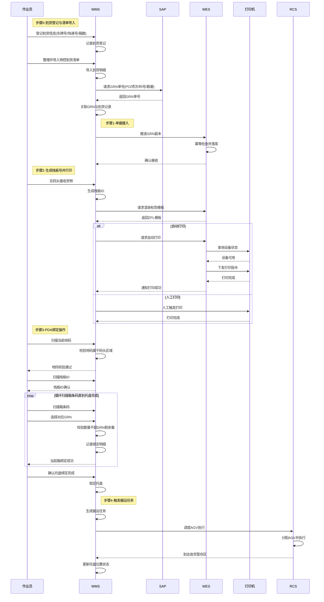

# 3.2.1 码头接收与绑定 (Dock Receiving & Binding) — 详细设计

## 技术栈说明 (Technology Stack)

### WMS 技术架构

**前端技术**: Blazor Server (前后端不分离)

- **Web 界面**: Blazor Server App
  - 到货登记页面、清单导入页面、栈板打印页面、GRN 替换页面等
  - 服务端渲染，通过 SignalR 实时通信
  - C# 编写，.NET 运行时
- **PDA 界面**: Blazor Server App (移动端适配)
  - PDA 绑定界面、扫描流程
  - 响应式设计，适配手持设备屏幕

**后端技术**: ASP.NET Core

- RESTful API 服务（内部使用）
- 数据库访问层（Entity Framework Core）
- SAP 集成服务（RFC/OData）

### WES 技术架构

**后端技术**: Python (FastAPI/Flask) 或 Java (Spring Boot)

- RESTful API 服务（北向接口、南向接口、内部接口）
- 事件驱动架构（消息队列）
- 硬件设备适配器（打印机、AGV、RCS）

### 集成架构 (Integration Architecture)

```
┌─────────────────────────────────────────────────────────┐
│                    WMS (Blazor Server)                  │
│  ┌──────────────┐  ┌──────────────┐  ┌──────────────┐  │
│  │ Web Pages    │  │ PDA Screens  │  │ API Services │  │
│  │ (Blazor)     │  │ (Blazor)     │  │ (ASP.NET)    │  │
│  └──────┬───────┘  └──────┬───────┘  └──────┬───────┘  │
│         │                 │                 │           │
│         └─────────────────┴─────────────────┘           │
│                           │                             │
└───────────────────────────┼─────────────────────────────┘
                            │ HTTP/REST
                            ↓
┌─────────────────────────────────────────────────────────┐
│                    WES (Python/Java)                    │
│  ┌──────────────┐  ┌──────────────┐  ┌──────────────┐  │
│  │ Northbound   │  │ Core Engine  │  │ Southbound   │  │
│  │ API          │  │              │  │ Adapters     │  │
│  └──────────────┘  └──────────────┘  └──────────────┘  │
└─────────────────────────────────────────────────────────┘
```

### Blazor 调用 WES API 示例

**C# 代码示例** (Blazor Component):

```csharp
@inject HttpClient Http
@inject IConfiguration Config

@code {
    // 生成 ZPL 标签内容 (WMS 内部逻辑)
    private string GenerateZplLabel(string palletId)
    {
        // WMS 负责标签模板渲染
        var timestamp = DateTime.Now.ToString("yyyy-MM-dd HH:mm");
        var zpl = $@"
^XA
^FO50,50^A0N,50,50^FD{palletId}^FS
^FO50,120^BQN,2,6^FDQA,{palletId}^FS
^FO50,350^A0N,30,30^FD{timestamp}^FS
^XZ";
        return zpl;
    }

    // 直接发送到打印机 (WMS 内部逻辑)
    private async Task PrintLabel(string palletId, string printerIp)
    {
        var zplContent = GenerateZplLabel(palletId);

        // 通过 TCP 直接发送到 ZPL 打印机 (端口 9100)
        using var client = new TcpClient(printerIp, 9100);
        using var stream = client.GetStream();
        var bytes = Encoding.UTF8.GetBytes(zplContent);
        await stream.WriteAsync(bytes, 0, bytes.Length);
    }

    // 注意：栈板号生成、标签渲染、打印管理、搬运任务创建都由 WMS 负责
    // 码头收货绑定阶段 WES 不参与
}
```

### 配置说明 (Configuration)

**appsettings.json** (WMS):

```json
{
  "Printers": {
    "DockPrinter01": "192.168.1.100",
    "DockPrinter02": "192.168.1.101"
  },
  "SAP": {
    "RfcHost": "sap-server",
    "RfcClient": "100",
    "RfcSystemNumber": "00"
  }
}
```

### 部署架构 (Deployment)

```
┌─────────────────┐
│  Browser/PDA    │
│  (Client)       │
└────────┬────────┘
         │ HTTPS (SignalR WebSocket)
         ↓
┌─────────────────┐
│  WMS Server     │
│  (Blazor Server)│
│  IIS / Kestrel  │
└────────┬────────┘
         │ TCP (Port 9100)
         ↓
┌─────────────────┐
│  ZPL Printer    │
│  (Zebra/SATO)   │
└─────────────────┘
```

**关键特性**:

- **Blazor Server**: 服务端渲染，客户端通过 SignalR 保持连接
- **无需前端构建**: Blazor 组件直接编译为 .NET DLL
- **实时更新**: SignalR 支持服务端主动推送更新到客户端
- **统一语言**: 前后端都使用 C#，代码复用性高
- **直接打印**: WMS 通过 TCP 端口 9100 直接发送 ZPL 到打印机

## 范围与依据 (Scope & Traceability)

- 基于 `docs/SRS.md` §3.2.1（码头接收与绑定）与 §3.1.2（单层货架背景）。
- 过程参考 `docs/process/inbound_kitting_hybrid_putaway_e2e_tabletop.md` §5.1~5.4。
- 需求参考 `docs/user_requirement.md`（码头到收货暂存区步骤 1~14，完整业务流程）、`docs/feature_list.md`（2.1~2.4）。
- **范围说明**：本文档描述码头收货与绑定的完整业务流程，包括到货登记、清单导入、栈板准备、标签打印、PDA 绑定、搬运任务创建。当前阶段由 WMS 全权负责，WES 不参与此阶段。

## 角色与归属 (Actors & Ownership)

| 子功能                                                      | 归属                                                              | 说明                                                                                                                   |
| ----------------------------------------------------------- | ----------------------------------------------------------------- | ---------------------------------------------------------------------------------------------------------------------- |
| 到货登记与清单导入 (Arrival Registration & Manifest Import) | **WMS PDA** (登记)、**WMS** (清单导入/SAP对接)        | 作业员通过 WMS PDA 登记到货信息（车牌号/快递号、箱数）；WMS 导入物控到货清单并向 SAP 请求 GRN 单号。WES 不参与此阶段。 |
| GRN 单据接入 (Order Ingest Sync)                            | **WMS** (SAP 对接/主账)                                     | WMS 与 SAP 完成主对账，管理 GRN 单据。码头收货绑定阶段 WES 不参与。                                                    |
| 栈板号生成 (Pallet ID Generation)                           | **WMS**                                                     | PalletID 规则与号段管理由 WMS 负责，WES 不涉。                                                                         |
| 标签渲染与打印 (Label Render & Print)                       | **WMS** (渲染/打印/管理)、**硬件供应商** (打印机驱动) | WMS 负责 ZPL 标签渲染和打印机管理，直接下发打印任务到打印机。WES 不参与打印流程。                                      |
| PDA 绑定 (M:N Binding via PDA)                              | **WMS PDA** (前端)、**WMS** (校验/汇总)               | PDA 仅连 WMS；绑定完成后触发后续搬运任务。                                                                             |
| 搬运任务创建 (Dock → Buffer Transport_Task)                | **WMS** (生成任务并直接调度 RCS)、**RCS/AGV** (执行)  | 绑定完成后，WMS 生成搬运任务并直接调度 RCS 执行 AGV 搬运。当前阶段 WES 不参与 RCS 调度。                               |
| 设备交互 (Printer/Scanner)                                  | **硬件供应商**                                              | 提供打印机、扫描枪驱动与健康检查。                                                                                     |
| 地码配置 (Location Codes)                                   | **WMS + RCS**                                               | 码头/收货暂存区地码由 WMS 与 RCS 双侧维护一致；当前 WES 不维护地码，待 RCS 迁移到 WES 时再同步主数据。                 |

## 前提与配置 (Preconditions & Config)

- 到货登记规则：车牌号/快递号格式、到货箱数记录规则由 **WMS** 维护；物控到货清单模板/导入格式由 **WMS** 定义。
- 主数据：`Material+Vendor+Lot/LC+DC`、尺寸/厚度 由 **WMS 主数据** 初始化与维护；WES 不维护此类主数据，仅消费 WMS 推送/透传的数据，且不对设备暴露主数据接口。
- 码头/收货暂存区地码：**由 WMS 与 RCS 双侧维护一致**；当前 WES 不维护地码数据。待 RCS 迁移到 WES 时，再从 WMS 迁移地码主数据到 WES。
- Pallet 编码规则（唯一、可重打）由 **WMS** 维护；打印模板/ZPL 渲染由 WES 提供（仅模板，不负责号段管理）。
- 幂等键：`request_id`（接单）、`pallet_id`（绑定与搬运）、`binding_id`（每次 PDA 绑定提交）。
- 网络/权限：WMS ↔ SAP 渠道稳定；WMS → WES 北向接口可达；WES → 打印机（若自动打印）可达。
- 自动打印设备（打印机）接入遵循 `docs/third_party_integration_whitepaper.md`（设备状态查询 + 命令下发）；WES 维护可用设备列表（健康状态/负载），无可用设备时自动回落人工打印。

## 子功能流程设计 (Sub-function Flows)

### 0) 到货登记与清单导入 (Arrival Registration & Manifest Import) — Owner: WMS, WES 不参与

1. **到货信息登记**：作业员在码头使用 **WMS PDA** 登记到货基本信息：
   - 车牌号（陆运）或快递号（快递）
   - 到货箱数
   - 登记时间与操作员
2. **物控清单整理**：仓库人员整理物控部门提供的到货清单（包含 PO、项次、料号、数量等明细）。
3. **到货明细导入**：WMS 提供清单导入功能，将物控到货清单批量导入系统，建立 `到货记录 (Arrival_Record)` 数据。
4. **GRN 单号请求**：WMS 根据导入的到货明细（PO + 项次 + 料号 + 数量），向 **SAP** 请求生成 GRN 单号。
5. **GRN 同步**：SAP 返回 GRN 单号后，WMS 更新到货列表，将 GRN 与到货记录关联。
6. **数据准备完成**：此时 WMS 已完成到货登记和 GRN 获取，为后续的栈板打印和绑定提供数据基础。

> **注**：本步骤完全由 WMS 负责，WES 不参与。WES 在下一步骤（单据接入）才开始介入，接收 WMS 推送的 GRN 副本。

### 1) 单据接入 (Order Ingest Sync) — Owner: WMS 主账, WES 仅接收副本

1. **前置条件**：WMS 已完成步骤 0（到货登记与 GRN 获取），GRN 单号已与到货记录关联。
2. **WMS → WES**：WMS 将 GRN 副本推送至 `POST /api/v1/orders/inbound`（或消息通道），携带 `request_id`、`allow_mixed_pallet`、Dock、GRN 明细（料号、数量、供应商等）。
3. **WES 侧处理**：幂等检查 `request_id`，落库用于后续打印/绑定/搬运编排；仅做基础字段校验（长度/必填/格式）。主数据存在性与数值合理性由 WMS 负责，WES 不额外校验主数据。
4. **数据落库**：WES 将 GRN 副本存储为 `Inbound_Order` 记录，状态标记为 `RECEIVED`，等待后续打印和绑定操作。

### 2) 栈板号生成与打印 (Pallet ID & Label Generation/Print)

1. **PalletID 生成**：由 WMS 按其编码规则生成，并在推送 GRN 副本时携带或后续调用接口时传入。
2. **模板渲染**：WMS 调用 `GET /api/v1/print-templates/pallet/{pallet_id}`（或批量渲染接口）获取 ZPL/PNG，WES 仅渲染模板。
3. **打印执行**：
   - **人工打印 (WMS Web)**：WMS Web 侧触发打印，打印结果由 WMS 记录；必要时回执给 WES 做编排状态可视化。
   - **自动打印 (WES 代打)**：WMS 提交 `pallet_id` + 打印机信息/自动打印偏好给 WES；WES 按白皮书接口优先挑选健康状态的自动打印机（`GET /api/v1/device/status`），下发打印指令（`POST /api/v1/device/command`，`task_type=PRINT_LABEL`，payload=ZPL/模板ID/份数/重打标记）；失败则重试后回落人工打印并通知 WMS。
4. 打印事件落库：`Print_Task(status, printer_id, timestamp, error_code, source=WMS/WES)`，便于追溯。

### 3) PDA 多对多绑定 (M:N Binding) — Owner: WMS PDA+WMS

1. 作业员在 **WMS PDA** 流程（单次绑定会话）：
   - **步骤 1**：扫描当前地码（建立位置上下文，一次性校验）
   - **步骤 2**：扫描 `PalletID`（建立托盘上下文）
   - **步骤 3**：循环操作直到该托盘物料完成：
     - 扫描/录入箱条码（含料号/数量）
     - 选择对应 GRN（支持混托多 GRN）
     - 提交当前箱绑定
   - **步骤 4**：确认托盘绑定完成，结束会话
2. **位置校验**（步骤 1）：地码必须属于码头交接区（防止越区绑定），由 WMS 基于其地码主数据校验；WES 不维护地码。
3. **数量校验**（步骤 3 每次提交）：`sum(current_qty_by_grn) <= GRN.remaining_qty`；混托允许多 GRN，同托同 GRN 可多次累加。
4. **提交事件**（步骤 3 每次）：WMS 生成 `binding_id`，写入绑定明细；步骤 4 完成时锁托；绑定结果不推送 WES。
5. **混托一致性约束**：由 WMS 记录每托物料集合；后续若需自动化装箱，WMS 在交接时将汇总信息告知 WES（见后续模块），WES 不持有绑定过程状态。

### 4) 搬运任务创建与调度 (Transport Task: Dock → Inbound Buffer)

1. 触发条件：同一 `pallet_id` 的绑定提交结束且 WMS 校验成功。
2. WMS 生成并下发搬运任务（`from=dock_location`, `to=inbound_buffer`, `payload=pallet_id`），直接调度 RCS。
3. RCS 事件（到达/失败）由 WMS 自行处理；若后续需进入自动化设备流程，再通过单独的“自动化交接”接口/消息告知 WES（不在本子章节内）。

### 5) 事件同步与追踪 (Event Sync & Traceability)

- WES 仅记录自身参与的事件（接单副本、模板渲染/代打结果）。绑定与搬运事件由 WMS 内部审计，不同步至 WES。
- 关键状态机（WES 侧）：
  - `Pallet`: `NEW -> PRINTED`（若代打） -> `STORED_FOR_AUTOMATION`（待后续模块交接）。
- 审计要求：WES 记录渲染/代打调用日志；PDA 绑定、RCS 搬运的审计由 WMS 负责。

### 6) 异常与补救 (Exceptions & Recovery)

- **打印失败**：自动打印重试 3 次；超限转为人工打印工单，需人工确认后继续。
- **数量超限 / GRN 关闭**：WMS PDA 前置拦截并提示；不通知 WES。
- **绑定撤销/改量**：仅在未生成搬运任务前允许；由 WMS 处理锁托/解锁，WES 不参与。
- **搬运拒绝/失败**：WMS/RCS 回执 `REJECTED/FAILED`；由 WMS 决定重派/人工介入，WES 不参与。
- **自动打印设备不可用**：WES 健康检查失败或指令拒绝时，记录 `fallback_reason`，通知 WMS 走人工打印。

## 典型时序 (Mermaid Sequence)



## 工业操作对齐要点 (Industrial Ops Alignment)

- 顺序控制：必须先打印成功再绑定；绑定成功且托盘锁定后才生成搬运请求，防止物理错托。
- 区域一致性：绑定时扫描地码确保托盘仍在码头交接区；搬运目标仅允许收货暂存区。
- 混托安全：混托允许，但后续装箱需槽位内单一物料/批次；在 WES 侧记录并校验。
- 幂等与恢复：重复请求（接单/绑定/搬运）按幂等键返回同结果，确保断点可恢复。
- 边界遵循：WES 不直连 RCS；PDA 只连 WMS；设备驱动由硬件供应商负责。
- 绑定数据停留在 WMS，WES 仅在进入自动化设备前通过单独交接接口获取汇总信息。
- 自动打印按设备健康优先，失败回落人工；符合白皮书“指令下发 + 异步回调”模式。

## 数据要点 (Data Notes)

- Pallet 对象：`pallet_id`, `dock_id`, `status`, `print_task_id`, `allow_mixed_pallet`.
- Binding 明细：`binding_id`, `pallet_id`, `grn_id`, `material_id`, `vendor_id`, `qty`, `lc`, `dc`, `dock_location`, `operator`（**仅 WMS 持有**；WES 不落此数据）。
- 自动化交接载荷（后续模块触发）：`pallet_id`, `pallet_summary`(物料/批次/数量聚合), `handover_state`，供 WES 编排设备。
- Transport_Task（WMS 持有）：`task_id`, `pallet_id`, `from`, `to`, `state`, `rcs_ref`, `timestamps`。
- AutoPrinter 调度：`device_id`, `status`（来自设备/status），`last_health_ts`, `retry_count`, `print_task_id`, `fallback_reason`。

## 功能页面设计 (Functional Page Design)

### WMS Web 页面 (WMS Web Forms)

#### 1. 到货登记页面 (Arrival Registration Page)

**路径**: `/wms/inbound/arrival-registration`
**角色**: 仓库管理员、收货员

**页面元素**:

```
表单字段:
  - 运输方式: [陆运 | 快递] (单选)
  - 车牌号/快递号: <输入框> (必填)
  - 到货箱数: <数字输入> (必填，>0)
  - 备注: <文本域> (可选)

操作按钮:
  - [提交登记] - 保存到货记录
  - [取消] - 清空表单

显示区域:
  - 今日到货列表 (表格)
    列: 登记时间 | 车牌号/快递号 | 箱数 | 操作员 | 状态
```

**交互逻辑**:

- 提交后生成到货记录 ID，状态标记为"待导入清单"
- 显示成功消息: "✓ 到货登记成功 (车牌号: 粤B12345, 箱数: 10)"
- **不自动生成栈板号**: 箱数 ≠ 栈板数，需要根据实际情况确定
- 用户继续下一步操作（导入清单或栈板准备）

#### 2. 到货清单导入页面 (Manifest Import Page)

**路径**: `/wms/inbound/manifest-import`
**角色**: 仓库管理员、物控专员

**页面元素**:

```
选择区域:
  - 到货记录: <下拉选择> (显示待导入的到货记录)
  - 清单文件: <文件上传> (支持 .xlsx, .csv)
  - 模板下载: [下载导入模板]

预览区域:
  - 清单明细表格 (上传后显示)
    列: PO号 | 项次 | 料号 | 供应商 | 数量 | 批次 | 日期码
  - 校验结果: <提示信息> (显示格式错误、重复项等)

操作按钮:
  - [校验清单] - 验证数据格式和完整性
  - [请求GRN] - 向SAP请求生成GRN单号
  - [取消] - 返回上一页

状态显示:
  - GRN请求状态: [待请求 | 请求中 | 已获取 | 失败]
  - GRN单号: <显示区域> (获取后显示)
```

**交互逻辑**:

- 上传文件后自动校验格式
- 校验通过后启用"请求GRN"按钮
- 请求GRN成功后，状态更新为"已获取"，可进入打印流程

#### 3. 栈板准备与标签打印页面 (Pallet Preparation & Label Printing)

**路径**: `/wms/inbound/pallet-preparation`
**角色**: 仓库管理员、收货员

**业务背景**:

- 箱数 ≠ 栈板数（1 个栈板可能装多个箱子）
- 栈板数量需要根据实际物理情况确定
- 仓库人员现场整理货物后，按需生成栈板号

**页面元素**:

```
到货信息:
  到货记录: ARR202501170001
  车牌号: 粤B12345
  到货箱数: 10 箱

栈板准备:
  需要栈板数量: <数字输入> (必填，>0)
  说明: 根据实际整理情况输入需要的栈板数量

操作按钮:
  [生成并打印标签] (主按钮)
  [取消] (次要按钮)
```

**交互逻辑**:

```
1. 用户输入栈板数量（例如：8）
   ↓
2. 点击"生成并打印标签"
   ↓
3. WMS 生成栈板号
   PALLET202501170001 ~ PALLET202501170008
   ↓
4. WMS 渲染 ZPL 标签内容
   ↓
5. WMS 提交打印任务到 WES (后台)
   ↓
6. 显示提示: "✓ 已生成 8 个栈板，标签正在打印..."
   ↓
7. 用户可继续其他操作
   ↓
8. 打印完成 → 通知: "✓ 8 个栈板标签已打印完成"
```

**打印失败处理**:

```
打印失败
  ↓
自动重试 3 次
  ↓
仍失败 → 通知: "⚠️ 自动打印失败"
  ↓
提供补救:
  - 显示待打印标签列表
  - [重新打印] 或 [下载 PDF]
```

**关键特性**:

- **按需生成**: 根据实际需要的栈板数量生成
- **一键完成**: 生成和打印一次完成
- **后台打印**: 不阻塞用户操作
- **智能容错**: 失败自动重试

### WMS PDA 界面 (WMS PDA Screens)

#### 4. PDA 绑定界面 (PDA Binding Screen)

**界面**: PDA 扫描流程
**角色**: 收货员、仓库作业员

**界面流程**:

```
步骤1: 扫描地码
  显示: "请扫描当前地码"
  输入: <扫描枪输入>
  校验: 地码是否属于码头交接区
  成功: 显示地码信息，进入步骤2
  失败: 提示"地码不属于码头区域"，重新扫描

步骤2: 扫描栈板ID
  显示: "当前地码: [地码]"
         "请扫描栈板ID"
  输入: <扫描枪输入>
  校验: 栈板ID是否已打印、是否已锁定
  成功: 显示栈板信息，进入步骤3
  失败: 提示错误原因，重新扫描

步骤3: 循环扫描箱条码 (可重复)
  显示: "当前地码: [地码]"
         "当前栈板: [栈板ID]"
         "已绑定: [X]箱"
         "请扫描箱条码"
  输入: <扫描枪输入>
  解析: 从箱条码提取料号、数量、批次等信息

  子步骤3.1: 选择GRN
    显示: "料号: [料号]"
           "数量: [数量]"
           "可选GRN:"
           - GRN001 (剩余: 100)
           - GRN002 (剩余: 50)
    操作: <触摸选择GRN>

  子步骤3.2: 确认绑定
    显示: "确认绑定?"
           "料号: [料号]"
           "数量: [数量]"
           "GRN: [GRN号]"
    操作: [确认] [取消]

  校验: 数量不超过GRN剩余量
  成功: 提示"绑定成功"，返回步骤3继续扫描
  失败: 提示错误原因，返回步骤3重新扫描

  快捷操作:
    - [完成绑定] - 结束当前栈板绑定，进入步骤4
    - [取消] - 返回步骤2重新扫描栈板

步骤4: 确认完成
  显示: "栈板绑定完成"
         "栈板ID: [栈板ID]"
         "总箱数: [X]箱"
         "涉及GRN: [GRN列表]"
  操作: [确认完成] [继续绑定]

  确认完成:
    1. 锁定栈板状态
    2. WMS 生成搬运任务 (码头 → 暂存区/IQC区)
    3. WMS 直接调度 RCS 执行 AGV 搬运
    4. 返回步骤1开始新栈板

  继续绑定: 返回步骤3继续扫描箱条码
```

**界面特性**:

- 大字体显示，适配手持PDA屏幕
- 扫描枪输入自动触发，无需手动点击
- 实时显示当前绑定进度和剩余量
- 支持快捷键操作（F1-完成，F2-取消等）
- 错误提示伴随蜂鸣声和震动反馈


## 双向校验机制 (Bidirectional Validation Mechanism)

### 设计原则 (Design Principles)

**核心要求**: 到货登记和到货清单导入的先后顺序无关，支持以下两种场景：

- **场景 A**: 先到货登记 → 后导入清单 → 导入时校验
- **场景 B**: 先导入清单 → 后到货登记 → 登记时校验

**关键特性**:

- 允许孤立记录存在（未匹配的登记或清单）
- 双向关联验证（任一方完成时触发校验）
- 状态驱动的数据一致性保证
- 完整的审计追踪

### 数据关联机制 (Data Association)

#### 数据库模型 (Database Schema)

```sql
-- 到货登记表 (Arrival Registration)
CREATE TABLE Arrival_Record (
  arrival_id VARCHAR(50) PRIMARY KEY,
  transport_type ENUM('TRUCK', 'EXPRESS'),
  vehicle_number VARCHAR(50),
  box_count INT NOT NULL,
  remarks TEXT,
  registration_status ENUM('PENDING_MANIFEST', 'VALIDATED', 'MISMATCH'),
  registered_by VARCHAR(50),
  registered_at TIMESTAMP,
  validated_at TIMESTAMP
);

-- 到货清单表 (Arrival Manifest)
CREATE TABLE Arrival_Manifest (
  manifest_id VARCHAR(50) PRIMARY KEY,
  arrival_id VARCHAR(50),  -- 关联键，可为空（孤立清单）
  grn_number VARCHAR(50),
  expected_box_count INT NOT NULL,
  manifest_status ENUM('PENDING_REGISTRATION', 'VALIDATED', 'MISMATCH'),
  imported_by VARCHAR(50),
  imported_at TIMESTAMP,
  validated_at TIMESTAMP,
  FOREIGN KEY (arrival_id) REFERENCES Arrival_Record(arrival_id)
);

-- 校验日志表 (Validation Log)
CREATE TABLE Validation_Log (
  log_id VARCHAR(50) PRIMARY KEY,
  arrival_id VARCHAR(50),
  manifest_id VARCHAR(50),
  validation_type ENUM('ON_MANIFEST_IMPORT', 'ON_REGISTRATION', 'ON_GRN_REQUEST', 'ON_BINDING'),
  validation_result ENUM('PASS', 'FAIL'),
  mismatch_details JSON,
  validated_at TIMESTAMP
);
```

#### 关联逻辑 (Association Logic)

**匹配键**: `arrival_id` (由到货登记生成，清单导入时关联)

**场景 A 流程** (先登记后导入):

1. 到货登记 → 生成 `arrival_id`，状态 = `PENDING_MANIFEST`
2. 清单导入 → 用户选择 `arrival_id` 关联，状态 = `PENDING_REGISTRATION`
3. 关联成功 → 触发校验，更新双方状态

**场景 B 流程** (先导入后登记):

1. 清单导入 → `arrival_id` = NULL，状态 = `PENDING_REGISTRATION`
2. 到货登记 → 生成 `arrival_id`，状态 = `PENDING_MANIFEST`
3. 系统提示待关联清单 → 用户确认关联 → 触发校验

### 校验检查点 (Validation Checkpoints)

#### 检查点 1: 清单导入时 (On Manifest Import)

**触发条件**: 清单导入时选择了已存在的 `arrival_id`

**校验逻辑**:

```python
def validate_on_manifest_import(arrival_id, manifest_box_count):
    arrival = get_arrival_record(arrival_id)

    if arrival is None:
        return {
            "status": "PENDING_REGISTRATION",
            "message": "清单已导入，等待到货登记关联"
        }

    if arrival.box_count != manifest_box_count:
        log_validation(arrival_id, "ON_MANIFEST_IMPORT", "FAIL", {
            "registered_count": arrival.box_count,
            "manifest_count": manifest_box_count
        })
        return {
            "status": "MISMATCH",
            "message": f"箱数不匹配：登记 {arrival.box_count} 箱，清单 {manifest_box_count} 箱"
        }

    update_status(arrival_id, "VALIDATED")
    log_validation(arrival_id, "ON_MANIFEST_IMPORT", "PASS", None)
    return {"status": "VALIDATED"}
```

#### 检查点 2: 到货登记时 (On Arrival Registration)

**触发条件**: 到货登记完成后，系统检测是否有待关联的清单

**校验逻辑**:

```python
def validate_on_registration(arrival_id, registered_box_count):
    pending_manifests = get_pending_manifests_by_vehicle(vehicle_number)

    if len(pending_manifests) == 0:
        return {
            "status": "PENDING_MANIFEST",
            "message": "到货登记已完成，等待清单导入"
        }

    if len(pending_manifests) == 1:
        manifest = pending_manifests[0]
        if manifest.expected_box_count != registered_box_count:
            return {
                "status": "MISMATCH",
                "message": f"箱数不匹配：登记 {registered_box_count} 箱，清单 {manifest.expected_box_count} 箱",
                "suggest_link": manifest.manifest_id
            }

        # 自动关联
        link_manifest_to_arrival(manifest.manifest_id, arrival_id)
        return {"status": "VALIDATED"}

    # 多个待关联清单，需要人工选择
    return {
        "status": "MANUAL_SELECTION_REQUIRED",
        "candidates": pending_manifests
    }
```

#### 检查点 3: GRN 请求时 (On GRN Request)

**触发条件**: WMS 向 WES 发起 GRN 单据接入请求

**校验逻辑**:

```python
def validate_on_grn_request(grn_number):
    manifest = get_manifest_by_grn(grn_number)

    if manifest is None:
        return {"status": "REJECTED", "reason": "清单未导入"}

    if manifest.arrival_id is None:
        return {"status": "REJECTED", "reason": "清单未关联到货登记"}

    arrival = get_arrival_record(manifest.arrival_id)

    if arrival.registration_status != "VALIDATED":
        return {"status": "REJECTED", "reason": "到货登记与清单校验未通过"}

    return {"status": "APPROVED"}
```

#### 检查点 4: PDA 绑定时 (On Binding Operation)

**触发条件**: PDA 扫描托盘码进行绑定操作

**校验逻辑**:

```python
def validate_on_binding(pallet_id, grn_number):
    # 检查 GRN 是否已通过前置校验
    manifest = get_manifest_by_grn(grn_number)

    if manifest.manifest_status != "VALIDATED":
        return {
            "status": "BLOCKED",
            "message": "该 GRN 单据未通过到货校验，无法绑定"
        }

    return {"status": "ALLOWED"}
```

### 异常处理 (Exception Handling)

#### 异常 1: 箱数不匹配 (Box Count Mismatch)

**场景**: 登记箱数 ≠ 清单箱数

**处理流程**:

1. 系统标记状态为 `MISMATCH`
2. 记录差异详情到 `Validation_Log`
3. UI 显示警告信息，提供以下选项：
   - **修正登记**: 重新录入到货登记箱数
   - **修正清单**: 联系 SAP 管理员修正清单
   - **强制通过**: 需要主管审批（记录审批人和原因）

**UI 交互**:

```
⚠️ 校验失败：箱数不匹配
━━━━━━━━━━━━━━━━━━━━━━━━━━━━━━━━━━
到货登记箱数: 50 箱
清单预期箱数: 48 箱
差异: +2 箱

处理选项:
[ ] 修正到货登记 (重新录入)
[ ] 修正清单 (联系 SAP)
[ ] 强制通过 (需主管审批)

备注: ___________________________
```

#### 异常 2: 缺少到货登记 (Missing Registration)

**场景**: 清单已导入，但无对应的到货登记

**处理流程**:

1. 清单状态 = `PENDING_REGISTRATION`
2. 系统在到货登记页面显示待关联清单提示
3. 用户完成登记后，系统自动匹配或提示手动关联

**UI 交互** (到货登记页面):

```
ℹ️ 系统提示：检测到待关联清单
━━━━━━━━━━━━━━━━━━━━━━━━━━━━━━━━━━
清单 ID: MANIFEST-20250117-0001
车牌号: 粤B12345
预期箱数: 50 箱
导入时间: 2025-01-17 09:30:00

是否关联到本次登记？
[确认关联] [稍后处理]
```

#### 异常 3: 缺少清单 (Missing Manifest)

**场景**: 到货登记已完成，但清单未导入

**处理流程**:

1. 登记状态 = `PENDING_MANIFEST`
2. 系统在清单导入页面显示待关联登记提示
3. 用户导入清单时，系统自动匹配或提示手动关联

**UI 交互** (清单导入页面):

```
ℹ️ 系统提示：检测到待关联到货登记
━━━━━━━━━━━━━━━━━━━━━━━━━━━━━━━━━━
车牌号: 粤B12345
登记箱数: 50 箱
登记时间: 2025-01-17 08:00:00

是否关联到本次导入的清单？
[确认关联] [稍后处理]
```

### 状态转换图 (State Transition)

```
场景 A (先登记后导入):
Arrival_Record:  [NEW] → [PENDING_MANIFEST] → [VALIDATED] / [MISMATCH]
Manifest:        NULL  → [PENDING_REGISTRATION] → [VALIDATED] / [MISMATCH]

场景 B (先导入后登记):
Manifest:        [NEW] → [PENDING_REGISTRATION] → [VALIDATED] / [MISMATCH]
Arrival_Record:  NULL  → [PENDING_MANIFEST] → [VALIDATED] / [MISMATCH]

最终状态:
- VALIDATED: 双方数据一致，允许后续操作
- MISMATCH: 数据不一致，需要人工干预
- PENDING_*: 等待另一方数据完成关联
```

### 数据一致性保证 (Data Consistency)

#### 事务管理 (Transaction Management)

```python
@transaction
def link_and_validate(arrival_id, manifest_id):
    # 原子操作：关联 + 校验 + 状态更新
    manifest = get_manifest(manifest_id)
    arrival = get_arrival_record(arrival_id)

    # 更新关联
    manifest.arrival_id = arrival_id

    # 执行校验
    validation_result = validate_box_count(arrival.box_count, manifest.expected_box_count)

    # 更新状态
    if validation_result == "PASS":
        arrival.registration_status = "VALIDATED"
        manifest.manifest_status = "VALIDATED"
    else:
        arrival.registration_status = "MISMATCH"
        manifest.manifest_status = "MISMATCH"

    # 记录日志
    log_validation(arrival_id, manifest_id, validation_result)

    commit()
```

#### 审计追踪 (Audit Trail)

所有校验操作记录到 `Validation_Log`，包含：

- 校验时间点 (validation_type)
- 校验结果 (PASS/FAIL)
- 不匹配详情 (mismatch_details)
- 操作人员 (validated_by)

**查询示例**:

```sql
SELECT * FROM Validation_Log
WHERE arrival_id = 'ARR202501170001'
ORDER BY validated_at DESC;
```

### UI 工作流设计 (UI Workflow)

#### 场景 A: 先登记后导入

```
步骤 1: 到货登记
  ↓ 用户填写表单 (车牌号、箱数)
  ↓ 提交 → 生成 arrival_id
  ↓ 状态 = PENDING_MANIFEST
  ↓ 提示: "登记成功，等待清单导入"

步骤 2: 清单导入
  ↓ 用户上传 Excel
  ↓ 系统解析清单内容
  ↓ 系统检测到匹配的 arrival_id (通过车牌号/时间)
  ↓ 弹窗提示: "检测到到货登记 ARR202501170001 (车牌号: 粤B12345)，是否关联？"
  ↓ 用户确认 → 触发校验
  ↓ 校验通过 → 状态 = VALIDATED
  ↓ 校验失败 → 状态 = MISMATCH，显示差异详情
```

#### 场景 B: 先导入后登记

```
步骤 1: 清单导入
  ↓ 用户上传 Excel
  ↓ 系统解析清单内容（PO、料号、数量等）
  ↓ arrival_id = NULL
  ↓ 状态 = PENDING_REGISTRATION
  ↓ 提示: "清单已导入，等待到货登记关联"

步骤 2: 到货登记
  ↓ 用户填写表单 (车牌号、箱数)
  ↓ 系统检测到待关联清单 (通过车牌号匹配)
  ↓ 弹窗提示: "检测到清单 MANIFEST-20250117-0001 (车牌号: 粤B12345)，是否关联？"
  ↓ 用户确认 → 触发校验
  ↓ 校验通过 → 状态 = VALIDATED
  ↓ 校验失败 → 状态 = MISMATCH，显示差异详情
```

### 性能优化 (Performance Optimization)

**索引设计**:

```sql
CREATE INDEX idx_arrival_vehicle ON Arrival_Record(vehicle_number, registered_at);
CREATE INDEX idx_manifest_grn ON Arrival_Manifest(grn_number);
CREATE INDEX idx_manifest_arrival ON Arrival_Manifest(arrival_id);
CREATE INDEX idx_validation_arrival ON Validation_Log(arrival_id);
```

**缓存策略**:

- 待关联记录缓存 (Redis): `pending:arrivals`, `pending:manifests`
- 缓存 TTL: 24 小时
- 关联成功后立即清除缓存
