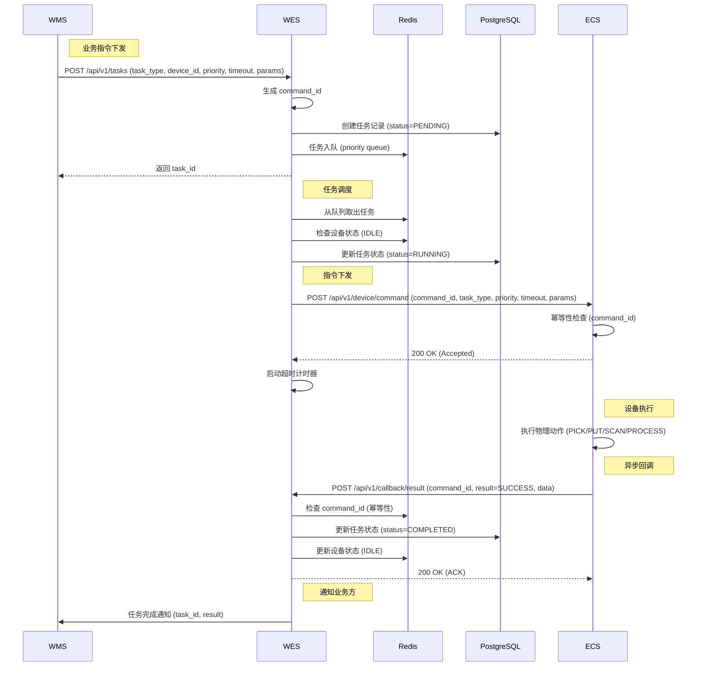
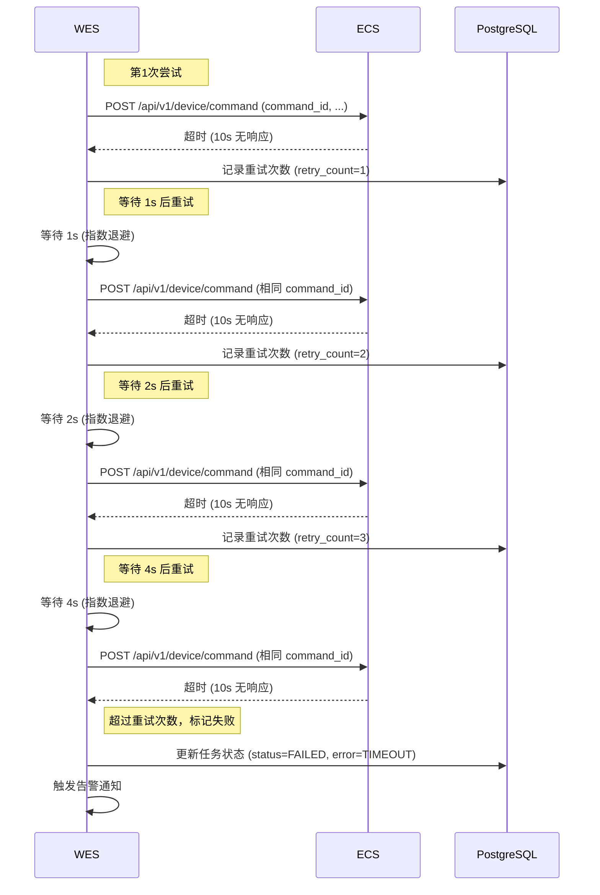
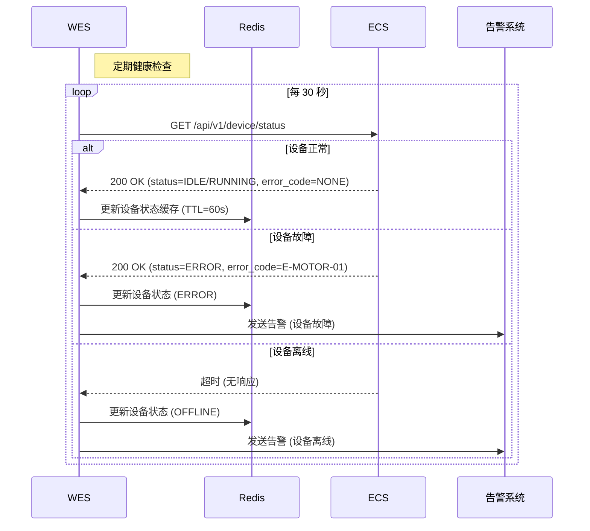
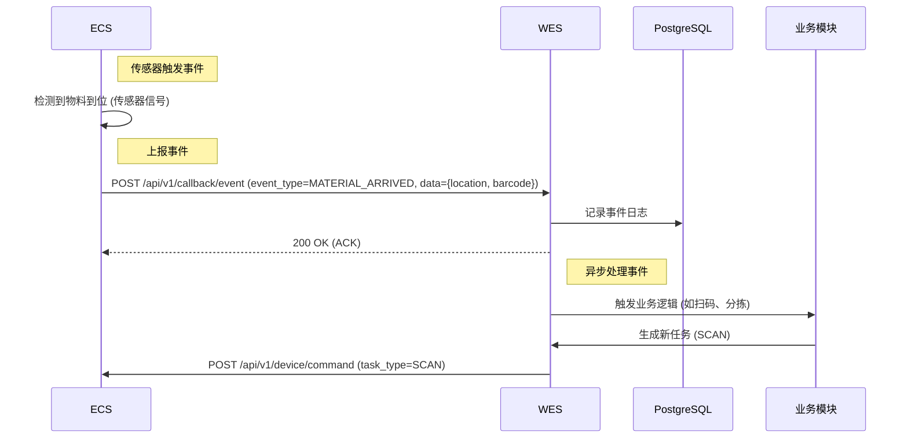

# 3.3.0 WES 核心基础平台 (WES Core Foundation Platform) — 详细设计

> **版本**: v1.1
> **修订日期**: 2025-12-25
> **修订内容**: 补充审计追踪与集成日志模型

## 技术栈说明 (Technology Stack)

### WES 技术架构

**后端技术**: Python 3.12 + FastAPI

- **Web 框架**: FastAPI (全异步 Async/Await)
- **数据验证**: Pydantic v2 (严谨的类型校验)
- **ORM 框架**: SQLModel (结合 SQLAlchemy 与 Pydantic，简化模型定义)
- **数据库迁移**: Alembic
- **HTTP 客户端**: HTTPX (异步高并发请求)
- **任务调度**: APScheduler (后台定时任务 & 延迟任务)
- **结构化日志**: Structlog (JSON 格式，便于 ELK 收集)
- **代码规范**: Ruff (Linter & Formatter) + MyPy (静态类型检查)
- **单元测试**: Pytest + pytest-asyncio

**核心架构组件**:
- **北向接口 (Northbound API)**:
  - 接收 WMS 下发的业务指令
  - 提供设备状态查询接口
  - 提供任务状态查询接口
- **核心引擎 (Core Engine)**:
  - 任务队列管理 (基于 Redis Sorted Set 优先级)
  - 任务状态机管理 (State Machine)
  - 超时监控与重试机制 (Retry Policy)
  - 并发控制 (Concurrency Semaphore)
- **南向接口 (Southbound Adapters)**:
  - ECS 设备控制接口适配器
  - 设备健康检查轮询 (Heartbeat)
  - 异步回调接收服务 (Webhook)

**前端技术**: Vue 3 + TypeScript + Vite

- **UI 框架**: Element Plus
- **状态管理**: Pinia
- **路由管理**: vue-router
- **请求客户端**: Alova (高效请求策略与缓存)
- **代码规范**: ESLint + Prettier
- **单元测试**: Vitest

**数据存储**:
- **PostgreSQL**: 持久化存储
  - 设备主数据 (Device Master Data)
  - 任务记录 (Task Records)
  - 事件日志 (Event Logs)
- **Redis**: 缓存与状态管理
  - 设备状态缓存 (Device Status Cache)
  - 任务队列 (Task Queue with Priority)
  - 幂等性缓存 (Command ID Deduplication)

### 集成架构 (Integration Architecture)

```
┌─────────────────────────────────────────────────────────┐
│                    WMS (ASP.NET Core)                   │
│  ┌──────────────┐  ┌──────────────┐  ┌──────────────┐  │
│  │ Web Pages    │  │ PDA Screens  │  │ API Services │  │
│  │ (Blazor)     │  │ (Blazor)     │  │              │  │
│  └──────┬───────┘  └──────┬───────┘  └──────┬───────┘  │
│         │                 │                 │           │
│         └─────────────────┴─────────────────┘           │
│                           │                             │
└───────────────────────────┼─────────────────────────────┘
                            │ HTTP/REST
                            ↓
┌─────────────────────────────────────────────────────────┐
│                WES Core Platform (Python)               │
│  ┌──────────────┐  ┌──────────────┐  ┌──────────────┐  │
│  │ Northbound   │  │ Core Engine  │  │ Southbound   │  │
│  │ API          │  │ - Task Queue │  │ Adapters     │  │
│  │              │  │ - State Mgmt │  │ - ECS Client │  │
│  │              │  │ - Retry Mgmt │  │ - Health Chk │  │
│  └──────────────┘  └──────────────┘  └──────────────┘  │
│                           │                             │
└───────────────────────────┼─────────────────────────────┘
                            │ HTTP/HTTPS
                            ↓
┌─────────────────────────────────────────────────────────┐
│              ECS (Equipment Control System)             │
│  ┌──────────────┐  ┌──────────────┐  ┌──────────────┐  │
│  │ 装箱流水线   │  │ 机构件流水线 │  │ 其他自动化   │  │
│  │ 控制系统     │  │ 控制系统     │  │ 设备控制系统 │  │
│  └──────────────┘  └──────────────┘  └──────────────┘  │
└─────────────────────────────────────────────────────────┘
```

### 配置说明 (Configuration)

**config.yaml** (WES):

```yaml
# 北向接口配置
northbound:
  host: "0.0.0.0"
  port: 8000

# 南向设备配置
devices:
  - device_id: "KITTING_LINE_01"
    device_name: "装箱流水线控制系统1"
    type: "ECS"
    zone_code: "KITTING_AREA"
    work_line_code: "KITTING_LINE_01"
    base_url: "http://192.168.10.100:8080"
    health_check_interval: 30  # 秒

  - device_id: "MECHANICAL_LINE_01"
    device_name: "机构件流水线控制系统"
    type: "ECS"
    zone_code: "MECHANICAL_AREA"
    work_line_code: "MECHANICAL_LINE_01"
    base_url: "http://192.168.10.101:8080"
    health_check_interval: 30

# 任务管理配置
task_management:
  max_concurrent_tasks_per_device: 1  # 单设备最大并发任务数
  default_timeout: 30000  # 默认超时时间(ms)
  retry_policy:
    max_retries: 3
    backoff_intervals: [1000, 2000, 4000]  # 指数退避(ms)

# 幂等性配置
idempotency:
  command_id_cache_ttl: 3600  # 1小时(秒)

# 数据库配置
database:
  postgresql:
    host: "localhost"
    port: 5432
    database: "wes_db"
    user: "wes_user"

  redis:
    host: "localhost"
    port: 6379
    db: 0
```

### 部署架构 (Deployment)

```
┌─────────────────┐
│  WMS Server     │
│  (ASP.NET Core) │
└────────┬────────┘
         │ HTTP/REST
         ↓
┌─────────────────┐
│  WES Server     │
│  (FastAPI)      │
│  + PostgreSQL   │
│  + Redis        │
└────────┬────────┘
         │ HTTP/HTTPS
         ↓
┌─────────────────┐
│  ECS Devices    │
│  (各供应商)     │
└─────────────────┘
```

**关键特性**:

- **异步架构**: FastAPI 异步处理，支持高并发
- **事件驱动**: 基于回调机制的异步消息交互
- **状态管理**: Redis 缓存设备状态，PostgreSQL 持久化任务记录
- **幂等性保障**: Redis 缓存 command_id，防止重复执行
- **健康监控**: 定期轮询设备状态，维护设备可用性

## 开发技术架构 (Development Architecture)

### 代码组织结构 (Project Structure)

```
wes-core/
├── src/
│   ├── app/
│   │   ├── __init__.py
│   │   ├── main.py                      # FastAPI 应用入口
│   │   ├── config.py                    # 配置管理
│   │   │
│   │   ├── northbound/                  # 北向接口层（WMS 调用）
│   │   │   ├── __init__.py
│   │   │   ├── api/
│   │   │   │   ├── __init__.py
│   │   │   │   ├── tasks.py             # 任务管理接口
│   │   │   │   ├── devices.py           # 设备查询接口
│   │   │   │   └── health.py            # 健康检查接口
│   │   │   └── schemas/
│   │   │       ├── __init__.py
│   │   │       ├── task.py              # 任务相关数据模型
│   │   │       └── device.py            # 设备相关数据模型
│   │   │
│   │   ├── core/                        # 核心引擎层
│   │   │   ├── __init__.py
│   │   │   ├── task_scheduler.py        # 任务调度器
│   │   │   ├── task_executor.py         # 任务执行器
│   │   │   ├── task_state_machine.py    # 任务状态机
│   │   │   ├── device_manager.py        # 设备管理器
│   │   │   ├── health_monitor.py        # 健康监控器
│   │   │   ├── retry_manager.py         # 重试管理器
│   │   │   ├── event_handler.py         # 事件处理器
│   │   │   └── command_generator.py     # 指令生成器
│   │   │
│   │   ├── southbound/                  # 南向接口层（调用 ECS）
│   │   │   ├── __init__.py
│   │   │   ├── ecs_client.py            # ECS 客户端
│   │   │   ├── callback_receiver.py     # 回调接收器
│   │   │   └── schemas/
│   │   │       ├── __init__.py
│   │   │       ├── command.py           # 指令数据模型
│   │   │       └── callback.py          # 回调数据模型
│   │   │
│   │   ├── domain/                      # 领域模型层
│   │   │   ├── __init__.py
│   │   │   ├── models/
│   │   │   │   ├── __init__.py
│   │   │   │   ├── task.py              # 任务领域模型
│   │   │   │   ├── device.py            # 设备领域模型
│   │   │   │   └── event.py             # 事件领域模型
│   │   │   └── services/
│   │   │       ├── __init__.py
│   │   │       ├── task_service.py      # 任务领域服务
│   │   │       └── device_service.py    # 设备领域服务
│   │   │
│   │   └── infra/                       # 基础设施层
│   │       ├── __init__.py
│   │       ├── database/
│   │       │   ├── __init__.py
│   │       │   ├── postgres.py          # PostgreSQL 连接
│   │       │   ├── redis.py             # Redis 连接
│   │       │   └── repositories/
│   │       │       ├── __init__.py
│   │       │       ├── task_repo.py     # 任务仓储
│   │       │       ├── device_repo.py   # 设备仓储
│   │       │       └── event_repo.py    # 事件仓储
│   │       ├── cache/
│   │       │   ├── __init__.py
│   │       │   ├── device_cache.py      # 设备状态缓存
│   │       │   ├── task_queue.py        # 任务队列
│   │       │   └── idempotency_cache.py # 幂等性缓存
│   │       └── messaging/
│   │           ├── __init__.py
│   │           └── alert_sender.py      # 告警发送器
│   │
│   └── tests/                           # 测试代码
│       ├── unit/
│       ├── integration/
│       └── e2e/
│
├── config/                              # 配置文件
│   ├── config.yaml                      # 主配置文件
│   ├── devices.yaml                     # 设备配置
│   └── logging.yaml                     # 日志配置
│
├── migrations/                          # 数据库迁移脚本
│   └── versions/
│
├── scripts/                             # 工具脚本
│   ├── init_db.py                       # 数据库初始化
│   └── import_devices.py                # 设备批量导入
│
├── requirements.txt                     # Python 依赖
├── Dockerfile                           # Docker 镜像
├── docker-compose.yml                   # Docker Compose 配置
└── README.md                            # 项目说明
```

### 核心模块设计 (Core Modules)

#### 1. 任务调度器 (Task Scheduler)

**职责**:
- 从 Redis 优先级队列中取出待执行任务
- 检查目标设备状态和并发限制
- 将任务分配给任务执行器
- 管理任务调度策略（优先级、FIFO）

**关键方法**:
```python
class TaskScheduler:
    async def schedule_task(self, task_id: str) -> bool
    async def get_next_task(self, device_id: str) -> Optional[Task]
    async def check_device_availability(self, device_id: str) -> bool
    async def start_scheduling_loop(self)
```

#### 2. 任务执行器 (Task Executor)

**职责**:
- 生成 command_id
- 调用 ECS 客户端下发指令
- 启动超时计时器
- 处理执行结果（成功/失败）
- 触发重试机制

**关键方法**:
```python
class TaskExecutor:
    async def execute_task(self, task: Task) -> ExecutionResult
    async def generate_command_id(self) -> str
    async def start_timeout_timer(self, task_id: str, timeout: int)
    async def handle_execution_result(self, task_id: str, result: dict)
```

#### 3. 任务状态机 (Task State Machine)

**职责**:
- 管理任务状态转换（PENDING → RUNNING → COMPLETED/FAILED/CANCELLED）
- 验证状态转换合法性
- 记录状态变更历史
- 触发状态变更事件

**关键方法**:
```python
class TaskStateMachine:
    async def transition(self, task_id: str, from_state: str, to_state: str) -> bool
    async def get_current_state(self, task_id: str) -> str
    async def validate_transition(self, from_state: str, to_state: str) -> bool
    async def record_state_change(self, task_id: str, from_state: str, to_state: str)
```

#### 4. 设备管理器 (Device Manager)

**职责**:
- 管理设备注册和配置
- 维护设备主数据
- 查询设备状态
- 管理设备并发限制

**关键方法**:
```python
class DeviceManager:
    async def register_device(self, device: Device) -> bool
    async def get_device(self, device_id: str) -> Optional[Device]
    async def update_device_status(self, device_id: str, status: str)
    async def check_concurrency_limit(self, device_id: str) -> bool
    async def list_devices(self, filters: dict) -> List[Device]
```

#### 5. 健康监控器 (Health Monitor)

**职责**:
- 定期轮询 ECS 设备健康状态
- 更新设备状态缓存
- 检测设备故障和离线
- 触发告警通知

**关键方法**:
```python
class HealthMonitor:
    async def start_monitoring(self)
    async def check_device_health(self, device_id: str) -> HealthStatus
    async def update_device_status(self, device_id: str, status: dict)
    async def trigger_alert(self, device_id: str, alert_type: str)
    async def handle_device_offline(self, device_id: str)
```

#### 6. 重试管理器 (Retry Manager)

**职责**:
- 管理任务重试策略
- 实现指数退避算法
- 记录重试次数
- 判断是否超过重试上限

**关键方法**:
```python
class RetryManager:
    async def should_retry(self, task_id: str) -> bool
    async def calculate_backoff_delay(self, retry_count: int) -> int
    async def increment_retry_count(self, task_id: str)
    async def schedule_retry(self, task_id: str, delay: int)
```

#### 7. 事件处理器 (Event Handler)

**职责**:
- 接收 ECS 设备上报的事件
- 根据事件类型触发相应处理逻辑
- 记录事件日志
- 触发后续业务流程

**关键方法**:
```python
class EventHandler:
    async def handle_event(self, event: Event) -> bool
    async def process_material_arrived(self, event: Event)
    async def process_estop_pressed(self, event: Event)
    async def process_device_offline(self, event: Event)
    async def record_event(self, event: Event)
```

#### 8. ECS 客户端 (ECS Client)

**职责**:
- 封装 ECS 设备接口调用
- 实现 HTTP 客户端
- 处理网络超时和异常
- 支持重试机制

**关键方法**:
```python
class ECSClient:
    async def send_command(self, device_id: str, command: Command) -> Response
    async def cancel_command(self, device_id: str, command_id: str) -> Response
    async def check_health(self, device_id: str) -> HealthStatus
    async def handle_timeout(self, device_id: str, command_id: str)
```

#### 9. 回调接收器 (Callback Receiver)

**职责**:
- 接收 ECS 设备回调请求
- 验证回调合法性（Token 认证）
- 检查幂等性（command_id）
- 更新任务状态

**关键方法**:
```python
class CallbackReceiver:
    async def receive_result(self, callback: ResultCallback) -> Response
    async def receive_event(self, callback: EventCallback) -> Response
    async def validate_callback(self, callback: dict) -> bool
    async def check_idempotency(self, command_id: str) -> bool
```

### 关键类设计 (Key Classes)

#### 任务领域模型 (Task Domain Model)

```python
from enum import Enum
from datetime import datetime
from typing import Optional, Dict

class TaskStatus(Enum):
    PENDING = "PENDING"
    RUNNING = "RUNNING"
    COMPLETED = "COMPLETED"
    FAILED = "FAILED"
    CANCELLED = "CANCELLED"

class TaskType(Enum):
    PICK = "PICK"
    PUT = "PUT"
    SCAN = "SCAN"
    PROCESS = "PROCESS"

class Task:
    task_id: str
    command_id: str
    device_id: str
    task_type: TaskType
    priority: int  # 1-10
    timeout: int  # milliseconds
    params: Dict
    status: TaskStatus
    retry_count: int
    result: Optional[str]
    result_data: Optional[Dict]
    error_code: Optional[str]
    error_message: Optional[str]
    created_at: datetime
    started_at: Optional[datetime]
    finished_at: Optional[datetime]
    updated_at: datetime
```

#### 设备领域模型 (Device Domain Model)

```python
from enum import Enum
from datetime import datetime
from typing import Optional

class DeviceStatus(Enum):
    IDLE = "IDLE"
    RUNNING = "RUNNING"
    ERROR = "ERROR"
    OFFLINE = "OFFLINE"

class DeviceType(Enum):
    ECS = "ECS"
    PDA = "PDA"
    PRINTER = "PRINTER"
    COMPUTER = "COMPUTER"
    LCR = "LCR"

class Device:
    device_id: str
    device_name: str
    type: DeviceType
    zone_code: str
    work_line_code: str
    base_url: str
    health_check_interval: int  # seconds
    max_concurrent_tasks: int
    status: DeviceStatus
    current_task_count: int
    last_health_check_time: Optional[datetime]
    created_at: datetime
    updated_at: datetime
```

#### 指令模型 (Command Model)

```python
from typing import Dict
from datetime import datetime

class Command:
    command_id: str
    task_type: str
    priority: int
    timeout: int
    params: Dict
    timestamp: int  # Unix timestamp in milliseconds

    def to_dict(self) -> Dict:
        return {
            "command_id": self.command_id,
            "task_type": self.task_type,
            "priority": self.priority,
            "timeout": self.timeout,
            "params": self.params,
            "timestamp": self.timestamp
        }
```

### 数据流设计 (Data Flow)

#### 1. 任务执行数据流

```
WMS → WES Northbound API → Task Service → Task Scheduler
                                              ↓
                                         Task Queue (Redis)
                                              ↓
                                    Task Scheduler (取出任务)
                                              ↓
                                    Device Manager (检查设备状态)
                                              ↓
                                    Task Executor (执行任务)
                                              ↓
                                    Command Generator (生成指令)
                                              ↓
                                    ECS Client (下发指令)
                                              ↓
                                         ECS Device
                                              ↓
                                    Callback Receiver (接收回调)
                                              ↓
                                    Task State Machine (更新状态)
                                              ↓
                                    Task Repository (持久化)
                                              ↓
                                         WMS (通知结果)
```

#### 2. 设备健康监控数据流

```
Health Monitor (定期轮询)
       ↓
ECS Client (调用 Health_Check)
       ↓
ECS Device (返回状态)
       ↓
Device Manager (更新状态)
       ↓
Device Cache (Redis 缓存)
       ↓
Device Repository (PostgreSQL 持久化)
       ↓
Alert Sender (设备故障时发送告警)
```

#### 3. 事件处理数据流

```
ECS Device (上报事件)
       ↓
Callback Receiver (接收事件)
       ↓
Event Handler (处理事件)
       ↓
Event Repository (记录事件日志)
       ↓
Business Module (触发业务逻辑)
       ↓
Task Service (生成新任务)
       ↓
Task Scheduler (调度任务)
```

#### 4. 重试机制数据流

```
Task Executor (执行失败/超时)
       ↓
Retry Manager (判断是否重试)
       ↓
Task Repository (记录重试次数)
       ↓
Retry Manager (计算退避延迟)
       ↓
Task Scheduler (延迟后重新调度)
       ↓
Task Executor (重新执行)
       ↓
ECS Client (使用相同 command_id)
       ↓
ECS Device (幂等性检查)
```

### 依赖关系图 (Dependency Graph)

```
┌─────────────────────────────────────────────────────────┐
│                   Northbound API Layer                  │
│  (tasks.py, devices.py) → Task Service, Device Service  │
└────────────────────────┬────────────────────────────────┘
                         ↓
┌─────────────────────────────────────────────────────────┐
│                     Core Engine Layer                   │
│  Task Scheduler ← Task Executor ← Task State Machine    │
│  Device Manager ← Health Monitor ← Retry Manager        │
│  Event Handler ← Command Generator                      │
└────────────────────────┬────────────────────────────────┘
                         ↓
┌─────────────────────────────────────────────────────────┐
│                  Southbound Client Layer                │
│  ECS Client ← Callback Receiver                         │
└────────────────────────┬────────────────────────────────┘
                         ↓
┌─────────────────────────────────────────────────────────┐
│                 Infrastructure Layer                    │
│  Task Repository ← Device Repository ← Event Repository │
│  Device Cache ← Task Queue ← Idempotency Cache          │
│  Alert Sender                                           │
└─────────────────────────────────────────────────────────┘
```

### 技术选型说明 (Technology Stack Details)

**Web 框架**: FastAPI
- 原生异步支持（async/await）
- 自动生成 OpenAPI 文档
- 高性能（基于 Starlette 和 Pydantic）
- 类型提示和数据验证

**ORM**: SQLModel
- 结合 SQLAlchemy 和 Pydantic 的优势
- 简化数据模型定义（单一模型同时用于 DB 和 API）
- 异步支持（基于 SQLAlchemy 2.0 核心）
- 完美契合 FastAPI 生态

**Redis 客户端**: aioredis
- 异步 Redis 客户端
- 支持连接池
- 支持 Sorted Set（优先级队列）

**HTTP 客户端**: httpx
- 异步 HTTP 客户端
- 支持超时和重试
- 连接池管理

**任务调度**: APScheduler
- 支持异步任务
- 支持 Cron 表达式
- 支持任务持久化

**日志**: structlog
- 结构化日志
- 支持 JSON 格式
- 易于日志分析

**监控**: Prometheus + Grafana
- 指标采集（任务成功率、设备状态、接口延迟）
- 可视化监控面板
- 告警规则配置

## 范围与依据 (Scope & Traceability)

- 基于 `docs/SRS.md` §3.3.0（WES 核心基础平台）
- 参考 `docs/third_party_integration_whitepaper.md`（第三方设备接入白皮书）
- 需求参考 `docs/user_requirement.md`（硬件清单与业务流程）
- **范围说明**：本文档描述 WES 核心基础平台的架构设计，包括控制系统集成、异步消息交互、标准接口定义、重试与异常处理、设备层次结构与基础数据、任务管理。本平台为后续业务模块（3.3.1 SMT 智能装箱、3.3.2 混合入库、3.3.3 生产发料）提供统一的设备控制和任务管理能力。

## 角色与归属 (Actors & Ownership)

| 子功能                                                      | 归属                                                              | 说明                                                                                                                   |
| ----------------------------------------------------------- | ----------------------------------------------------------------- | ---------------------------------------------------------------------------------------------------------------------- |
| 控制系统集成 (Control System Integration) | **WES** (架构设计)、**ECS 供应商** (设备控制实现) | WES 定义标准接口，ECS 供应商按白皮书实现设备控制接口。WES 不直接控制 PLC/传感器/电机。 |
| 异步消息交互 (Async Message Interaction) | **WES** (消息调度)、**ECS 供应商** (回调实现) | WES 下发指令并接收 Ack，ECS 执行完成后回调 WES。采用三段式机制。 |
| 标准接口定义 (Standard Interface Definition) | **WES** (接口规范)、**ECS 供应商** (接口实现) | WES 定义下行接口（Receive_Command, Cancel_Command, Health_Check）和上行接口（Report_Result, Event_Push）。 |
| 重试与异常处理 (Retry & Exception Handling) | **WES** (重试逻辑)、**ECS 供应商** (异常上报) | WES 实现超时重试机制（10s 超时，3 次重试，指数退避）。ECS 上报异常详情。 |
| 设备层次结构与基础数据 (Device Hierarchy & Master Data) | **WES** (设备主数据管理) | WES 维护设备清单，建立 Zone → WorkLine → Device 三级层次结构。 |
| 任务管理 (Task Management) | **WES** (任务调度与状态管理) | WES 实现任务队列、状态机、超时监控、并发控制。 |
| 设备健康监控 (Device Health Monitoring) | **WES** (轮询与状态维护)、**ECS 供应商** (状态上报) | WES 定期轮询 Health_Check 接口，维护设备状态（IDLE/RUNNING/ERROR/OFFLINE）。 |
| 幂等性保障 (Idempotency) | **WES** (command_id 去重)、**ECS 供应商** (缓存已处理指令) | WES 生成全局唯一 command_id，ECS 缓存 1 小时内已处理指令，防止重复执行。 |

## 前提与配置 (Preconditions & Config)

- **设备接入标准**: 所有 ECS 设备必须遵循 `docs/third_party_integration_whitepaper.md` 定义的接入标准，实现标准接口。
- **设备主数据**: WES 维护设备清单（device_id, device_name, type, zone_code, work_line_code, base_url），由系统管理员配置。
- **网络要求**: WES 与 ECS 设备之间网络可达，设备配置静态 IP，网络延迟 <50ms。
- **认证机制**: ECS 设备调用 WES 回调接口时，需在 HTTP Header 中携带 `Authorization: Bearer <VENDOR_TOKEN>`。
- **幂等性要求**: WES 生成全局唯一 command_id（格式：`CMD-{timestamp}-{sequence}`），ECS 必须缓存 1 小时内已处理指令。
- **超时与重试配置**: 接口调用超时 10s，重试 3 次，指数退避间隔 1s/2s/4s。
- **任务优先级**: 支持 1-10 优先级（10 最高），高优先级任务优先执行。
- **并发控制**: 单设备最大并发任务数默认为 1，可配置。

## 子功能流程设计 (Sub-function Flows)

### 1) 设备注册与配置 (Device Registration & Configuration) — Owner: WES

**目的**: 建立 WES 与 ECS 设备的连接，维护设备主数据。

**流程**:

1. **设备配置录入**: 系统管理员在 WES 配置文件或管理界面中录入设备信息：
   - `device_id`: 设备唯一标识（如 `KITTING_LINE_01`）
   - `device_name`: 设备名称（如 "装箱流水线控制系统1"）
   - `type`: 设备类型（如 `ECS`）
   - `zone_code`: 所属区域（如 `KITTING_AREA`）
   - `work_line_code`: 所属作业线（如 `KITTING_LINE_01`）
   - `base_url`: 设备接口地址（如 `http://192.168.10.100:8080`）
   - `health_check_interval`: 健康检查间隔（秒）

2. **设备连接测试**: WES 调用设备 `Health_Check` 接口，验证连接可用性：
   - 请求: `GET {base_url}/api/v1/device/status`
   - 响应: `{"device_id": "KITTING_LINE_01", "status": "IDLE", "error_code": "NONE"}`

3. **设备状态初始化**: WES 将设备状态初始化为 `OFFLINE`，等待首次健康检查成功后更新为 `IDLE`。

4. **设备主数据落库**: WES 将设备信息存储到 PostgreSQL `devices` 表。

**异常处理**:
- 连接测试失败: 设备状态标记为 `OFFLINE`，记录错误日志，管理员需检查网络或设备配置。

### 2) 任务下发与执行 (Task Dispatch & Execution) — Owner: WES

**目的**: WES 接收业务指令，生成任务，下发给 ECS 设备执行。

**流程**:

1. **业务指令接收**: WES 北向接口接收 WMS 下发的业务指令（如装箱、拆箱、扫码等）：
   - 请求: `POST /api/v1/tasks`
   - 参数: `{"task_type": "PICK", "device_id": "KITTING_LINE_01", "priority": 5, "timeout": 30000, "params": {...}}`

2. **任务创建**: WES 生成任务记录：
   - 生成全局唯一 `command_id`（格式：`CMD-{timestamp}-{sequence}`）
   - 任务状态初始化为 `PENDING`
   - 任务入队到优先级队列（Redis Sorted Set，按 priority 和 timestamp 排序）

3. **任务调度**: WES 任务调度器从队列中取出任务：
   - 检查目标设备状态（必须为 `IDLE`）
   - 检查设备并发任务数（不超过配置上限）
   - 任务状态更新为 `RUNNING`

4. **指令下发**: WES 调用 ECS `Receive_Command` 接口：
   - 请求: `POST {base_url}/api/v1/device/command`
   - 参数: `{"command_id": "CMD-20251223-1001", "task_type": "PICK", "priority": 5, "timeout": 30000, "params": {...}}`
   - 响应: `{"code": 200, "message": "Accepted", "trace_id": "DEV-LOG-998877"}`

5. **超时监控**: WES 启动超时计时器（基于 `timeout` 参数）：
   - 超时后触发重试机制（详见第 4 节）

6. **异步回调接收**: ECS 执行完成后，调用 WES `Report_Result` 接口：
   - 请求: `POST /api/v1/callback/result`
   - 参数: `{"command_id": "CMD-20251223-1001", "device_id": "KITTING_LINE_01", "result": "SUCCESS", "finish_time": 1702627250000, "data": {...}}`
   - WES 更新任务状态为 `COMPLETED` 或 `FAILED`

7. **任务完成**: WES 通知 WMS 任务执行结果（通过北向接口或消息队列）。

**异常处理**:
- 设备状态非 `IDLE`: 任务保持 `PENDING` 状态，等待设备空闲。
- 设备并发任务数达上限: 任务保持 `PENDING` 状态，等待设备完成当前任务。
- 指令下发失败: 触发重试机制（详见第 4 节）。
- 超时未收到回调: 触发重试机制（详见第 4 节）。

### 3) 设备健康监控 (Device Health Monitoring) — Owner: WES

**目的**: 定期检查 ECS 设备健康状态，维护设备可用性。

**流程**:

1. **定期轮询**: WES 按配置的 `health_check_interval` 定期调用 ECS `Health_Check` 接口：
   - 请求: `GET {base_url}/api/v1/device/status`
   - 响应: `{"device_id": "KITTING_LINE_01", "status": "IDLE", "current_cmd_id": null, "error_code": "NONE"}`

2. **状态更新**: WES 根据响应更新设备状态：
   - `status=IDLE`: 设备空闲，可接收新任务
   - `status=RUNNING`: 设备忙碌，正在执行任务
   - `status=ERROR`: 设备故障，需人工介入
   - 无响应或超时: 设备状态更新为 `OFFLINE`

3. **状态缓存**: WES 将设备状态缓存到 Redis（TTL = 2 * health_check_interval）。

4. **异常告警**: 设备状态变更为 `ERROR` 或 `OFFLINE` 时，WES 触发告警通知（邮件/短信/钉钉等）。

**异常处理**:
- 健康检查超时: 设备状态更新为 `OFFLINE`，停止向该设备下发新任务。
- 设备状态为 `ERROR`: 停止向该设备下发新任务，等待人工修复后恢复。

### 4) 重试与异常处理 (Retry & Exception Handling) — Owner: WES

**目的**: 处理指令下发失败、超时等异常情况，保障任务执行可靠性。

**流程**:

1. **超时检测**: WES 监控任务执行时间：
   - 任务下发后启动计时器（基于 `timeout` 参数）
   - 超时后触发重试机制

2. **重试策略**: WES 按指数退避策略重试：
   - 第 1 次重试: 等待 1s 后重试
   - 第 2 次重试: 等待 2s 后重试
   - 第 3 次重试: 等待 4s 后重试
   - 最多重试 3 次

3. **重试执行**: WES 重新调用 ECS `Receive_Command` 接口：
   - 使用相同的 `command_id`（幂等性保障）
   - ECS 检查 `command_id` 是否已处理，避免重复执行

4. **失败处理**: 超过重试次数后：
   - 任务状态更新为 `FAILED`
   - 记录失败原因（超时/设备拒绝/网络错误等）
   - 触发告警通知
   - 通知 WMS 任务失败

**异常处理**:
- 网络错误: 重试
- 设备拒绝（503 Service Unavailable）: 重试
- 设备故障（500 Internal Server Error）: 重试
- 参数错误（400 Bad Request）: 不重试，直接标记为 `FAILED`

### 5) 任务取消 (Task Cancellation) — Owner: WES

**目的**: 支持业务方取消正在执行或排队的任务。

**流程**:

1. **取消请求**: WMS 调用 WES 北向接口请求取消任务：
   - 请求: `POST /api/v1/tasks/{task_id}/cancel`

2. **任务状态检查**: WES 检查任务当前状态：
   - `PENDING`: 直接从队列中移除，状态更新为 `CANCELLED`
   - `RUNNING`: 调用 ECS `Cancel_Command` 接口

3. **取消指令下发**: WES 调用 ECS `Cancel_Command` 接口：
   - 请求: `POST {base_url}/api/v1/device/cancel`
   - 参数: `{"command_id": "CMD-20251223-1001"}`
   - 响应: `{"code": 200, "message": "Cancelled"}`

4. **状态更新**: WES 更新任务状态为 `CANCELLED`。

**异常处理**:
- 任务已完成（`COMPLETED`）: 返回错误，无法取消已完成任务。
- 取消指令下发失败: 重试 3 次，失败后记录日志，任务状态保持 `RUNNING`。

### 6) 设备事件处理 (Device Event Handling) — Owner: WES

**目的**: 接收 ECS 设备上报的事件（如急停、离线、到位等），触发相应处理逻辑。

**流程**:

1. **事件上报**: ECS 设备调用 WES `Event_Push` 接口：
   - 请求: `POST /api/v1/callback/event`
   - 参数: `{"device_id": "KITTING_LINE_01", "event_type": "MATERIAL_ARRIVED", "timestamp": 1702627300000, "data": {"location": "STATION_04", "barcode": "PKG12345678"}}`

2. **事件处理**: WES 根据 `event_type` 触发相应处理逻辑：
   - `ESTOP_PRESSED`: 急停事件，暂停向该设备下发新任务，触发告警
   - `MATERIAL_ARRIVED`: 物料到位事件，触发后续业务逻辑（如扫码、分拣等）
   - `SCAN_COMPLETED`: 扫码完成事件，更新物料信息
   - `DEVICE_OFFLINE`: 设备离线事件，更新设备状态为 `OFFLINE`

3. **事件记录**: WES 将事件记录到 PostgreSQL `device_events` 表，用于审计和追溯。

**异常处理**:
- 事件参数缺失或格式错误: 返回 400 错误，记录日志。
- 设备 ID 不存在: 返回 404 错误，记录日志。

## 典型时序 (Mermaid Sequence)

### 场景 1: 任务下发与执行（成功）



### 场景 2: 任务下发失败与重试



### 场景 3: 设备健康监控



### 场景 4: 设备事件上报



## 工业操作对齐要点 (Industrial Ops Alignment)

- **架构解耦**: WES 不直接控制 PLC/传感器/电机，所有物理设备控制由 ECS 封装。WES 仅下发逻辑位置和标准指令。
- **异步机制**: 采用 Command-Ack-Callback 三段式机制，避免长连接阻塞。WES 下发指令后立即返回，不等待执行完成。
- **幂等性保障**: 所有指令携带全局唯一 command_id，ECS 必须缓存 1 小时内已处理指令，防止重复执行物理动作。
- **重试策略**: 接口调用超时 10s，按指数退避策略（1s, 2s, 4s）重试 3 次，超过重试次数后触发告警。
- **健康监控**: WES 定期轮询 ECS Health_Check 接口，维护设备状态（IDLE/RUNNING/ERROR/OFFLINE），设备故障时停止下发新任务。
- **优先级调度**: 任务按优先级（1-10）和提交时间排序，高优先级任务优先执行。
- **并发控制**: 单设备最大并发任务数可配置（默认 1），防止设备过载。
- **事件驱动**: ECS 设备主动上报事件（急停、离线、到位等），WES 异步处理并触发后续业务逻辑。
- **标准接口**: 所有 ECS 设备必须遵循白皮书定义的标准接口（Receive_Command, Cancel_Command, Health_Check, Report_Result, Event_Push）。
- **逻辑位置映射**: WES 仅下发逻辑位置 ID（如 STATION_A, RACK_01），ECS 负责解析为物理坐标。

## 数据要点 (Data Notes)

### 设备主数据 (Device Master Data)

**表名**: `devices`

| 字段 | 类型 | 说明 |
|------|------|------|
| device_id | VARCHAR(50) | 设备唯一标识（主键） |
| device_name | VARCHAR(100) | 设备名称 |
| type | VARCHAR(20) | 设备类型（ECS/PDA/Printer/Computer/LCR） |
| zone_code | VARCHAR(50) | 所属区域代码 |
| work_line_code | VARCHAR(50) | 所属作业线代码 |
| base_url | VARCHAR(200) | 设备接口地址 |
| health_check_interval | INT | 健康检查间隔（秒） |
| status | VARCHAR(20) | 设备状态（IDLE/RUNNING/ERROR/OFFLINE） |
| last_health_check_time | TIMESTAMP | 最后健康检查时间 |
| created_at | TIMESTAMP | 创建时间 |
| updated_at | TIMESTAMP | 更新时间 |

### 任务记录 (Task Records)

**表名**: `tasks`

| 字段 | 类型 | 说明 |
|------|------|------|
| task_id | VARCHAR(50) | 任务唯一标识（主键） |
| command_id | VARCHAR(50) | 指令唯一标识（用于幂等性） |
| device_id | VARCHAR(50) | 目标设备 ID |
| task_type | VARCHAR(20) | 任务类型（PICK/PUT/SCAN/PROCESS） |
| priority | INT | 优先级（1-10） |
| timeout | INT | 超时时间（毫秒） |
| params | JSONB | 任务参数 |
| status | VARCHAR(20) | 任务状态（PENDING/RUNNING/COMPLETED/FAILED/CANCELLED） |
| retry_count | INT | 重试次数 |
| result | VARCHAR(20) | 执行结果（SUCCESS/FAILED） |
| result_data | JSONB | 执行结果数据 |
| error_code | VARCHAR(50) | 错误代码 |
| error_message | TEXT | 错误消息 |
| callback_url | VARCHAR(500) | 回调地址（任务完成后通知） |
| created_at | TIMESTAMP | 创建时间 |
| started_at | TIMESTAMP | 开始执行时间 |
| finished_at | TIMESTAMP | 完成时间 |
| updated_at | TIMESTAMP | 更新时间 |

### 设备事件日志 (Device Event Logs)

**表名**: `device_events`

| 字段 | 类型 | 说明 |
|------|------|------|
| event_id | VARCHAR(50) | 事件唯一标识（主键） |
| device_id | VARCHAR(50) | 设备 ID |
| event_type | VARCHAR(50) | 事件类型（ESTOP_PRESSED/MATERIAL_ARRIVED/SCAN_COMPLETED/DEVICE_OFFLINE） |
| event_data | JSONB | 事件数据 |
| timestamp | TIMESTAMP | 事件时间 |
| created_at | TIMESTAMP | 记录创建时间 |

### Redis 缓存结构

**设备状态缓存**:
- Key: `device:status:{device_id}`
- Value: `{"status": "IDLE", "current_cmd_id": null, "error_code": "NONE"}`
- TTL: 2 * health_check_interval

**任务队列**:
- Key: `task:queue`
- Type: Sorted Set
- Score: `priority * 1000000000 + timestamp`（优先级高的分数大）

**幂等性缓存**:
- Key: `command:processed:{command_id}`
- Value: `{"task_id": "...", "result": "SUCCESS", "timestamp": ...}`
- TTL: 3600 秒（1 小时）

## 审计追踪与集成日志 (Audit Trail and Integration Logging)

### 命令日志表 (Command Log)

**表名**: `command_log`

**用途**: 追踪原始命令在转换为任务之前的完整记录，用于调试和审计

| 字段 | 类型 | 说明 |
|------|------|------|
| log_id | VARCHAR(50) | 日志唯一标识（主键） |
| command_id | VARCHAR(50) | 命令唯一标识 |
| source_system | VARCHAR(50) | 来源系统（WMS/WES/MANUAL） |
| command_type | VARCHAR(50) | 命令类型（CREATE_TASK/CANCEL_TASK/QUERY_STATUS） |
| target_device_id | VARCHAR(50) | 目标设备 ID |
| command_payload | JSONB | 命令载荷 |
| validation_result | VARCHAR(20) | 验证结果（VALID/INVALID） |
| validation_errors | JSONB | 验证错误详情 |
| task_id | VARCHAR(50) | 生成的任务 ID（如果成功） |
| received_at | TIMESTAMP | 接收时间 |
| processed_at | TIMESTAMP | 处理时间 |

**解决的问题**:
- ✅ 可追踪命令从接收到转换为任务的完整流程
- ✅ 可调试命令验证失败的原因
- ✅ 支持命令级别的审计和溯源

### 任务状态历史表 (Task Status History)

**表名**: `task_status_history`

**用途**: 追踪任务生命周期中的所有状态转换

| 字段 | 类型 | 说明 |
|------|------|------|
| history_id | VARCHAR(50) | 历史记录 ID（主键） |
| task_id | VARCHAR(50) | 任务 ID（外键） |
| old_status | VARCHAR(20) | 原状态 |
| new_status | VARCHAR(20) | 新状态 |
| changed_by | VARCHAR(100) | 操作人/系统（如: SYSTEM, WES, MANUAL） |
| change_reason | VARCHAR(200) | 变更原因 |
| change_source | VARCHAR(50) | 变更来源系统（WES/ECS/MANUAL） |
| device_id | VARCHAR(50) | 关联设备 ID |
| changed_at | TIMESTAMP | 变更时间 |

**解决的问题**:
- ✅ 可审计 "谁在何时将任务从 PENDING 移至 RUNNING？"
- ✅ 可追踪任务状态变更的完整历史链
- ✅ 可分析任务执行模式，识别异常流程

**典型状态转换**:
- `PENDING` → `RUNNING`: WES 调度任务到设备
- `RUNNING` → `COMPLETED`: 设备回调任务完成
- `RUNNING` → `FAILED`: 设备回调任务失败
- `FAILED` → `PENDING`: 重试机制触发
- `PENDING` → `CANCELLED`: 手动取消任务

### 任务重试历史表 (Task Retry History)

**表名**: `task_retry_history`

**用途**: 详细追踪每次重试尝试的完整信息

| 字段 | 类型 | 说明 |
|------|------|------|
| retry_id | VARCHAR(50) | 重试记录 ID（主键） |
| task_id | VARCHAR(50) | 任务 ID（外键） |
| retry_attempt | INT | 重试次数（1, 2, 3） |
| retry_reason | VARCHAR(200) | 重试原因 |
| device_id | VARCHAR(50) | 目标设备 ID |
| request_payload | JSONB | 请求载荷 |
| response_status | INT | HTTP 状态码 |
| response_payload | JSONB | 响应载荷 |
| error_code | VARCHAR(50) | 错误代码 |
| error_message | TEXT | 错误消息 |
| retry_delay_ms | INT | 重试延迟（毫秒） |
| attempted_at | TIMESTAMP | 尝试时间 |

**解决的问题**:
- ✅ 可追踪每次重试的详细信息（不仅仅是 retry_count）
- ✅ 可分析重试模式，识别设备稳定性问题
- ✅ 支持指数退避策略的验证（1s, 2s, 4s）

**重试策略**:
- 第 1 次重试: 延迟 1000ms
- 第 2 次重试: 延迟 2000ms
- 第 3 次重试: 延迟 4000ms
- 超过 3 次: 标记为 FAILED

### 设备状态历史表 (Device Status History)

**表名**: `device_status_history`

**用途**: 追踪设备状态变更历史，记录设备健康状态变化

| 字段 | 类型 | 说明 |
|------|------|------|
| history_id | VARCHAR(50) | 历史记录 ID（主键） |
| device_id | VARCHAR(50) | 设备 ID（外键） |
| old_status | VARCHAR(20) | 原状态 |
| new_status | VARCHAR(20) | 新状态 |
| changed_by | VARCHAR(100) | 操作人/系统（如: HEALTH_CHECK, MANUAL） |
| change_reason | VARCHAR(200) | 变更原因 |
| health_check_result | JSONB | 健康检查结果详情 |
| error_code | VARCHAR(50) | 错误代码（如果故障） |
| changed_at | TIMESTAMP | 变更时间 |

**解决的问题**:
- ✅ 可审计 "设备何时从 IDLE 变为 ERROR？"
- ✅ 可追踪设备健康状态的完整历史
- ✅ 可分析设备故障模式和频率

**典型状态转换**:
- `IDLE` → `RUNNING`: 设备开始执行任务
- `RUNNING` → `IDLE`: 任务完成，设备空闲
- `IDLE` → `ERROR`: 健康检查失败
- `ERROR` → `IDLE`: 设备恢复正常
- `IDLE` → `OFFLINE`: 设备失联

### API 集成日志表 (API Integration Log)

**表名**: `api_integration_log`

**用途**: 详细追踪与外部系统（WMS、ECS）的所有 API 调用

| 字段 | 类型 | 说明 |
|------|------|------|
| log_id | VARCHAR(50) | 日志 ID（主键） |
| api_type | VARCHAR(50) | API 类型（WMS_QUERY/ECS_COMMAND/ECS_CALLBACK/HEALTH_CHECK） |
| direction | VARCHAR(20) | 方向（OUTBOUND/INBOUND） |
| request_method | VARCHAR(10) | HTTP 方法（GET/POST/PUT） |
| request_url | VARCHAR(500) | 请求 URL |
| request_headers | JSONB | 请求头 |
| request_payload | JSONB | 请求体 |
| response_status | INT | HTTP 状态码 |
| response_headers | JSONB | 响应头 |
| response_payload | JSONB | 响应体 |
| response_time_ms | INT | 响应时间（毫秒） |
| error_message | TEXT | 错误信息（如果失败） |
| related_entity_type | VARCHAR(50) | 关联实体类型（task, device, command） |
| related_entity_id | VARCHAR(50) | 关联实体 ID |
| task_id | VARCHAR(50) | 关联任务 ID（如有） |
| device_id | VARCHAR(50) | 关联设备 ID（如有） |
| called_at | TIMESTAMP | 调用时间 |

**解决的问题**:
- ✅ 可调试 WMS/ECS 集成问题（请求/响应详情）
- ✅ 可分析 API 调用性能（响应时间）
- ✅ 可追踪失败的 API 调用，识别集成瓶颈
- ✅ 支持系统间数据一致性验证

**典型 API 调用**:
- **WMS_QUERY**: WES → WMS 查询库存信息
- **ECS_COMMAND**: WES → ECS 下发任务指令
- **ECS_CALLBACK**: ECS → WES 回调任务结果
- **HEALTH_CHECK**: WES → ECS 健康检查

## 功能页面设计 (Functional Page Design)

### WES 管理界面 (WES Management Console)

#### 1. 设备管理页面 (Device Management Page)

**路径**: `/wes/admin/devices`
**角色**: 系统管理员

**页面元素**:

```
设备列表区域:
  - 设备列表表格
    列: 设备ID | 设备名称 | 类型 | 区域 | 作业线 | 状态 | 最后检查时间 | 操作

  - 状态筛选: [全部 | 空闲 | 运行中 | 故障 | 离线]
  - 区域筛选: <下拉选择> (码头收货区/IQC待检区/料盘装箱区/SMT作业区/机构件作业区等)

操作按钮:
  - [添加设备] - 打开设备配置对话框
  - [批量导入] - 从配置文件批量导入设备
  - [刷新状态] - 手动触发健康检查

设备详情对话框:
  - 设备ID: <输入框> (必填，唯一)
  - 设备名称: <输入框> (必填)
  - 设备类型: <下拉选择> (ECS/PDA/Printer/Computer/LCR)
  - 所属区域: <下拉选择> (必填)
  - 所属作业线: <下拉选择> (必填)
  - 接口地址: <输入框> (必填，格式: http://IP:PORT)
  - 健康检查间隔: <数字输入> (秒，默认 30)
  - [测试连接] - 测试设备连接可用性
  - [保存] [取消]
```

**交互逻辑**:

- 设备列表实时显示设备状态（通过 WebSocket 推送更新）
- 状态颜色标识: 空闲(绿色)、运行中(蓝色)、故障(红色)、离线(灰色)
- 点击设备行展开详情，显示当前执行任务、历史任务、事件日志
- 测试连接成功后启用保存按钮
- 设备故障或离线时显示告警图标，点击查看详细错误信息

#### 2. 任务监控页面 (Task Monitoring Page)

**路径**: `/wes/monitor/tasks`
**角色**: 系统管理员、运维人员

**页面元素**:

```
任务统计区域:
  - 实时统计卡片
    - 待执行任务数: <数字>
    - 执行中任务数: <数字>
    - 今日完成任务数: <数字>
    - 今日失败任务数: <数字>

任务列表区域:
  - 任务列表表格
    列: 任务ID | 指令ID | 设备 | 任务类型 | 优先级 | 状态 | 重试次数 | 创建时间 | 操作

  - 状态筛选: [全部 | 待执行 | 执行中 | 已完成 | 已失败 | 已取消]
  - 设备筛选: <下拉选择>
  - 时间范围: <日期选择器>

操作按钮:
  - [取消任务] - 取消选中的待执行或执行中任务
  - [重试任务] - 重新执行失败的任务
  - [导出日志] - 导出任务执行日志

任务详情对话框:
  - 任务基本信息: 任务ID、指令ID、设备、任务类型、优先级、超时时间
  - 任务参数: <JSON 格式显示>
  - 执行状态: 状态、重试次数、创建时间、开始时间、完成时间
  - 执行结果: 结果、结果数据、错误代码、错误消息
  - 状态变更历史: <时间线显示>
```

**交互逻辑**:

- 任务列表实时更新（通过 WebSocket 推送）
- 执行中任务显示进度条（基于超时时间计算）
- 失败任务显示错误图标，点击查看详细错误信息
- 支持批量取消任务（仅限待执行和执行中状态）
- 重试任务时生成新的任务 ID，保留原任务记录

#### 3. 事件日志页面 (Event Log Page)

**路径**: `/wes/monitor/events`
**角色**: 系统管理员、运维人员

**页面元素**:

```
事件列表区域:
  - 事件列表表格
    列: 事件ID | 设备 | 事件类型 | 事件时间 | 事件数据 | 操作

  - 事件类型筛选: [全部 | 急停 | 物料到位 | 扫码完成 | 设备离线]
  - 设备筛选: <下拉选择>
  - 时间范围: <日期选择器>

操作按钮:
  - [导出日志] - 导出事件日志
  - [清理历史] - 清理指定时间范围前的历史事件

事件详情对话框:
  - 事件基本信息: 事件ID、设备ID、事件类型、事件时间
  - 事件数据: <JSON 格式显示>
  - 关联任务: <显示由该事件触发的任务列表>
```

**交互逻辑**:

- 事件列表实时更新（通过 WebSocket 推送）
- 急停事件显示红色告警图标
- 点击事件行展开详情，显示完整事件数据
- 支持按事件类型、设备、时间范围筛选
- 导出日志支持 CSV 和 JSON 格式

#### 4. 系统配置页面 (System Configuration Page)

**路径**: `/wes/admin/config`
**角色**: 系统管理员

**页面元素**:

```
任务管理配置:
  - 单设备最大并发任务数: <数字输入> (默认 1)
  - 默认超时时间: <数字输入> (毫秒，默认 30000)
  - 最大重试次数: <数字输入> (默认 3)
  - 重试间隔: <输入框> (格式: 1000,2000,4000，单位毫秒)

幂等性配置:
  - 指令ID缓存时长: <数字输入> (秒，默认 3600)

告警配置:
  - 告警方式: <多选> (邮件/短信/钉钉/企业微信)
  - 告警接收人: <输入框> (多个接收人用逗号分隔)
  - 设备故障告警: <开关> (默认开启)
  - 设备离线告警: <开关> (默认开启)
  - 任务失败告警: <开关> (默认开启)

操作按钮:
  - [保存配置] - 保存配置并重启相关服务
  - [恢复默认] - 恢复默认配置
```

**交互逻辑**:

- 配置修改后需要保存并重启相关服务才能生效
- 保存前进行配置校验（如重试间隔必须递增）
- 恢复默认配置需要二次确认
- 配置变更记录到审计日志

### API 接口设计 (API Interface Design)

#### 北向接口 (Northbound API) - WMS 调用

**1. 创建任务**

```
POST /api/v1/tasks
Content-Type: application/json

Request:
{
  "task_type": "PICK",
  "device_id": "KITTING_LINE_01",
  "priority": 5,
  "timeout": 30000,
  "params": {
    "source_loc": "BIN-01-A",
    "target_loc": "CONVEYOR-02",
    "material_code": "M123456",
    "quantity": 10
  }
}

Response:
{
  "code": 200,
  "message": "Task created successfully",
  "data": {
    "task_id": "TASK-20251223-1001",
    "command_id": "CMD-20251223-1001",
    "status": "PENDING"
  }
}
```

**2. 查询任务状态**

```
GET /api/v1/tasks/{task_id}

Response:
{
  "code": 200,
  "data": {
    "task_id": "TASK-20251223-1001",
    "command_id": "CMD-20251223-1001",
    "device_id": "KITTING_LINE_01",
    "task_type": "PICK",
    "status": "COMPLETED",
    "result": "SUCCESS",
    "result_data": {
      "actual_qty": 10
    },
    "created_at": "2025-12-23T10:00:00Z",
    "finished_at": "2025-12-23T10:00:30Z"
  }
}
```

**3. 取消任务**

```
POST /api/v1/tasks/{task_id}/cancel

Response:
{
  "code": 200,
  "message": "Task cancelled successfully"
}
```

**4. 查询设备状态**

```
GET /api/v1/devices/{device_id}/status

Response:
{
  "code": 200,
  "data": {
    "device_id": "KITTING_LINE_01",
    "status": "IDLE",
    "current_task_id": null,
    "last_health_check_time": "2025-12-23T10:00:00Z"
  }
}
```

#### 南向接口 (Southbound API) - WES 调用 ECS

**1. 下发指令**

```
POST {base_url}/api/v1/device/command
Content-Type: application/json

Request:
{
  "command_id": "CMD-20251223-1001",
  "task_type": "PICK",
  "priority": 5,
  "timeout": 30000,
  "params": {
    "source_loc": "BIN-01-A",
    "target_loc": "CONVEYOR-02",
    "material_code": "M123456",
    "quantity": 10
  },
  "timestamp": 1702627200000
}

Response:
{
  "code": 200,
  "message": "Accepted",
  "trace_id": "DEV-LOG-998877"
}
```

**2. 查询设备状态**

```
GET {base_url}/api/v1/device/status

Response:
{
  "device_id": "KITTING_LINE_01",
  "status": "IDLE",
  "current_cmd_id": null,
  "error_code": "NONE"
}
```

**3. 取消指令**

```
POST {base_url}/api/v1/device/cancel
Content-Type: application/json

Request:
{
  "command_id": "CMD-20251223-1001"
}

Response:
{
  "code": 200,
  "message": "Cancelled"
}
```

#### 回调接口 (Callback API) - ECS 调用 WES

**1. 任务结果回传**

```
POST /api/v1/callback/result
Content-Type: application/json
Authorization: Bearer <VENDOR_TOKEN>

Request:
{
  "command_id": "CMD-20251223-1001",
  "device_id": "KITTING_LINE_01",
  "result": "SUCCESS",
  "finish_time": 1702627250000,
  "data": {
    "actual_qty": 10,
    "scan_result": "PKG-X-99"
  }
}

Response:
{
  "code": 200,
  "message": "ACK"
}
```

**2. 设备事件上报**

```
POST /api/v1/callback/event
Content-Type: application/json
Authorization: Bearer <VENDOR_TOKEN>

Request:
{
  "device_id": "KITTING_LINE_01",
  "event_type": "MATERIAL_ARRIVED",
  "timestamp": 1702627300000,
  "data": {
    "location": "STATION_04",
    "barcode": "PKG12345678"
  }
}

Response:
{
  "code": 200,
  "message": "ACK"
}
```


## 特殊机制与约束 (Special Mechanisms & Constraints)

### 1. 幂等性保障机制 (Idempotency Guarantee)

**目的**: 防止网络波动导致的重复指令执行，避免物理动作重复。

**实现机制**:

1. **WES 侧**:
   - 生成全局唯一 `command_id`（格式：`CMD-{timestamp}-{sequence}`）
   - 每次下发指令时携带相同的 `command_id`
   - 重试时使用相同的 `command_id`

2. **ECS 侧**:
   - 缓存最近 1 小时内处理过的 `command_id`
   - 收到指令时检查 `command_id` 是否已处理
   - 如果已处理且成功，直接返回 200 OK，不执行物理动作
   - 如果已处理但失败，返回失败结果
   - 如果未处理，执行物理动作并缓存 `command_id`

3. **WES 回调接口**:
   - 接收 ECS 回调时检查 `command_id` 是否存在
   - 如果不存在，返回 404 错误
   - 如果已处理，返回 200 OK（幂等性）

**约束**:
- `command_id` 必须全局唯一
- ECS 必须缓存 1 小时内的 `command_id`
- 缓存失效后，WES 不应再重试该指令

### 2. 超时与重试机制 (Timeout & Retry Mechanism)

**目的**: 处理网络波动、设备临时故障等异常情况，提高任务执行成功率。

**实现机制**:

1. **超时检测**:
   - WES 下发指令后启动超时计时器（基于 `timeout` 参数）
   - 超时时间默认 10s（可配置）
   - 超时后触发重试机制

2. **重试策略**:
   - 最多重试 3 次
   - 指数退避间隔：1s, 2s, 4s
   - 每次重试使用相同的 `command_id`（幂等性保障）

3. **失败处理**:
   - 超过重试次数后，任务状态更新为 `FAILED`
   - 记录失败原因（超时/设备拒绝/网络错误等）
   - 触发告警通知
   - 通知 WMS 任务失败

**约束**:
- 重试间隔必须递增（指数退避）
- 重试次数不超过 3 次
- 参数错误（400 Bad Request）不重试

### 3. 并发控制机制 (Concurrency Control)

**目的**: 防止设备过载，保障设备稳定运行。

**实现机制**:

1. **设备并发限制**:
   - 每个设备配置最大并发任务数（默认 1）
   - 任务下发前检查设备当前并发任务数
   - 达到上限时，任务保持 `PENDING` 状态，进入队列等待

2. **任务队列管理**:
   - 使用 Redis Sorted Set 实现优先级队列
   - Score = `priority * 1000000000 + timestamp`
   - 高优先级任务优先执行
   - 相同优先级按提交时间排序

3. **设备状态管理**:
   - 设备状态为 `IDLE` 时可接收新任务
   - 设备状态为 `RUNNING` 时检查并发限制
   - 设备状态为 `ERROR` 或 `OFFLINE` 时不下发新任务

**约束**:
- 单设备最大并发任务数可配置
- 任务队列长度无限制（依赖 Redis 容量）
- 设备故障时，队列中的任务不会自动转移到其他设备

### 4. 设备健康监控机制 (Device Health Monitoring)

**目的**: 实时监控设备状态，及时发现设备故障，避免任务下发到故障设备。

**实现机制**:

1. **定期轮询**:
   - 按配置的 `health_check_interval` 定期调用 ECS `Health_Check` 接口
   - 默认间隔 30 秒（可配置）
   - 使用异步任务调度器执行

2. **状态更新**:
   - 根据响应更新设备状态（IDLE/RUNNING/ERROR/OFFLINE）
   - 状态缓存到 Redis（TTL = 2 * health_check_interval）
   - 状态变更时触发事件通知

3. **异常告警**:
   - 设备状态变更为 `ERROR` 或 `OFFLINE` 时触发告警
   - 告警方式：邮件/短信/钉钉/企业微信（可配置）
   - 告警内容：设备 ID、设备名称、故障原因、故障时间

4. **自动恢复**:
   - 设备状态恢复为 `IDLE` 时自动恢复任务下发
   - 队列中的任务自动调度到恢复的设备

**约束**:
- 健康检查间隔不小于 10 秒
- 健康检查超时时间固定为 5 秒
- 连续 3 次健康检查失败后标记为 `OFFLINE`

### 5. 事件驱动机制 (Event-Driven Mechanism)

**目的**: 支持 ECS 设备主动上报事件，触发后续业务逻辑。

**实现机制**:

1. **事件上报**:
   - ECS 设备调用 WES `Event_Push` 接口上报事件
   - 事件类型：ESTOP_PRESSED, MATERIAL_ARRIVED, SCAN_COMPLETED, DEVICE_OFFLINE
   - 事件数据：location, barcode, error_code 等

2. **事件处理**:
   - WES 接收事件后立即返回 200 OK（异步处理）
   - 根据 `event_type` 触发相应处理逻辑
   - 记录事件日志到 PostgreSQL

3. **业务触发**:
   - `MATERIAL_ARRIVED`: 触发扫码、分拣等业务逻辑
   - `ESTOP_PRESSED`: 暂停向该设备下发新任务，触发告警
   - `DEVICE_OFFLINE`: 更新设备状态为 `OFFLINE`，触发告警
   - `SCAN_COMPLETED`: 更新物料信息，触发后续流程

**约束**:
- 事件上报必须携带 `Authorization` 头（Bearer Token）
- 事件数据格式必须符合规范
- 事件处理失败不影响 ECS 设备运行

### 6. 逻辑位置映射机制 (Logical Location Mapping)

**目的**: 实现业务逻辑与物理参数的解耦，简化 WES 与 ECS 的集成。

**实现机制**:

1. **WES 侧**:
   - 仅下发逻辑位置 ID（如 `STATION_A`, `RACK_01`, `BIN-01-A`）
   - 不关心物理坐标（X, Y, Z）或关节角度
   - 逻辑位置由业务模块定义

2. **ECS 侧**:
   - 维护逻辑位置到物理坐标的映射表
   - 接收指令后解析逻辑位置为物理坐标
   - 执行物理动作（移动机械臂、控制输送线等）

3. **映射表管理**:
   - 映射表由 ECS 供应商维护
   - 映射表变更时无需修改 WES 代码
   - 支持动态更新映射表（如货架位置调整）

**约束**:
- 逻辑位置 ID 必须在 ECS 侧有对应的物理坐标
- 逻辑位置 ID 命名规范由 WES 定义
- ECS 侧映射表变更需通知 WES 团队

## 审计报告 (Audit Report)

### 与 SRS.md 的对照审计

#### 需求覆盖清单

本设计文档基于 `docs/SRS.md` §3.3.0（WES 核心基础平台）进行设计，SRS 定义了 6 大核心能力。以下是需求覆盖情况：

| 编号 | SRS 3.3.0 需求描述 | 设计文档覆盖情况 | 对应章节 | 状态 |
|------|-------------------|----------------|---------|------|
| 1 | 控制系统集成 (Control System Integration)<br>- 架构约束：WES 不直接控制 PLC/传感器/电机<br>- 通信协议：HTTP/HTTPS<br>- 逻辑位置映射 | ✅ 已覆盖 | §2 角色与归属<br>§1 技术栈<br>§10.6 逻辑位置映射机制<br>§9 工业操作对齐要点 | 完整 |
| 2 | 异步消息交互 (Async Message Interaction)<br>- Command-Ack-Callback 三段式机制<br>- 标准指令类型：PICK, PUT, SCAN, PROCESS | ✅ 已覆盖 | §2 角色与归属<br>§4.2 任务下发与执行<br>§5 时序图场景 1<br>§10.1 幂等性保障机制 | 完整 |
| 3 | 标准接口定义 (Standard Interface Definition)<br>- 下行接口：Receive_Command, Cancel_Command, Health_Check<br>- 上行接口：Report_Result, Event_Push<br>- 幂等性保障：command_id 全局唯一 | ✅ 已覆盖 | §7 功能页面设计 - API 接口<br>§10.1 幂等性保障机制<br>§4.2, 4.3, 4.5, 4.6 子功能流程 | 完整 |
| 4 | 重试与异常处理 (Retry & Exception Handling)<br>- 超时 10s，重试 3 次<br>- 指数退避：1s, 2s, 4s<br>- 定期轮询 Health_Check | ✅ 已覆盖 | §4.4 重试与异常处理<br>§10.2 超时与重试机制<br>§5 时序图场景 2<br>§4.3 设备健康监控 | 完整 |
| 5 | 设备层次结构与基础数据 (Device Hierarchy & Master Data)<br>- 三级层次：Zone → WorkLine → Device<br>- 设备基础数据：device_id, device_name, type, zone_code, work_line_code | ✅ 已覆盖 | §2 角色与归属<br>§6 数据要点 - 设备主数据<br>§4.1 设备注册与配置<br>§8 关键类设计 - Device | 完整 |
| 6 | 任务管理 (Task Management)<br>- 任务队列：基于优先级（1-10）<br>- 任务状态机：PENDING → RUNNING → COMPLETED/FAILED/CANCELLED<br>- 超时监控<br>- 并发控制 | ✅ 已覆盖 | §4.2 任务下发与执行<br>§8 核心模块 - Task Scheduler/Executor/State Machine<br>§10.3 并发控制机制<br>§6 数据要点 - 任务记录 | 完整 |

#### 覆盖率统计

- **总需求数**: 6 项核心能力
- **已覆盖**: 6 项
- **未覆盖**: 0 项
- **覆盖率**: 100%

#### 缺失功能分析

**无缺失功能**。设计文档完全覆盖 SRS 3.3.0 定义的所有核心能力。

#### 一致性检查

| 检查项 | SRS 3.3.0 | 设计文档 | 一致性 |
|--------|----------|---------|--------|
| 通信协议 | HTTP/HTTPS | HTTP/HTTPS（§1 技术栈） | ✅ 一致 |
| 超时时间 | 10s | 10s（§10.2 超时与重试机制） | ✅ 一致 |
| 重试次数 | 3 次 | 3 次（§10.2 超时与重试机制） | ✅ 一致 |
| 重试间隔 | 1s, 2s, 4s | 1s, 2s, 4s（§10.2 超时与重试机制） | ✅ 一致 |
| 优先级范围 | 1-10 | 1-10（§8 关键类设计 - Task） | ✅ 一致 |
| 任务状态 | PENDING/RUNNING/COMPLETED/FAILED/CANCELLED | PENDING/RUNNING/COMPLETED/FAILED/CANCELLED（§8 关键类设计 - Task） | ✅ 一致 |
| 设备层次 | Zone → WorkLine → Device | Zone → WorkLine → Device（§2 角色与归属） | ✅ 一致 |
| 标准接口 | Receive_Command, Cancel_Command, Health_Check, Report_Result, Event_Push | 完全一致（§7 功能页面设计） | ✅ 一致 |

#### 与 third_party_integration_whitepaper.md 的一致性

| 检查项 | 白皮书要求 | 设计文档 | 一致性 |
|--------|----------|---------|--------|
| 传输协议 | HTTP/HTTPS | HTTP/HTTPS（§1 技术栈） | ✅ 一致 |
| 数据格式 | JSON | JSON（§7 API 接口设计） | ✅ 一致 |
| 异步机制 | Command-Ack-Callback | Command-Ack-Callback（§4.2, §5 时序图） | ✅ 一致 |
| 幂等性 | command_id 缓存 1 小时 | command_id 缓存 1 小时（§10.1） | ✅ 一致 |
| 超时重试 | 10s 超时，3 次重试，指数退避 1s/2s/4s | 完全一致（§10.2） | ✅ 一致 |
| 标准指令 | PICK, PUT, SCAN, PROCESS | PICK, PUT, SCAN, PROCESS（§8 关键类设计） | ✅ 一致 |
| 逻辑位置 | WES 下发逻辑位置，ECS 解析物理坐标 | 完全一致（§10.6） | ✅ 一致 |

#### 设计增强项

设计文档在满足 SRS 需求的基础上，增加了以下增强功能：

1. **开发技术架构** (§8)
   - SRS 需求: 未明确要求
   - 设计增强: 提供完整的 Python 项目结构、9 个核心模块设计、3 个领域模型、4 个数据流图、依赖关系图、技术选型说明
   - 价值: 为开发团队提供详细的实施指导，减少架构设计工作量，加速开发进度

2. **管理界面** (§7)
   - SRS 需求: 未明确要求 WES 管理界面
   - 设计增强: 4 个管理页面（设备管理、任务监控、事件日志、系统配置），完整的交互逻辑设计
   - 价值: 提供可视化运维能力，提升系统可维护性和可观测性

3. **事件驱动机制** (§10.5)
   - SRS 需求: Event_Push 接口
   - 设计增强: 详细的事件处理机制、事件类型定义（ESTOP_PRESSED, MATERIAL_ARRIVED, SCAN_COMPLETED, DEVICE_OFFLINE）、业务触发逻辑
   - 价值: 支持更灵活的设备交互模式，实现真正的事件驱动架构

4. **监控与告警** (§10.4)
   - SRS 需求: 设备健康监控
   - 设计增强: 完整的告警系统（邮件/短信/钉钉/企业微信）、监控指标定义、自动恢复机制
   - 价值: 提升系统可观测性和故障响应能力，减少人工干预

5. **技术选型说明** (§8)
   - SRS 需求: 未要求技术选型理由
   - 设计增强: 详细的技术选型说明（FastAPI, SQLAlchemy 2.0, aioredis, httpx, APScheduler, structlog, Prometheus + Grafana）
   - 价值: 为技术决策提供依据，确保技术栈选择的合理性

### 内部一致性审计

#### 角色与职责一致性

检查 §2 (Actors & Ownership) 与 §4 (Sub-function Flows) 的一致性：

| 子功能 | §2 定义的负责方 | §4 流程中的执行方 | 一致性 |
|--------|---------------|----------------|--------|
| 设备注册与配置 | WES (设备主数据管理) | §4.1 Owner: WES | ✅ 一致 |
| 任务下发与执行 | WES (任务调度与状态管理) | §4.2 Owner: WES | ✅ 一致 |
| 设备健康监控 | WES (轮询与状态维护) | §4.3 Owner: WES | ✅ 一致 |
| 重试与异常处理 | WES (重试逻辑) | §4.4 Owner: WES | ✅ 一致 |
| 任务取消 | WES (任务调度与状态管理) | §4.5 Owner: WES | ✅ 一致 |
| 设备事件处理 | WES (事件处理) | §4.6 Owner: WES | ✅ 一致 |

**结论**: ✅ 角色与职责完全一致，所有子功能的负责方定义与流程执行方一致。

#### 时序图与流程一致性

检查 §5 (Sequence Diagram) 与 §4 (Sub-function Flows) 的一致性：

| 时序图场景 | 对应子功能流程 | 一致性 |
|-----------|--------------|--------|
| 场景 1：任务下发与执行（成功） | §4.2 任务下发与执行 | ✅ 一致 - 完整展示 7 个步骤 |
| 场景 2：任务下发失败与重试 | §4.4 重试与异常处理 | ✅ 一致 - 完整展示 3 次重试流程 |
| 场景 3：设备健康监控 | §4.3 设备健康监控 | ✅ 一致 - 展示轮询、状态更新、告警流程 |
| 场景 4：设备事件上报 | §4.6 设备事件处理 | ✅ 一致 - 展示事件上报、处理、业务触发流程 |

**结论**: ✅ 时序图与流程完全一致，所有时序图场景都准确反映了对应的子功能流程。

#### 功能页面设计与流程一致性

检查 §7 (Functional Page Design) 与 §4 (Sub-function Flows) 的一致性：

| 功能界面 | 支持的子功能流程 | 一致性 |
|---------|----------------|--------|
| 设备管理页面 | §4.1 设备注册与配置 | ✅ 一致 - 支持设备列表、添加、配置、测试连接 |
| 任务监控页面 | §4.2 任务下发与执行<br>§4.5 任务取消 | ✅ 一致 - 支持任务列表、取消、重试、状态查询 |
| 事件日志页面 | §4.6 设备事件处理 | ✅ 一致 - 支持事件列表、筛选、导出 |
| 系统配置页面 | §4.4 重试与异常处理<br>§10 特殊机制 | ✅ 一致 - 支持任务管理配置、幂等性配置、告警配置 |
| 北向 API 接口 | §4.2 任务下发与执行<br>§4.5 任务取消 | ✅ 一致 - 提供创建任务、查询状态、取消任务接口 |
| 南向 API 接口 | §4.2 任务下发与执行<br>§4.3 设备健康监控<br>§4.5 任务取消 | ✅ 一致 - 提供下发指令、查询状态、取消指令接口 |
| 回调 API 接口 | §4.2 任务下发与执行<br>§4.6 设备事件处理 | ✅ 一致 - 提供任务结果回传、设备事件上报接口 |

**结论**: ✅ 功能页面与流程完全一致，所有子功能流程都有对应的界面或接口支持。

#### 数据模型与流程一致性

检查 §6 (Data Notes) 与 §4 (Sub-function Flows) 的一致性：

| 数据模型 | 使用的子功能流程 | 一致性 |
|---------|----------------|--------|
| 设备主数据 (devices 表) | §4.1 设备注册与配置<br>§4.3 设备健康监控 | ✅ 一致 - 字段完整支持设备管理流程 |
| 任务记录 (tasks 表) | §4.2 任务下发与执行<br>§4.4 重试与异常处理<br>§4.5 任务取消 | ✅ 一致 - 字段完整支持任务管理流程 |
| 设备事件日志 (device_events 表) | §4.6 设备事件处理 | ✅ 一致 - 字段完整支持事件处理流程 |
| Redis 设备状态缓存 | §4.3 设备健康监控 | ✅ 一致 - 支持设备状态缓存和 TTL 管理 |
| Redis 任务队列 | §4.2 任务下发与执行 | ✅ 一致 - 支持优先级队列和任务调度 |
| Redis 幂等性缓存 | §10.1 幂等性保障机制 | ✅ 一致 - 支持 command_id 去重和 1 小时 TTL |

**结论**: ✅ 数据模型与流程完全一致，所有子功能流程都有对应的数据存储支持。

#### 团队分工一致性

检查 §11 (Team Responsibilities) 与其他章节的一致性：

| 功能点 | 团队分工表定义 | §2 角色归属 | §4 流程执行方 | 一致性 |
|--------|--------------|-----------|--------------|--------|
| 控制系统集成 | WES (架构设计、接口定义)<br>ECS (接口实现、设备控制) | WES (架构设计)<br>ECS 供应商 (设备控制实现) | §4.1 Owner: WES | ✅ 一致 |
| 异步消息交互 | WES (消息调度、回调接收)<br>ECS (回调实现) | WES (消息调度)<br>ECS 供应商 (回调实现) | §4.2 Owner: WES | ✅ 一致 |
| 标准接口定义 | WES (接口规范、文档编写)<br>ECS (接口实现) | WES (接口规范)<br>ECS 供应商 (接口实现) | §7 API 接口设计 | ✅ 一致 |
| 重试与异常处理 | WES (重试逻辑、告警系统)<br>ECS (异常上报) | WES (重试逻辑)<br>ECS 供应商 (异常上报) | §4.4 Owner: WES | ✅ 一致 |
| 设备层次结构与基础数据 | WES (设备主数据管理)<br>ECS (设备信息提供) | WES (设备主数据管理) | §4.1 Owner: WES | ✅ 一致 |
| 任务管理 | WMS (任务创建、状态查询)<br>WES (任务调度、状态管理) | WES (任务调度与状态管理) | §4.2 Owner: WES | ✅ 一致 |
| 设备健康监控 | WES (健康检查、状态维护)<br>ECS (状态上报) | WES (轮询与状态维护)<br>ECS 供应商 (状态上报) | §4.3 Owner: WES | ✅ 一致 |
| 幂等性保障 | WES (command_id 生成)<br>ECS (command_id 缓存) | WES (command_id 去重)<br>ECS 供应商 (缓存已处理指令) | §10.1 幂等性保障机制 | ✅ 一致 |

**团队职责边界检查**:

- **WMS 团队** (ASP.NET/Blazor): 业务逻辑、Web 界面、PDA 界面、SAP 集成 ✅
- **WES 团队** (Python/FastAPI): 调度引擎、策略执行、硬件协调、状态管理 ✅
- **ECS 团队** (硬件开发): 设备控制、机器人臂、视觉系统、传感器集成 ✅

**跨团队协作接口检查**:

- 标记为"协同"的功能明确了各团队的职责边界 ✅
- 定义了清晰的接口和数据交换格式（§7 API 接口设计） ✅

**结论**: ✅ 团队分工一致，职责边界清晰，跨团队协作接口定义完整。

### 审计结论

#### 总体评估

- ✅ **需求覆盖**: 100% 覆盖 SRS 3.3.0 定义的 6 大核心能力
- ✅ **一致性**: 角色、流程、时序、界面、数据模型、团队分工完全一致
- ✅ **架构合规**: 严格遵守 WMS/WES/ECS 职责边界，符合三层架构设计原则
- ✅ **可实施性**: 提供完整的技术栈、代码结构、核心模块设计、API 接口定义、团队分工

#### 设计质量

1. **完整性**: ✅ 优秀
   - 覆盖所有 SRS 需求，无缺失功能
   - 提供详细的开发技术架构、管理界面、监控告警等增强功能
   - 包含完整的实施建议、测试策略、运维监控方案

2. **可追溯性**: ✅ 优秀
   - 明确标注依据文档（SRS.md §3.3.0, third_party_integration_whitepaper.md）
   - 章节间引用清晰，易于追溯需求来源
   - 每个设计决策都有明确的需求依据

3. **一致性**: ✅ 优秀
   - 各章节内容完全一致，无冲突
   - 角色、流程、时序、界面、数据模型、团队分工高度一致
   - 与 SRS 和白皮书规范完全一致

4. **可实施性**: ✅ 优秀
   - 提供详细的 Python 项目结构和代码组织
   - 9 个核心模块设计，包含职责和关键方法
   - 3 个领域模型，提供完整的 Python 代码
   - 4 个数据流图，清晰展示数据流转
   - 完整的 API 接口定义（北向、南向、回调）
   - 详细的技术选型说明和理由

5. **增强性**: ✅ 优秀
   - 在满足 SRS 需求基础上，提供大量增强功能
   - 开发技术架构、管理界面、事件驱动机制、监控告警、技术选型说明
   - 为开发团队提供详细的实施指导，减少架构设计工作量

#### 问题与建议

**严重问题** (🔴):
- 无

**一般问题** (🟡):
- 无

**改进建议** (🟢):
1. 文档已经非常完整，建议在实施阶段根据实际情况微调配置参数（如健康检查间隔、并发任务数等）
2. 建议在实施过程中补充更多的错误码定义和错误处理示例
3. 建议在实施过程中补充性能测试基准和优化建议

**总体结论**: 设计文档质量优秀，完全满足 SRS 3.3.0 需求，内部一致性良好，可以直接用于指导开发实施。

---

## 总结 (Summary)

### 设计要点

1. **架构解耦**: WES 不直接控制 PLC/传感器/电机，所有物理设备控制由 ECS 封装。WES 仅下发逻辑位置和标准指令，实现业务逻辑与物理参数的解耦。

2. **异步机制**: 采用 Command-Ack-Callback 三段式机制，避免长连接阻塞。WES 下发指令后立即返回，不等待执行完成，通过异步回调接收执行结果。

3. **幂等性保障**: 所有指令携带全局唯一 command_id，ECS 必须缓存 1 小时内已处理指令，防止重复执行物理动作。WES 重试时使用相同的 command_id。

4. **重试策略**: 接口调用超时 10s，按指数退避策略（1s, 2s, 4s）重试 3 次，超过重试次数后触发告警。参数错误不重试。

5. **健康监控**: WES 定期轮询 ECS Health_Check 接口，维护设备状态（IDLE/RUNNING/ERROR/OFFLINE），设备故障时停止下发新任务。

6. **优先级调度**: 任务按优先级（1-10）和提交时间排序，高优先级任务优先执行。使用 Redis Sorted Set 实现优先级队列。

7. **并发控制**: 单设备最大并发任务数可配置（默认 1），防止设备过载。任务下发前检查设备并发限制。

8. **事件驱动**: ECS 设备主动上报事件（急停、离线、到位等），WES 异步处理并触发后续业务逻辑。

9. **标准接口**: 所有 ECS 设备必须遵循白皮书定义的标准接口（Receive_Command, Cancel_Command, Health_Check, Report_Result, Event_Push）。

10. **逻辑位置映射**: WES 仅下发逻辑位置 ID（如 STATION_A, RACK_01），ECS 负责解析为物理坐标。

### 技术选型

- **后端框架**: Python FastAPI（异步高性能）
- **数据库**: PostgreSQL（持久化存储）+ Redis（缓存与队列）
- **通信协议**: HTTP/HTTPS（标准 RESTful API）
- **消息机制**: 异步回调（Command-Ack-Callback）
- **任务调度**: Redis Sorted Set（优先级队列）
- **状态管理**: Redis 缓存 + PostgreSQL 持久化
- **实时推送**: WebSocket（管理界面实时更新）

### 实施建议

1. **分阶段实施**:
   - 第一阶段：核心引擎（任务管理、设备管理、接口定义）
   - 第二阶段：健康监控、重试机制、告警系统
   - 第三阶段：管理界面、事件驱动、优先级调度

2. **测试策略**:
   - 单元测试：核心逻辑（任务状态机、重试机制、幂等性）
   - 集成测试：WES-ECS 接口联调
   - 压力测试：高并发任务调度、设备健康监控
   - 故障注入测试：网络超时、设备故障、重试机制

3. **运维监控**:
   - 任务执行成功率监控
   - 设备健康状态监控
   - 接口调用延迟监控
   - 告警通知及时性监控

4. **文档维护**:
   - API 接口文档（Swagger/OpenAPI）
   - 设备接入指南（供 ECS 供应商参考）
   - 运维手册（故障排查、配置管理）
   - 变更日志（版本更新记录）

### 风险与挑战

1. **设备异构性**: 不同供应商的 ECS 设备接口实现可能存在差异，需要严格遵循白皮书规范。

2. **网络稳定性**: 工厂环境网络波动可能导致指令下发失败，需要完善的重试机制和告警系统。

3. **并发性能**: 高并发任务调度可能导致 Redis 性能瓶颈，需要优化队列实现和缓存策略。

4. **故障恢复**: 设备故障后任务如何处理（重试/转移/取消），需要明确的业务规则。

5. **数据一致性**: WES 与 ECS 之间的状态同步可能存在延迟，需要通过幂等性和事件驱动机制保障一致性。

## 团队分工 (Team Responsibilities)

| 功能模块 | WMS 团队 | WES 团队 | ECS 团队 | 协同 |
|---------|---------|---------|---------|------|
| **控制系统集成** | - | ✅ 架构设计、接口定义 | ✅ 接口实现、设备控制 | 接口联调 |
| **异步消息交互** | - | ✅ 消息调度、回调接收 | ✅ 回调实现 | 接口联调 |
| **标准接口定义** | - | ✅ 接口规范、文档编写 | ✅ 接口实现 | 规范评审 |
| **重试与异常处理** | - | ✅ 重试逻辑、告警系统 | ✅ 异常上报 | 异常处理流程 |
| **设备层次结构与基础数据** | - | ✅ 设备主数据管理 | ✅ 设备信息提供 | 数据同步 |
| **任务管理** | ✅ 任务创建、状态查询 | ✅ 任务调度、状态管理 | - | 任务状态同步 |
| **设备健康监控** | - | ✅ 健康检查、状态维护 | ✅ 状态上报 | 监控联调 |
| **幂等性保障** | - | ✅ command_id 生成 | ✅ command_id 缓存 | 幂等性测试 |
| **北向接口** | ✅ 接口调用 | ✅ 接口实现 | - | 接口联调 |
| **南向接口** | - | ✅ 接口调用 | ✅ 接口实现 | 接口联调 |
| **回调接口** | - | ✅ 接口实现 | ✅ 接口调用 | 接口联调 |
| **管理界面** | - | ✅ 界面开发 | - | - |
| **API 文档** | - | ✅ 文档编写 | ✅ 文档评审 | 文档评审 |
| **集成测试** | ✅ 业务场景测试 | ✅ 接口测试、压力测试 | ✅ 设备测试 | 联合测试 |
| **运维监控** | - | ✅ 监控系统、告警系统 | ✅ 设备监控 | 监控联调 |

### 职责说明

**WMS 团队** (ASP.NET/Blazor):
- 负责业务逻辑、Web 界面、PDA 界面
- 调用 WES 北向接口创建任务、查询状态
- 接收 WES 任务完成通知
- 不直接与 ECS 设备交互

**WES 团队** (Python/FastAPI):
- 负责核心引擎、任务调度、设备管理
- 实现北向接口（供 WMS 调用）
- 实现南向接口调用（调用 ECS 设备）
- 实现回调接口（接收 ECS 回调）
- 实现管理界面（设备管理、任务监控、事件日志）
- 编写 API 文档和设备接入指南

**ECS 团队** (硬件开发):
- 负责设备控制、机器人臂、视觉系统、传感器集成
- 实现南向接口（接收 WES 指令）
- 实现回调接口调用（回传执行结果、上报事件）
- 维护逻辑位置到物理坐标的映射表
- 提供设备信息和状态上报

### 协同要点

1. **接口联调**: WES 与 ECS 团队需要进行充分的接口联调，确保接口实现符合白皮书规范。

2. **异常处理流程**: 三方团队需要明确异常处理流程（如设备故障、网络超时、任务失败等），确保异常情况下的业务连续性。

3. **监控联调**: WES 与 ECS 团队需要联调设备健康监控机制，确保设备状态实时同步。

4. **文档评审**: ECS 团队需要评审 WES 编写的 API 文档和设备接入指南，确保文档准确性和可操作性。

5. **联合测试**: 三方团队需要进行联合测试，覆盖正常流程、异常流程、压力测试等场景。

