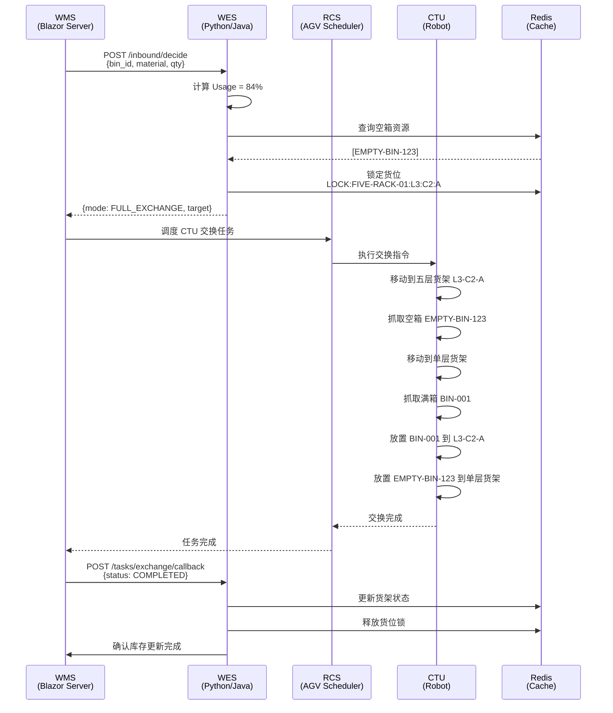
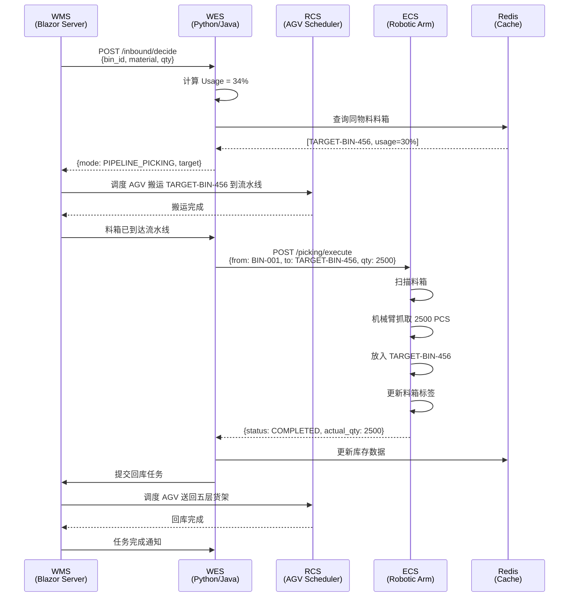

# 3.3.2 混合入库策略 (Hybrid Inbound Strategy) — 详细设计

> **版本**: v1.0
> **日期**: 2025-12-23
> **状态**: Draft
> **作者**: WMS/WES 联合设计团队

---

## 1. 技术栈 (Technology Stack)

### 1.1 WMS 层 (Northbound Business Layer)

**框架**: **Blazor Server** (ASP.NET Core 8.0+)

- **架构特点**: 前后端不分离,服务端渲染 + SignalR 实时通信
- **职责**:
  - 业务逻辑层: 库存管理、订单处理、SAP 集成
  - Web 界面: 管理员操作台、监控大屏
  - PDA 界面: 移动端作业终端 (Blazor Server 响应式页面)
  - RCS 调度接口: 通过 WMS 统一调度 AGV/CTU 搬运任务

**技术组件**:
- **数据库**: PostgreSQL (主库存数据) + Redis (缓存/会话)
- **API 网关**: 统一对外 RESTful API (SAP/WES/第三方系统)
- **消息队列**: RabbitMQ (异步任务、事件驱动)

### 1.2 WES 层 (Core Strategy & Orchestration Layer)

**框架**: **Python (FastAPI)** 或 **Java (Spring Boot)**

- **职责**:
  - 策略引擎: 混合入库模式决策 (满箱交换/优先交换/零散入库)
  - 任务编排: 生成原子任务并提交给 WMS 调度
  - 状态管理: 维护货架/料箱实时状态
  - 硬件协调: 通过 UHI (Universal Hardware Interface) 与 ECS 交互

**技术组件**:
- **数据库**: PostgreSQL (共享 WMS 数据库) + Redis (实时状态缓存)
- **API**: RESTful API (接收 WMS 请求,下发 ECS 指令)
- **事件总线**: RabbitMQ (订阅 WMS 事件,发布硬件事件)

### 1.3 集成架构 (Integration Architecture)

```
┌─────────────────────────────────────────────────────────────┐
│                    WMS (Blazor Server)                      │
│  ┌──────────────┐  ┌──────────────┐  ┌──────────────┐      │
│  │ Web 管理界面  │  │  PDA 作业端   │  │  RCS 调度器   │      │
│  └──────────────┘  └──────────────┘  └──────────────┘      │
│         ↕                ↕                  ↕                │
│  ┌──────────────────────────────────────────────────┐      │
│  │         WMS Core (业务逻辑 + 库存管理)            │      │
│  └──────────────────────────────────────────────────┘      │
└─────────────────────────────────────────────────────────────┘
                           ↕ RESTful API
┌─────────────────────────────────────────────────────────────┐
│                 WES (Python/Java)                           │
│  ┌──────────────┐  ┌──────────────┐  ┌──────────────┐      │
│  │  策略引擎     │  │  任务编排器   │  │  状态管理器   │      │
│  └──────────────┘  └──────────────┘  └──────────────┘      │
│         ↕                ↕                  ↕                │
│  ┌──────────────────────────────────────────────────┐      │
│  │         UHI (Universal Hardware Interface)        │      │
│  └──────────────────────────────────────────────────┘      │
└─────────────────────────────────────────────────────────────┘
                           ↕ HTTP/TCP/MQTT
┌─────────────────────────────────────────────────────────────┐
│              Hardware Layer (RCS/ECS/CTU)                   │
│  ┌──────────────┐  ┌──────────────┐  ┌──────────────┐      │
│  │  RCS (AGV)   │  │  CTU (机器人) │  │  ECS (机械臂) │      │
│  └──────────────┘  └──────────────┘  └──────────────┘      │
└─────────────────────────────────────────────────────────────┘
```

---

## 2. 范围与可追溯性 (Scope & Traceability)

### 2.1 SRS 章节映射

| SRS 章节 | 需求描述 | 本设计覆盖内容 |
|---------|---------|--------------|
| **§3.3.2** | 混合入库策略 (Hybrid Inbound Strategy) | ✅ 完整覆盖: 模式决策、满箱交换、零散入库 |
| **§3.1.2** | 货架类型定义 (Rack Types) | ✅ 引用: 单层货架 → 五层货架规格 |
| **§3.3.0** | WES 核心基础平台 | ✅ 依赖: 任务编排、状态管理、硬件协调 |
| **§3.7.3** | 幂等性与重试机制 | ✅ 应用: 交换任务、拣选任务的幂等设计 |

### 2.2 业务场景

**核心场景**: 单层货架 (装满料) → SMT 存储区 (五层货架)

**自动触发条件**:
1. **前置流程**: §3.3.1 料盘装箱区完成拆箱分装作业,物料已装入单层货架
2. **自动搬运**: §3.3.1 完成后,WMS 自动请求 AGV 将单层货架移动到 SMT 作业区
3. **自动触发**: 单层货架到达 SMT 作业区后,作业区自动开始运作,WES 自动触发混合入库策略
4. **决策执行**: WES 根据料箱使用率 (Usage) 和五层货架空箱资源自动决策入库模式
5. **无需指令**: 整个流程从 3.3.1 到 3.3.2 连续自动执行,无需 SAP 入库指令或人工干预

**三种入库模式**:
- **满箱交换 (Full Exchange)**: Usage ≥ 80% 且有空箱 → CTU 执行原位交换
- **优先交换 (Priority Exchange)**: 50% ≤ Usage < 80% 且有空箱 → 优先交换,无空箱则拣选
- **零散入库 (Pipeline Picking)**: Usage < 50% 或无空箱 → ECS 机械臂拣选入库

---

## 3. 参与方与职责 (Actors & Ownership)

| 参与方 | 角色 | 职责 | 技术实现 |
|-------|------|------|---------|
| **WMS** | 业务协调者 | 1. 接收 §3.3.1 完成事件并触发 AGV 搬运<br>2. 查询库存状态并触发 WES 决策<br>3. 调度 RCS 执行搬运任务<br>4. 更新库存数据 (交换后/拣选后) | Blazor Server + PostgreSQL |
| **WES** | 策略决策者 | 1. 分析料箱 Usage 和五层货架空箱资源<br>2. 决策入库模式 (满箱交换/优先交换/零散入库)<br>3. 生成原子任务 (交换任务/拣选任务)<br>4. 锁定目标货位并提交给 WMS | Python/Java + Redis |
| **RCS** | 搬运执行者 | 1. 接收 WMS 调度指令<br>2. 控制 AGV/CTU 执行搬运任务<br>3. 反馈任务状态 (进行中/完成/失败) | 第三方系统 (HTTP API) |
| **CTU** | 交换执行者 | 1. 执行五层货架的料箱交换操作<br>2. 支持 A/B 面双侧操作<br>3. 反馈交换结果 | 硬件设备 (RCS 控制) |
| **ECS** | 拣选执行者 | 1. 扫描流水线上的料箱<br>2. 接收 WES 拣选指令 (Pick_List)<br>3. 机械臂执行抓取放入操作<br>4. 反馈拣选结果 | 硬件设备 (HTTP/TCP) |
| **操作员** | 监控者 | 1. 监控入库进度<br>2. 查看异常告警 (设备故障/物料不符)<br>3. 系统级故障时手动取消任务 | WMS Web 界面 |

---

## 4. 前置条件与配置 (Preconditions & Config)

### 4.1 货架配置

**单层货架 (Single-Layer Rack)**:
- **容量**: 4 个料箱位
- **用途**: 装箱区临时存储,作为入库缓冲区
- **料箱类型**: A 型 (6 槽 7 寸盘) 或 B 型 (2 槽 7 寸 + 1 槽 13/15 寸盘)

**五层货架 (Five-Layer Rack)**:
- **容量**: 每层 4 个料箱位,总计 20 个料箱位
- **结构**: 5 层 × 4 列,具有 A/B 面区分
- **用途**: SMT 存储区高密度存储
- **CTU 操作**: 支持双侧操作,可同时访问 A 面和 B 面

### 4.2 料箱使用率定义

**Usage 计算公式**:
```
Usage = (当前物料数量 / 料箱标准容量) × 100%
```

**示例**:
- 7 寸盘标准容量: 5000 PCS
- 当前物料数量: 4200 PCS
- Usage = (4200 / 5000) × 100% = 84% → **满箱交换模式**

### 4.3 空箱资源判断

**空箱定义**: 五层货架上 Usage = 0% 的料箱

**资源查询逻辑**:
1. WES 查询五层货架实时状态 (Redis 缓存)
2. 筛选 Usage = 0% 的料箱位
3. 优先选择同一层、同一列的空箱 (减少 CTU 移动距离)
4. 返回可用空箱列表及其货位信息 (层号、列号、A/B 面)

### 4.4 系统配置参数

| 参数名 | 默认值 | 说明 |
|-------|-------|------|
| `FULL_EXCHANGE_THRESHOLD` | 80% | 满箱交换阈值 |
| `PRIORITY_EXCHANGE_THRESHOLD` | 50% | 优先交换阈值 |
| `CTU_TIMEOUT` | 300s | CTU 交换任务超时时间 |
| `ECS_TIMEOUT` | 180s | ECS 拣选任务超时时间 |
| `RETRY_ATTEMPTS` | 3 | 任务失败重试次数 |
| `LOCK_TIMEOUT` | 600s | 货位锁定超时时间 |

---

## 5. 子功能流程 (Sub-function Flows)

### 5.1 模式决策流程 (Mode Decision Flow)

**自动触发条件**: §3.3.1 完成拆箱分装后,单层货架到达 SMT 作业区

**输入**:
- `Bin_ID`: 单层货架上的料箱 ID
- `Material_Code`: 物料代码
- `Current_Qty`: 当前物料数量
- `Standard_Capacity`: 料箱标准容量
- `Rack_Location`: 单层货架当前位置 (SMT 作业区)

**输出**:
- `Inbound_Mode`: 入库模式 (FULL_EXCHANGE / PRIORITY_EXCHANGE / PIPELINE_PICKING)
- `Target_Location`: 目标货位 (五层货架位置)
- `Task_ID`: 生成的任务 ID

**流程步骤**:

1. **§3.3.1 → WMS**: 拆箱分装完成,请求 AGV 搬运单层货架到 SMT 作业区
   ```json
   POST /wms/api/v1/kitting/complete
   {
     "kitting_task_id": "KITTING-20251223-001",
     "rack_id": "SINGLE-RACK-01",
     "bins": [
       {
         "bin_id": "BIN-001",
         "material_code": "Capacitor-001",
         "current_qty": 4200,
         "standard_capacity": 5000
       }
     ],
     "target_area": "SMT_OPERATION_AREA"
   }
   ```

2. **WMS → RCS**: 调度 AGV 搬运单层货架
   ```json
   POST /rcs/api/v1/transport/create
   {
     "rack_id": "SINGLE-RACK-01",
     "from_location": "KITTING_AREA",
     "to_location": "SMT_OPERATION_AREA",
     "priority": "NORMAL"
   }
   ```

3. **RCS → WMS**: 反馈单层货架到达 SMT 作业区
   ```json
   POST /wms/api/v1/events/rack-arrived
   {
     "rack_id": "SINGLE-RACK-01",
     "location": "SMT_OPERATION_AREA",
     "arrival_time": "2025-12-23T10:15:00Z"
   }
   ```

4. **WMS → WES**: 自动触发入库决策请求
   ```json
   POST /wes/api/v1/inbound/decide
   {
     "bin_id": "BIN-001",
     "material_code": "Capacitor-001",
     "current_qty": 4200,
     "standard_capacity": 5000,
     "source_rack": "SINGLE-RACK-01",
     "source_location": "SMT_OPERATION_AREA"
   }
   ```

5. **WES**: 计算料箱使用率
   ```python
   usage = (current_qty / standard_capacity) * 100
   # 示例: (4200 / 5000) * 100 = 84%
   ```

6. **WES**: 查询五层货架空箱资源
   ```python
   empty_bins = query_empty_bins(target_area="SMT_STORAGE")
   # 返回: [{"rack_id": "FIVE-RACK-01", "layer": 3, "column": 2, "side": "A", "bin_id": "EMPTY-BIN-123"}]
   ```

7. **WES**: 决策入库模式
   ```python
   if usage >= 80 and len(empty_bins) > 0:
       mode = "FULL_EXCHANGE"
       target_bin = select_optimal_empty_bin(empty_bins)
   elif 50 <= usage < 80 and len(empty_bins) > 0:
       mode = "PRIORITY_EXCHANGE"
       target_bin = select_optimal_empty_bin(empty_bins)
   else:
       mode = "PIPELINE_PICKING"
       target_bin = select_target_bin_for_picking(material_code)
   ```

8. **WES → WMS**: 返回决策结果
   ```json
   {
     "task_id": "TASK-20251223-001",
     "inbound_mode": "FULL_EXCHANGE",
     "source_bin": "BIN-001",
     "target_bin": "EMPTY-BIN-123",
     "target_location": {
       "rack_id": "FIVE-RACK-01",
       "layer": 3,
       "column": 2,
       "side": "A"
     }
   }
   ```

9. **WES**: 锁定目标货位
   - 在 Redis 中设置货位锁: `LOCK:FIVE-RACK-01:L3:C2:A = TASK-20251223-001`
   - 锁定超时时间: 600 秒

---

### 5.2 满箱交换流程 (Full Exchange Flow)

**前置条件**:
- 料箱 Usage ≥ 80%
- 五层货架有可用空箱
- WES 已锁定目标货位

**参与方**: WMS, WES, RCS, CTU

**流程步骤**:

1. **WES → WMS**: 提交交换任务
   ```json
   POST /wms/api/v1/tasks/exchange
   {
     "task_id": "TASK-20251223-001",
     "task_type": "BIN_EXCHANGE",
     "source_bin": "BIN-001",
     "source_location": "SINGLE-RACK-01",
     "target_bin": "EMPTY-BIN-123",
     "target_location": {
       "rack_id": "FIVE-RACK-01",
       "layer": 3,
       "column": 2,
       "side": "A"
     },
     "priority": "HIGH"
   }
   ```

2. **WMS**: 调度 RCS 执行搬运
   - WMS 生成 RCS 搬运指令: 将 `BIN-001` 从单层货架搬运到五层货架 L3-C2-A 位置
   - RCS 分配 CTU 机器人执行任务

3. **CTU**: 执行交换操作
   - **步骤 3.1**: CTU 移动到五层货架 L3-C2-A 位置
   - **步骤 3.2**: CTU 抓取空箱 `EMPTY-BIN-123` 并暂存
   - **步骤 3.3**: CTU 移动到单层货架 `SINGLE-RACK-01` 位置
   - **步骤 3.4**: CTU 抓取满箱 `BIN-001`
   - **步骤 3.5**: CTU 将满箱 `BIN-001` 放置到五层货架 L3-C2-A 位置
   - **步骤 3.6**: CTU 将空箱 `EMPTY-BIN-123` 放置到单层货架 `SINGLE-RACK-01` 位置

4. **RCS → WMS**: 反馈任务完成
   ```json
   {
     "task_id": "TASK-20251223-001",
     "status": "COMPLETED",
     "completion_time": "2025-12-23T10:30:00Z"
   }
   ```

5. **WMS → WES**: 通知交换完成
   ```json
   POST /wes/api/v1/tasks/exchange/callback
   {
     "task_id": "TASK-20251223-001",
     "status": "COMPLETED"
   }
   ```

6. **WES**: 更新库存属性
   ```python
   # 交换两个料箱的库存属性
   swap_bin_inventory(
       bin_1="BIN-001",
       location_1="FIVE-RACK-01:L3:C2:A",
       bin_2="EMPTY-BIN-123",
       location_2="SINGLE-RACK-01"
   )

   # 更新 Redis 缓存
   update_rack_status("FIVE-RACK-01", layer=3, column=2, side="A", bin_id="BIN-001")
   update_rack_status("SINGLE-RACK-01", bin_id="EMPTY-BIN-123")

   # 释放货位锁
   release_lock("FIVE-RACK-01:L3:C2:A")
   ```

7. **WES → WMS**: 确认库存更新完成
   ```json
   {
     "task_id": "TASK-20251223-001",
     "inventory_updated": true,
     "new_locations": {
       "BIN-001": "FIVE-RACK-01:L3:C2:A",
       "EMPTY-BIN-123": "SINGLE-RACK-01"
     }
   }
   ```

**异常处理**:
- **CTU 故障**: WES 自动重试 3 次 (间隔 10 秒),失败后任务进入 FAILED 状态,触发告警通知运维团队
- **货位冲突**: WES 检测到目标货位已被占用,自动重新选择空箱并重新调度
- **物料不符**: 系统检测到物料代码不匹配,WES 自动回滚任务并触发告警

---

### 5.3 优先交换流程 (Priority Exchange Flow)

**前置条件**:
- 50% ≤ 料箱 Usage < 80%
- 五层货架有可用空箱

**流程逻辑**:
1. **优先尝试交换**: 与满箱交换流程相同 (§5.2)
2. **降级处理**: 若交换过程中空箱被其他任务占用,WES 自动降级为零散入库模式 (§5.4)

**决策代码**:
```python
if 50 <= usage < 80:
    empty_bins = query_empty_bins(target_area="SMT_STORAGE")
    if len(empty_bins) > 0:
        # 尝试交换
        execute_full_exchange(bin_id, empty_bins[0])
    else:
        # 降级为零散入库
        execute_pipeline_picking(bin_id)
```

---

### 5.4 零散入库流程 (Pipeline Picking Flow)

**前置条件**:
- 料箱 Usage < 50% 或 无可用空箱
- 流水线可用 (ECS 机械臂正常)

**参与方**: WMS, WES, RCS, ECS

**流程步骤**:

1. **WES**: 选择目标料箱
   ```python
   # 查询五层货架上同物料的料箱,选择 Usage 最低的作为目标
   target_bin = query_target_bin(
       material_code="Capacitor-001",
       sort_by="usage_asc"
   )
   # 返回: {"bin_id": "TARGET-BIN-456", "location": "FIVE-RACK-02:L2:C1:B", "usage": 30%}
   ```

2. **WES → WMS**: 提交搬运任务 (将目标料箱搬运到流水线)
   ```json
   POST /wms/api/v1/tasks/transport
   {
     "task_id": "TASK-20251223-002",
     "task_type": "BIN_TRANSPORT",
     "source_bin": "TARGET-BIN-456",
     "source_location": "FIVE-RACK-02:L2:C1:B",
     "destination": "PIPELINE-01",
     "priority": "NORMAL"
   }
   ```

3. **WMS → RCS**: 调度 AGV 搬运目标料箱到流水线

4. **RCS → WMS**: 反馈搬运完成
   ```json
   {
     "task_id": "TASK-20251223-002",
     "status": "COMPLETED",
     "bin_location": "PIPELINE-01"
   }
   ```

5. **WMS → WES**: 通知料箱已到达流水线

6. **WES → ECS**: 下发拣选指令
   ```json
   POST /ecs/api/v1/picking/execute
   {
     "task_id": "TASK-20251223-003",
     "pick_list": [
       {
         "from_bin": "BIN-001",
         "to_bin": "TARGET-BIN-456",
         "material_code": "Capacitor-001",
         "qty": 2500,
         "tray_size": "7-inch"
       }
     ]
   }
   ```

7. **ECS**: 执行拣选操作
   - **步骤 7.1**: ECS 扫描流水线上的 `BIN-001` 和 `TARGET-BIN-456`
   - **步骤 7.2**: 机械臂从 `BIN-001` 抓取 2500 PCS 物料
   - **步骤 7.3**: 机械臂将物料放入 `TARGET-BIN-456`
   - **步骤 7.4**: ECS 更新料箱标签 (打印新的物料数量)

8. **ECS → WES**: 反馈拣选完成
   ```json
   {
     "task_id": "TASK-20251223-003",
     "status": "COMPLETED",
     "actual_qty": 2500,
     "from_bin_remaining": 1700,
     "to_bin_new_qty": 4000
   }
   ```

9. **WES**: 更新库存数据
   ```python
   # 更新源料箱库存
   update_bin_inventory("BIN-001", new_qty=1700, usage=34%)

   # 更新目标料箱库存
   update_bin_inventory("TARGET-BIN-456", new_qty=4000, usage=80%)
   ```

10. **WES → WMS**: 提交回库任务 (将目标料箱送回五层货架)
    ```json
    POST /wms/api/v1/tasks/transport
    {
      "task_id": "TASK-20251223-004",
      "task_type": "BIN_RETURN",
      "source_bin": "TARGET-BIN-456",
      "source_location": "PIPELINE-01",
      "destination": "FIVE-RACK-02:L2:C1:B",
      "priority": "NORMAL"
    }
    ```

11. **WMS → RCS**: 调度 AGV 将料箱送回五层货架

12. **RCS → WMS → WES**: 反馈回库完成

**异常处理**:
- **ECS 拣选失败**: WES 自动重试 3 次 (间隔 10 秒),失败后任务进入 FAILED 状态,触发告警通知运维团队
- **物料数量不符**: ECS 反馈实际拣选数量与预期不符,WES 记录差异并触发告警,系统根据实际数量更新库存
- **流水线堵塞**: WES 检测到流水线占用超时,自动暂停新任务并触发告警,等待流水线恢复后自动继续

---

## 6. 时序图 (Sequence Diagram)

### 6.1 满箱交换时序图 (Full Exchange Sequence)



### 6.2 零散入库时序图 (Pipeline Picking Sequence)



---

## 7. 工业运营对齐点 (Industrial Ops Alignment)

### 7.1 与 SAP 集成对齐

| 对齐点 | SAP 系统 | WMS/WES 系统 | 数据同步方式 |
|-------|---------|-------------|------------|
| **入库指令** | SAP 生成入库单 (Inbound Delivery) | WMS 接收并触发 WES 决策 | RESTful API (实时) |
| **库存确认** | SAP 更新库存主数据 | WES 完成入库后,WMS 回传确认 | Webhook (异步) |
| **物料主数据** | SAP 维护物料代码、容量、属性 | WMS 同步物料主数据 | 定时同步 (每小时) |
| **货位管理** | SAP 维护逻辑货位 | WES 维护物理货位 (五层货架) | 双向映射 |

### 7.2 与 RCS 集成对齐

| 对齐点 | WMS 职责 | RCS 职责 | 接口协议 |
|-------|---------|---------|---------|
| **任务调度** | WMS 生成搬运需求 | RCS 分配 AGV/CTU 资源 | HTTP API |
| **路径规划** | WMS 指定起点和终点 | RCS 计算最优路径 | RCS 内部逻辑 |
| **状态反馈** | WMS 接收任务状态 | RCS 实时上报进度 | Webhook |
| **异常处理** | WMS 决策重试或取消 | RCS 上报设备故障 | 事件通知 |

### 7.3 与 ECS 集成对齐

| 对齐点 | WES 职责 | ECS 职责 | 接口协议 |
|-------|---------|---------|---------|
| **拣选指令** | WES 生成 Pick_List | ECS 执行机械臂操作 | HTTP/TCP |
| **视觉识别** | WES 提供料箱 ID | ECS 扫描并验证 | ECS 内部逻辑 |
| **数量确认** | WES 接收实际拣选数量 | ECS 反馈执行结果 | JSON 响应 |
| **标签打印** | WES 提供新标签数据 | ECS 控制打印机 | 打印指令 |

---

## 8. 数据说明 (Data Notes)

### 8.1 料箱数据模型 (Bin Data Model)

```json
{
  "bin_id": "BIN-001",
  "material_code": "Capacitor-001",
  "current_qty": 4200,
  "standard_capacity": 5000,
  "usage": 84.0,
  "bin_type": "A",
  "tray_size": "7-inch",
  "location": {
    "rack_id": "FIVE-RACK-01",
    "layer": 3,
    "column": 2,
    "side": "A"
  },
  "status": "ACTIVE",
  "last_updated": "2025-12-23T10:30:00Z"
}
```

### 8.2 五层货架数据模型 (Five-Layer Rack Model)

```json
{
  "rack_id": "FIVE-RACK-01",
  "rack_type": "FIVE_LAYER",
  "total_capacity": 20,
  "occupied_bins": 15,
  "empty_bins": 5,
  "layers": [
    {
      "layer_number": 1,
      "columns": [
        {
          "column_number": 1,
          "side_a": {"bin_id": "BIN-101", "usage": 90.0},
          "side_b": {"bin_id": "BIN-102", "usage": 75.0}
        },
        {
          "column_number": 2,
          "side_a": {"bin_id": "EMPTY-BIN-123", "usage": 0.0},
          "side_b": {"bin_id": "BIN-104", "usage": 60.0}
        }
      ]
    }
  ],
  "status": "OPERATIONAL",
  "last_sync": "2025-12-23T10:25:00Z"
}
```

### 8.3 任务数据模型 (Task Data Model)

```json
{
  "task_id": "TASK-20251223-001",
  "task_type": "BIN_EXCHANGE",
  "inbound_mode": "FULL_EXCHANGE",
  "source_bin": "BIN-001",
  "source_location": "SINGLE-RACK-01",
  "target_bin": "EMPTY-BIN-123",
  "target_location": {
    "rack_id": "FIVE-RACK-01",
    "layer": 3,
    "column": 2,
    "side": "A"
  },
  "priority": "HIGH",
  "status": "IN_PROGRESS",
  "created_at": "2025-12-23T10:20:00Z",
  "updated_at": "2025-12-23T10:25:00Z",
  "retry_count": 0,
  "max_retries": 3
}
```

---

## 9. 功能界面设计 (Functional Page Design)

### 9.1 WMS Web 管理界面 (Admin Console)

#### 9.1.1 混合入库监控大屏 (Hybrid Inbound Dashboard)

**页面路径**: `/wms/inbound/hybrid-strategy`

**功能模块**:

1. **实时任务看板 (Real-time Task Board)**
   - 显示当前进行中的入库任务
   - 任务类型: 满箱交换 / 优先交换 / 零散入库
   - 任务状态: 待调度 / 进行中 / 已完成 / 失败
   - 预计完成时间 (ETA)

2. **五层货架热力图 (Rack Heatmap)**
   - 可视化显示五层货架的占用率
   - 颜色编码: 绿色 (0-50%) / 黄色 (50-80%) / 红色 (80-100%)
   - 点击货位显示详细信息 (料箱 ID、物料代码、数量)

3. **入库模式统计 (Mode Statistics)**
   - 饼图: 满箱交换 vs 优先交换 vs 零散入库的比例
   - 柱状图: 每小时入库任务数量趋势
   - 成功率: 完成任务数 / 总任务数

4. **异常告警列表 (Alert List)**
   - CTU 故障告警
   - ECS 拣选失败告警
   - 货位冲突告警
   - 流水线堵塞告警

**界面布局**:
```
┌─────────────────────────────────────────────────────────────┐
│  混合入库监控大屏                          [刷新] [导出报表]  │
├─────────────────────────────────────────────────────────────┤
│  ┌─────────────────────┐  ┌─────────────────────────────┐  │
│  │  实时任务看板        │  │  五层货架热力图              │  │
│  │  ┌───────────────┐  │  │  ┌─────────────────────┐  │  │
│  │  │ TASK-001      │  │  │  │ L5 [■][■][□][■]    │  │  │
│  │  │ 满箱交换      │  │  │  │ L4 [■][□][■][■]    │  │  │
│  │  │ 进行中 (60%)  │  │  │  │ L3 [□][■][■][□]    │  │  │
│  │  └───────────────┘  │  │  │ L2 [■][■][■][■]    │  │  │
│  │  ┌───────────────┐  │  │  │ L1 [■][□][■][■]    │  │  │
│  │  │ TASK-002      │  │  │  └─────────────────────┘  │  │
│  │  │ 零散入库      │  │  │  ■ 已占用  □ 空闲         │  │
│  │  │ 待调度        │  │  │                            │  │
│  │  └───────────────┘  │  └─────────────────────────────┘  │
│  └─────────────────────┘                                    │
│  ┌─────────────────────┐  ┌─────────────────────────────┐  │
│  │  入库模式统计        │  │  异常告警列表                │  │
│  │  [饼图]             │  │  ⚠️ CTU-01 故障 (10:25)    │  │
│  │  满箱交换: 45%      │  │  ⚠️ 流水线堵塞 (10:30)     │  │
│  │  优先交换: 30%      │  │  ⚠️ 货位冲突 (10:35)       │  │
│  │  零散入库: 25%      │  │                            │  │
│  └─────────────────────┘  └─────────────────────────────┘  │
└─────────────────────────────────────────────────────────────┘
```

#### 9.1.2 任务详情页 (Task Detail Page)

**页面路径**: `/wms/inbound/tasks/{task_id}`

**功能模块**:

1. **任务基本信息**
   - 任务 ID、类型、模式、优先级
   - 创建时间、更新时间、完成时间
   - 源料箱、目标料箱、货位信息

2. **执行时间线 (Timeline)**
   - 显示任务执行的每个步骤
   - 时间戳、操作描述、执行结果

3. **操作按钮**
   - 重试任务 (失败时可用)
   - 取消任务 (进行中时可用)
   - 查看日志 (查看详细执行日志)

---

### 9.2 PDA 移动端界面 (Mobile Interface)

#### 9.2.1 入库任务列表 (Inbound Task List)

**页面路径**: `/pda/inbound/tasks`

**功能**:
- 显示分配给当前操作员的入库任务
- 任务状态: 待处理 / 进行中 / 已完成
- 点击任务进入详情页

**界面布局**:
```
┌─────────────────────┐
│  入库任务列表        │
├─────────────────────┤
│  ┌───────────────┐  │
│  │ TASK-001      │  │
│  │ 满箱交换      │  │
│  │ BIN-001 → L3  │  │
│  │ [开始作业]    │  │
│  └───────────────┘  │
│  ┌───────────────┐  │
│  │ TASK-002      │  │
│  │ 零散入库      │  │
│  │ BIN-002 → 流水线│  │
│  │ [开始作业]    │  │
│  └───────────────┘  │
└─────────────────────┘
```

#### 9.2.2 料箱扫描页 (Bin Scan Page)

**页面路径**: `/pda/inbound/scan`

**功能**:
- 扫描料箱二维码
- 显示料箱信息 (物料代码、数量、Usage)
- 确认入库模式 (满箱交换 / 零散入库)
- 提交入库请求

**界面布局**:
```
┌─────────────────────┐
│  料箱扫描            │
├─────────────────────┤
│  [扫描二维码]        │
│                     │
│  料箱 ID: BIN-001   │
│  物料: Capacitor-001│
│  数量: 4200 PCS     │
│  Usage: 84%         │
│                     │
│  入库模式: 满箱交换  │
│                     │
│  [确认入库]         │
└─────────────────────┘
```

#### 9.2.3 监控查看页 (Monitoring Page)

**页面路径**: `/pda/inbound/monitor`

**功能**:
- 显示当前入库任务状态
- 查看异常告警列表
- 查看设备状态 (CTU/ECS/RCS)

**界面布局**:
```
┌─────────────────────┐
│  入库监控            │
├─────────────────────┤
│  ⚠️ TASK-001        │
│  CTU 故障           │
│  BIN-001 交换失败   │
│  状态: FAILED       │
│  [查看详情]         │
│                     │
│  ⚠️ TASK-002        │
│  物料数量不符       │
│  预期: 2500 PCS     │
│  实际: 2450 PCS     │
│  状态: COMPLETED    │
│  [查看详情]         │
└─────────────────────┘
```

---

## 10. 特殊机制 (Special Mechanisms)

### 10.1 货位锁定机制 (Location Locking Mechanism)

**目的**: 防止多个任务同时操作同一货位,避免货位冲突

**实现方式**:
1. **Redis 分布式锁**: 使用 Redis `SETNX` 命令实现分布式锁
2. **锁定键格式**: `LOCK:{rack_id}:{layer}:{column}:{side}`
3. **锁定值**: 任务 ID (用于追溯锁定来源)
4. **锁定超时**: 600 秒 (10 分钟),防止死锁

**代码示例**:
```python
def acquire_location_lock(rack_id, layer, column, side, task_id, timeout=600):
    lock_key = f"LOCK:{rack_id}:L{layer}:C{column}:{side}"
    acquired = redis.set(lock_key, task_id, nx=True, ex=timeout)
    if acquired:
        logger.info(f"Lock acquired: {lock_key} by {task_id}")
        return True
    else:
        logger.warning(f"Lock failed: {lock_key} already locked")
        return False

def release_location_lock(rack_id, layer, column, side):
    lock_key = f"LOCK:{rack_id}:L{layer}:C{column}:{side}"
    redis.delete(lock_key)
    logger.info(f"Lock released: {lock_key}")
```

---

### 10.2 幂等性设计 (Idempotency Design)

**目的**: 确保任务重试时不会产生重复操作或数据不一致

**实现方式**:

1. **任务 ID 唯一性**: 每个任务生成唯一 ID (UUID)
2. **状态机管理**: 任务状态严格按照状态机转换
   - `PENDING` → `IN_PROGRESS` → `COMPLETED` / `FAILED`
3. **重复请求检测**: 检查任务 ID 是否已存在
4. **操作日志**: 记录每次操作的时间戳和结果

**状态机示例**:
```python
class TaskStatus(Enum):
    PENDING = "PENDING"
    IN_PROGRESS = "IN_PROGRESS"
    COMPLETED = "COMPLETED"
    FAILED = "FAILED"
    CANCELLED = "CANCELLED"

def execute_task_idempotent(task_id):
    task = get_task(task_id)

    if task.status == TaskStatus.COMPLETED:
        logger.info(f"Task {task_id} already completed, skipping")
        return {"status": "ALREADY_COMPLETED"}

    if task.status == TaskStatus.IN_PROGRESS:
        logger.warning(f"Task {task_id} already in progress")
        return {"status": "IN_PROGRESS"}

    # 执行任务
    task.status = TaskStatus.IN_PROGRESS
    save_task(task)

    try:
        result = execute_task_logic(task)
        task.status = TaskStatus.COMPLETED
        save_task(task)
        return result
    except Exception as e:
        task.status = TaskStatus.FAILED
        task.error_message = str(e)
        save_task(task)
        raise
```

---

### 10.3 自动恢复策略 (Auto-Recovery Strategy)

**目的**: 当自动化设备故障时,系统能够自动等待设备恢复并继续执行,保证业务连续性

**恢复场景**:

1. **CTU 故障恢复**:
   - 故障检测: CTU 连续 3 次失败或设备离线
   - 自动处理: 任务进入 FAILED 状态,触发告警
   - 恢复机制: 设备恢复后,系统自动重新调度失败任务

2. **ECS 故障恢复**:
   - 故障检测: ECS 连续 3 次失败或设备离线
   - 自动处理: 任务进入 FAILED 状态,触发告警
   - 恢复机制: 设备恢复后,系统自动重新调度失败任务

3. **RCS 故障恢复**:
   - 故障检测: RCS 系统离线或 AGV 全部故障
   - 自动处理: 暂停新任务调度,触发告警
   - 恢复机制: RCS 恢复后,系统自动继续调度任务

**自动恢复流程**:
```python
def execute_with_auto_recovery(task, max_retries=3):
    retry_count = 0

    while retry_count < max_retries:
        try:
            # 尝试自动执行
            result = execute_auto_mode(task)
            return result
        except DeviceError as e:
            retry_count += 1
            logger.warning(f"Auto mode failed (attempt {retry_count}): {e}")
            time.sleep(10)  # 等待 10 秒后重试

    # 自动模式失败,任务进入 FAILED 状态
    logger.error(f"Auto mode failed after {max_retries} attempts")
    task.status = TaskStatus.FAILED
    task.error_message = f"Device error after {max_retries} retries"
    save_task(task)

    # 触发告警通知运维团队
    trigger_alert(
        level="HIGH",
        message=f"Task {task.task_id} failed due to device error",
        device=task.device_type
    )

    return {"status": "FAILED", "reason": "DEVICE_ERROR"}

def auto_recovery_scheduler():
    """自动恢复调度器 - 定期检查失败任务并重试"""
    while True:
        # 查询所有 FAILED 状态的任务
        failed_tasks = get_failed_tasks()

        for task in failed_tasks:
            # 检查设备是否已恢复
            if is_device_healthy(task.device_type):
                logger.info(f"Device {task.device_type} recovered, retrying task {task.task_id}")
                # 重置任务状态并重新调度
                task.status = TaskStatus.PENDING
                task.retry_count = 0
                save_task(task)
                schedule_task(task)

        time.sleep(60)  # 每分钟检查一次
```

---

### 10.4 优先级调度 (Priority Scheduling)

**目的**: 根据任务优先级和业务紧急程度,优化任务调度顺序

**优先级定义**:

| 优先级 | 场景 | 调度策略 |
|-------|------|---------|
| **HIGH** | 满箱交换 (Usage ≥ 80%) | 优先调度,减少等待时间 |
| **NORMAL** | 优先交换 (50% ≤ Usage < 80%) | 正常调度 |
| **LOW** | 零散入库 (Usage < 50%) | 低优先级,可延后处理 |
| **URGENT** | 生产线急需物料 | 最高优先级,立即调度 |

**调度算法**:
```python
def schedule_tasks():
    # 从任务队列中获取待调度任务
    pending_tasks = get_pending_tasks()

    # 按优先级排序 (URGENT > HIGH > NORMAL > LOW)
    sorted_tasks = sorted(pending_tasks, key=lambda t: (
        -priority_weight(t.priority),  # 优先级权重
        t.created_at  # 创建时间 (FIFO)
    ))

    # 调度任务
    for task in sorted_tasks:
        if can_schedule(task):
            dispatch_task(task)

def priority_weight(priority):
    weights = {
        "URGENT": 4,
        "HIGH": 3,
        "NORMAL": 2,
        "LOW": 1
    }
    return weights.get(priority, 1)
```

---

## 11. 总结 (Summary)

### 11.1 设计要点

1. **三种入库模式**: 满箱交换、优先交换、零散入库,根据料箱 Usage 和空箱资源智能决策
2. **分层架构**: WMS (业务层) → WES (策略层) → RCS/ECS (硬件层),职责清晰,解耦合
3. **状态管理**: Redis 缓存实时状态,PostgreSQL 持久化库存数据
4. **幂等性设计**: 任务重试不会产生重复操作,保证数据一致性
5. **自动恢复策略**: 设备故障时,系统自动等待设备恢复并重新调度任务,保证业务连续性

### 11.2 技术亮点

1. **货位锁定机制**: Redis 分布式锁防止货位冲突
2. **优先级调度**: 根据业务紧急程度优化任务调度顺序
3. **实时监控**: Web 管理界面提供实时任务看板和五层货架热力图
4. **自动恢复**: 设备故障后自动检测恢复并重新调度失败任务

### 11.3 实施建议

1. **分阶段实施**:
   - **阶段 1**: 实现满箱交换流程 (最常用场景)
   - **阶段 2**: 实现零散入库流程 (复杂场景)
   - **阶段 3**: 实现优先交换和自动恢复策略 (优化场景)

2. **测试策略**:
   - **单元测试**: 测试 WES 决策逻辑、货位锁定机制
   - **集成测试**: 测试 WMS-WES-RCS-ECS 集成流程
   - **压力测试**: 测试高并发场景下的任务调度性能

3. **监控与告警**:
   - **实时监控**: 任务执行进度、设备状态、货架占用率
   - **告警机制**: CTU/ECS 故障、货位冲突、流水线堵塞
   - **性能指标**: 任务完成率、平均执行时间、设备利用率

---

## 12. 团队职责分工 (Team Responsibilities)

| 功能点 | WMS 团队 | WES 团队 | ECS 团队 | 协同要求 |
|-------|---------|---------|---------|---------|
| **模式决策逻辑** | - | ✅ 实现决策算法 (Usage 计算、空箱查询) | - | WES 独立完成 |
| **满箱交换流程** | ✅ 调度 RCS,更新库存 | ✅ 生成交换任务,锁定货位 | - | WMS-WES API 集成 |
| **零散入库流程** | ✅ 调度 RCS 搬运 | ✅ 生成拣选任务,更新库存 | ✅ 执行机械臂拣选 | WMS-WES-ECS 三方协同 |
| **货位锁定机制** | - | ✅ Redis 分布式锁实现 | - | WES 独立完成 |
| **幂等性设计** | ✅ 任务状态管理 | ✅ 任务 ID 生成,重复检测 | - | WMS-WES 协同 |
| **自动恢复策略** | - | ✅ 故障检测,自动恢复调度 | - | WES 独立完成 |
| **优先级调度** | ✅ RCS 任务优先级传递 | ✅ 任务优先级计算 | - | WMS-WES 协同 |
| **Web 管理界面** | ✅ Blazor Server 实现 | - | - | WMS 独立完成 |
| **PDA 移动端** | ✅ Blazor Server 响应式页面 | - | - | WMS 独立完成 |
| **五层货架状态管理** | ✅ PostgreSQL 持久化 | ✅ Redis 实时缓存 | - | WMS-WES 数据同步 |
| **料箱数据模型** | ✅ 数据库表设计 | ✅ 数据模型定义 | - | WMS-WES 协同 |
| **任务数据模型** | ✅ 数据库表设计 | ✅ 数据模型定义 | - | WMS-WES 协同 |
| **SAP 集成** | ✅ RESTful API 接口 | - | - | WMS 独立完成 |
| **RCS 集成** | ✅ HTTP API 调用 | - | - | WMS 独立完成 |
| **ECS 集成** | - | ✅ HTTP/TCP 协议适配 | ✅ 接口实现 | WES-ECS 协同 |
| **监控与告警** | ✅ Web 界面展示 | ✅ 告警规则引擎 | ✅ 设备状态上报 | 三方协同 |
| **日志与审计** | ✅ 操作日志记录 | ✅ 任务执行日志 | ✅ 设备操作日志 | 三方协同 |

### 12.1 WMS 团队职责 (ASP.NET/Blazor)

**核心职责**: 业务逻辑、Web 界面、PDA 界面、SAP 集成、RCS 调度

**开发任务**:
1. **Web 管理界面**:
   - 混合入库监控大屏 (`/wms/inbound/hybrid-strategy`)
   - 任务详情页 (`/wms/inbound/tasks/{task_id}`)
   - 五层货架热力图组件
   - 实时任务看板组件

2. **PDA 移动端**:
   - 入库任务列表 (`/pda/inbound/tasks`)
   - 料箱扫描页 (`/pda/inbound/scan`)
   - 监控查看页 (`/pda/inbound/monitor`)

3. **API 接口**:
   - `POST /wms/api/v1/tasks/exchange` - 接收 WES 交换任务
   - `POST /wms/api/v1/tasks/transport` - 接收 WES 搬运任务
   - `GET /wms/api/v1/racks/{rack_id}/status` - 查询货架状态

4. **RCS 集成**:
   - 调度 RCS 执行 AGV/CTU 搬运任务
   - 接收 RCS 任务状态反馈

5. **数据库设计**:
   - 料箱表 (`bins`)
   - 货架表 (`racks`)
   - 任务表 (`tasks`)

### 12.2 WES 团队职责 (Python/Java)

**核心职责**: 策略引擎、任务编排、状态管理、硬件协调

**开发任务**:
1. **策略引擎**:
   - 模式决策算法 (`decide_inbound_mode()`)
   - Usage 计算逻辑 (`calculate_usage()`)
   - 空箱资源查询 (`query_empty_bins()`)
   - 目标料箱选择 (`select_target_bin()`)

2. **任务编排**:
   - 满箱交换任务生成 (`generate_exchange_task()`)
   - 零散入库任务生成 (`generate_picking_task()`)
   - 任务优先级计算 (`calculate_priority()`)

3. **状态管理**:
   - Redis 实时状态缓存
   - 货位锁定机制 (`acquire_location_lock()`, `release_location_lock()`)
   - 任务状态机管理

4. **API 接口**:
   - `POST /wes/api/v1/inbound/decide` - 接收 WMS 入库决策请求
   - `POST /wes/api/v1/tasks/exchange/callback` - 接收 WMS 交换完成通知
   - `POST /ecs/api/v1/picking/execute` - 下发 ECS 拣选指令

5. **特殊机制**:
   - 幂等性设计 (`execute_task_idempotent()`)
   - 自动恢复策略 (`execute_with_auto_recovery()`, `auto_recovery_scheduler()`)
   - 优先级调度 (`schedule_tasks()`)

### 12.3 ECS 团队职责 (硬件开发)

**核心职责**: 设备控制、机械臂操作、视觉识别、传感器集成

**开发任务**:
1. **拣选执行**:
   - 接收 WES 拣选指令 (`POST /ecs/api/v1/picking/execute`)
   - 机械臂抓取放入操作
   - 料箱扫描与验证

2. **视觉识别**:
   - 料箱二维码扫描
   - 物料识别与验证

3. **标签打印**:
   - 接收 WES 标签数据
   - 控制打印机打印新标签

4. **状态上报**:
   - 实时上报设备状态 (正常/故障/离线)
   - 反馈拣选结果 (成功/失败/数量不符)

### 12.4 协同接口定义

**WMS ↔ WES 接口**:
- `POST /wes/api/v1/inbound/decide` - WMS 请求 WES 决策入库模式
- `POST /wms/api/v1/tasks/exchange` - WES 提交交换任务给 WMS
- `POST /wms/api/v1/tasks/transport` - WES 提交搬运任务给 WMS
- `POST /wes/api/v1/tasks/exchange/callback` - WMS 通知 WES 交换完成

**WES ↔ ECS 接口**:
- `POST /ecs/api/v1/picking/execute` - WES 下发拣选指令给 ECS
- `POST /wes/api/v1/picking/callback` - ECS 反馈拣选结果给 WES

**WMS ↔ RCS 接口**:
- `POST /rcs/api/v1/tasks/transport` - WMS 调度 RCS 执行搬运
- `POST /wms/api/v1/rcs/callback` - RCS 反馈任务状态给 WMS

---

**文档结束**

