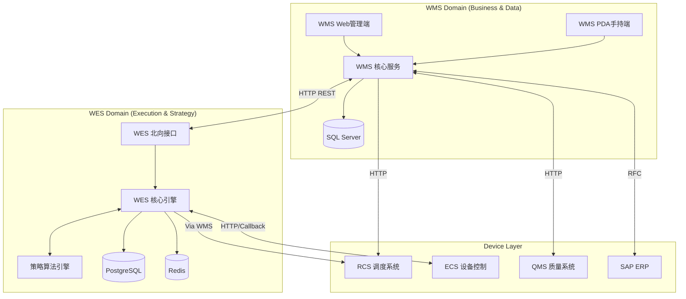
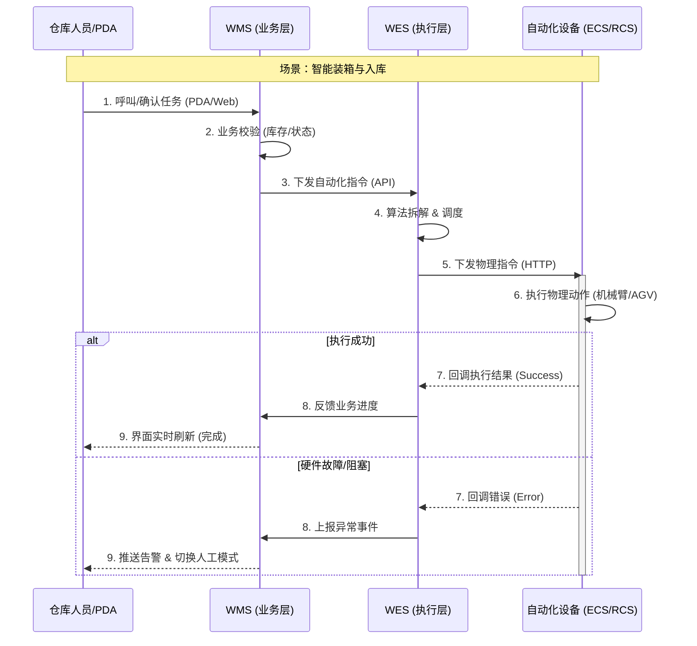
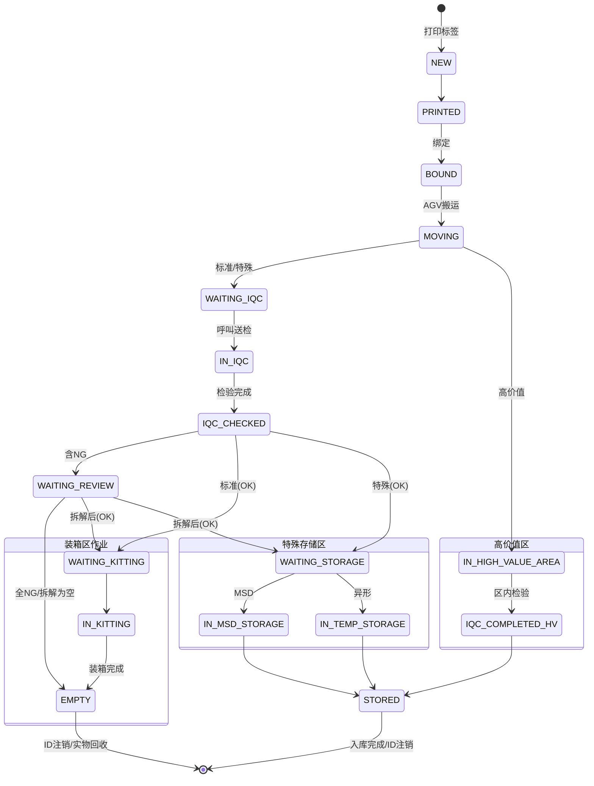

# fxn-wms 系统概要设计文档 (System High-Level Design)

> **版本**: v1.1 (评审增强版)
> **日期**: 2026-01-05
> **范围**: 涵盖 WMS (仓储管理) 与 WES (仓储执行) 全流程
> **面向对象**: 客户方业务代表、硬件供应商、系统架构师
> **状态**: 待评审

---

## 1. 系统架构概述 (System Architecture)

本系统采用 **WMS (业务决策层)** + **WES (执行控制层)** 的双层架构，通过明确的职责边界实现业务逻辑与硬件控制的解耦。

### 1.1 技术栈 (Technology Stack)

| 层级 | 系统 | 核心技术 | 数据库/存储 | 职责定位 |
| :--- | :--- | :--- | :--- | :--- |
| **业务层** | **WMS** | .NET 8 / Framework 4.8<br>ASP.NET Core / WebForms<br>Blazor Server (PDA/Web) | **SQL Server 2019**<br>(业务主数据、库存账务) | 业务流转、库存管理、单据处理、人工兜底、RCS调度(非自动化段) |
| **执行层** | **WES** | Python 3.12<br>FastAPI (Async)<br>Celery / APScheduler | **PostgreSQL 17** (执行数据)<br>**Redis 7** (缓存/队列)<br>**TimescaleDB** (时序日志) | 设备调度、算法策略、硬件协调、实时监控、异常自愈 |
| **硬件层** | **ECS/RCS** | C++/PLC<br>HTTP/Modbus/TCP | - | 物理动作执行 (机械臂、流水线、AGV、CTU) |

### 1.2 系统集成拓扑



---

## 2. 业务流程与用户交互 (Client View)

本章节面向**客户方**，重点阐述系统如何支持日常作业及异常情况下的处理机制。

### 2.1 核心业务泳道图



### 2.2 关键业务场景说明

#### 2.2.0 系统核心状态机 (System State Machines)

为确保业务流转的严谨性，系统定义了两大核心状态机：**栈板生命周期** (物理载具) 和 **WES 任务状态** (执行指令)。

**1. 栈板号生命周期 (Pallet ID Lifecycle)**
*管理唯一追溯码 (LPN) 从生成到注销的全过程。注：实物栈板在此流程结束后进入空托盘堆场循环使用。*



**2. WES 任务执行状态 (Task Execution Status)**
*管理自动化指令从下发到完成的闭环。*

| 状态 | 含义 | 触发事件 | 动作 |
| :--- | :--- | :--- | :--- |
| **PENDING** | 待执行 | WMS 下发任务 | 进入优先级队列 |
| **DISPATCHED** | 已派发 | 调度器分配给设备 | 调用 ECS 接口 |
| **RUNNING** | 执行中 | ECS 确认接收 (Ack) | 启动超时计时器 |
| **COMPLETED** | 已完成 | ECS 回调 Success | 扣减库存/释放资源 |
| **FAILED** | 失败 | ECS 回调 Fail / 超时 | 触发重试或人工报警 |
| **CANCELLED** | 已取消 | 人工/系统取消 | 释放预占资源 |

**3. 物料库存状态 (Material Inventory Status)**
*管理 SKU 维度的库存可用性与业务属性。*

| 状态 | 含义 | 触发事件 | 下一状态 |
| :--- | :--- | :--- | :--- |
| **UNAVAILABLE** | 不可用 | 码头收货绑定 | QC_HOLD |
| **QC_HOLD** | 质检冻结 | 送检取样 | AVAILABLE / BLOCKED |
| **AVAILABLE** | 可用 | 检验合格/上架 | RESERVED / BLOCKED |
| **RESERVED** | 已预占 | 工单波次分配 | ISSUED / AVAILABLE (取消) |
| **ISSUED** | 已发料 | 拣选出库完成 | (终态) |
| **BLOCKED** | 冻结 | 检验NG/盘点锁定 | AVAILABLE (解冻) / SCRAP |
| **SCRAP** | 报废 | 确认报废 | (终态) |

**4. 容器资源状态 (Container/Resource Status)**
*管理货架与料箱的容量与可用性，是 WES 调度算法的核心依据。*

| 对象 | 状态 | 含义 | 触发条件 |
| :--- | :--- | :--- | :--- |
| **Rack (货架)** | **EMPTY** | 空置 | 初始化/清空 |
| | **PARTIAL** | 部分占用 | 放入第一个料箱/料盘 |
| | **FULL** | 满载 | 所有储位/深度已满 (WES 算法判定) |
| | **LOCKED** | 锁定 | AGV 搬运中/任务预占 |
| | **DISABLED** | 停用 | 人工标记/多次读码失败 |
| **Bin (料箱)** | **EMPTY** | 空箱 | 初始化/清空 |
| | **OCCUPIED** | 占用 | 存入 PKG |
| | **FULL** | 满载 | 深度耗尽 (WES 深度计算) |
| | **EXCEPTION** | 异常 | 视觉识别失败/物理位置偏差 |

**5. 自动化设备状态 (Device Status)**
*管理 ECS/RCS/CTU 的健康度与可用性，是 WES 派单的熔断依据。*

| 状态 | 含义 | 触发条件 | 动作 |
| :--- | :--- | :--- | :--- |
| **IDLE** | 空闲 | 任务完成/初始化 | 允许派发新任务 |
| **BUSY** | 忙碌 | 接收并开始执行任务 | 拒绝/排队新任务 |
| **ERROR** | 故障 | 硬件报警/急停按下 | 停止派单，触发人工告警 |
| **OFFLINE** | 离线 | 心跳丢失 (>30s) | 任务挂起，尝试重连 |

**6. 业务单据状态 (Order Status)**
*管理 GRN (入库) 和 WO (出库) 的生命周期，对接 SAP 业务流。*

| 状态 | 含义 | 触发事件 |
| :--- | :--- | :--- |
| **CREATED** | 已创建 | 接收 SAP 接口数据 |
| **RELEASED** | 已释放 | WMS 生成波次/任务 |
| **PROCESSING** | 执行中 | 首个任务开始执行 |
| **COMPLETED** | 已完成 | 所有任务执行结束 |
| **SYNCED** | 已同步 | 账务回传 SAP 成功 (终态) |

**7. RCS 搬运任务状态 (RCS Transport Task Status)**
*由 WMS 直接调度 RCS 时的任务追踪（如码头搬运、特殊物料搬运）。*

| 状态 | 含义 | 触发事件 |
| :--- | :--- | :--- |
| **CREATED** | 已创建 | WMS 生成搬运需求 |
| **ASSIGNED** | 已分配 | RCS 确认并分配 AGV |
| **EXECUTING** | 执行中 | AGV 取货完成并开始移动 |
| **FINISHED** | 已完成 | AGV 卸货成功 (终态) |
| **FAILED** | 失败 | 搬运超时/路径死锁/设备掉线 |

**8. 工作站/线体作业状态 (Workstation Status)**
*管理装箱线、拣选站的逻辑状态与运行模式。*

| 状态 | 含义 | 触发条件 |
| :--- | :--- | :--- |
| **OFFLINE** | 离线 | 初始状态/系统关闭 |
| **AUTO** | 自动化模式 | 系统正常，设备自主作业 |
| **MANUAL** | 人工模式 | 自动化故障，切换为 PDA 指导作业 |
| **MAINTENANCE** | 维护模式 | 设备点检或停机维修 |

#### 2.2.1 正常作业流程 (Normal Operation Scenarios)

本节按照物料在仓库内的 **物理流转路径** 进行场景拆分，确保每个环节与现场作业区域一一对应。

**场景 1：码头收货与数字化准入 (Dock Intake)**
*位置：卸货月台 -> 收货工作站*

1.  **到货登记**:
    *   **人 (PDA)**: 扫描车牌号/快递单号，录入到货总箱数，WMS 生成到货记录 ID。
2.  **清单导入与 GRN 获取**:
    *   **人 (Web)**: 导入物控到货清单 (含 PO、项次、料号、数量等)。
    *   **系统 (WMS)**: 校验清单与登记箱数，向 SAP 请求并获取 **GRN 单号**。
3.  **标签生成与打印**:
    *   **人 (Web)**: 根据实物整理情况，输入所需栈板数量。
    *   **系统 (WMS)**: 生成唯一 **Pallet ID** (栈板号) 并驱动打印机输出 ZPL 标签。
4.  **数字化绑定**:
    *   **人 (PDA)**: 扫描【地码】确定位置，扫描【栈板号】开启绑定。
    *   **人 (PDA)**: 循环扫描【箱码】并【选择对应 GRN】，WMS 建立精确的 **栈板绑定关系**。
5.  **初始路由**:
    *   **系统 (WMS)**: 根据物料属性 (电子料/高价值/MSD) 自动判定流向。
    *   **系统**: 呼叫 RCS，调度 AGV 将已锁定的栈板搬运至 **IQC 暂存区**。

**场景 2：暂存与质量合规 (QC & Staging)**
*位置：IQC 暂存区*

1.  **送检呼叫**:
    *   **人 (PDA)**: IQC 人员在暂存区发起抽检任务。
    *   **设备 (AGV)**: 将栈板运送至检验工位。
2.  **取样与判定**:
    *   **人**: 拆箱取样，录入检验结果 (OK/NG)。
    *   **系统 (WMS)**: 释放合格物料库存，标记为 `Available`。
3.  **逻辑分流**:
    *   **标准电子料**: 状态转为 `WAITING_KITTING`，等待自动线呼叫。
    *   **特殊物料**: 状态转为 `WAITING_STORAGE`，等待送往专用区。

**场景 3：标准料自动化装箱与拼箱 (Auto Processing)**
*位置：装箱流水线 -> 混合入库区*

1.  **送料上线**:
    *   **系统 (WMS)**: 调度 AGV 将合格栈板从暂存区运至 **装箱上线口**。
    *   **系统 (WES)**: 监控空架数量，自动请求补给 **单层空货架**。
2.  **智能拆箱 (Smart Kitting)**:
    *   **人**: 拆除外箱，将料盘放入流水线串杆。
    *   **设备 (ECS)**: 视觉自动扫描 (6合1码)，机械臂抓取料盘放入 **单层货架**。
    *   **系统 (WMS)**: 接收绑定通知，建立 "PKG-货架储位" 精确库存。
3.  **混合入库 (Hybrid Strategy)**:
    *   **系统 (WES)**: 单层货架满载后，调度至 **混合入库作业区**。
    *   **决策执行**:
        *   **满箱交换**: CTU 直接交换 单层架满箱 <-> 五层架空箱。
        *   **流水线拼箱**: CTU 投料 -> 流水线 -> 机械臂将料盘抓入五层架。
4.  **立库上架**:
    *   **设备 (AGV)**: 将作业完成的 **五层货架** 搬运至 **SMT 自动化立库**。

**场景 4：特殊物料分类存储 (Special Handling)**
*位置：高价值笼区 / MSD 专区 / 异形平库*

1.  **高价值物料**:
    *   **流向**: 码头 -> **高价值笼区**。
    *   **作业**: 双人复核入库，全程视频监控，PDA 确认上架。
2.  **MSD (湿敏) 物料**:
    *   **密封状态 (原厂真空)**: AGV 运至 **特殊货架区** (恒温恒湿环境)，直接上架。
    *   **拆封状态 (IQC后/退料)**: 人工/AGV 运至 **干燥柜专区**，PDA 扫码入柜，WMS 启动暴露时间 (Floor Life) 监控。
3.  **异形/结构件**:
    *   **流向**: 码头 -> **平库区**。
    *   **作业**: 人工使用叉车/地牛搬运上架。

**场景 5：产线发料与退料闭环 (Production & Reverse)**
*位置：立库 -> 拣选站 -> 产线 -> 退料站*

1.  **生产发料**:
    *   **波次**: WMS 按 "退料优先 + FIFO" 生成波次，批量调度货架至 **拣选工作站**。
    *   **拣选**: WES 指挥 ECS (CTU+机械臂) 执行全自动拣选，放入出库周转箱。
    *   **配送**: AGV 将周转箱运送至 **SMT 产线接驳台**。
2.  **退料回收**:
    *   **登记**: 产线扫描料盘退料 (整盘/尾料)。
    *   **检测**: 尾数盘经过 **X-Ray 点数** (更新数量) 和 **LCR 测值** (防错料)。
    *   **重塑**: WMS 生成新 PKG ID，打印新标签覆盖。
    *   **回流**: 良品回流至 **退料货架** (A区)，作为下次发料的优先库存。
#### 2.2.2 异常兜底流程 (Manual Fallback)
**客户核心关切**: 当自动化设备（WES/ECS/RCS）瘫痪时，生产不能停。

1.  **降级触发**:
    *   自动触发: WES 连续 3 次连接设备失败或收到致命错误。
    *   手动触发: 管理员在 WMS 监控台点击 "切换人工模式"。
2.  **降级表现**:
    *   **WMS**: 停止向 WES 发送指令。生成 "人工拣选/搬运任务" 推送至 PDA。
    *   **PDA**: 指引人员到指定储位进行人工操作（扫码确认）。
    *   **账务**: 基于 PDA 的人工确认更新库存，确保账实一致。
3.  **恢复流程**:
    *   设备修复后，管理员点击 "恢复自动模式"。
    *   WMS 重新开始向 WES 下发新任务。

---

## 3. 硬件集成规格 (Vendor View)

本章节面向**硬件供应商**，定义系统边界、通信协议及协作标准。

### 3.1 职责边界 (Responsibility Boundary)

*   **WES (大脑)**: 负责 "做什么" (What) 和 "去哪里" (Where - 逻辑位置)。
    *   *例*: "请从 Station_A 抓取 PKG_123 放到 Bin_01"。
*   **ECS (手脚)**: 负责 "怎么做" (How) 和 "物理坐标" (Physical Coordinates)。
    *   *例*: "控制伺服电机移动到 (X:100, Y:200, Z:50)，开启吸盘"。

### 3.2 接口交互协议 (Protocol Specification)

所有交互遵循 **HTTP/1.1 RESTful** 标准，采用 **异步回调机制**。

#### 3.2.1 标准握手流程
1.  **Command (WES -> ECS)**: 下发指令。
    *   要求: ECS 必须在 **500ms** 内返回 HTTP 200 (Ack)，表示"已收到"。
    *   *超时*: 若 3秒 无响应，WES 视为网络故障。
2.  **Execution (ECS)**: 设备执行物理动作。
3.  **Callback (ECS -> WES)**: 动作完成后，ECS 调用 WES 回调接口。
    *   要求: 包含 `command_id` (原样返回) 和 `result` (Success/Fail)。

#### 3.2.2 关键接口定义

**1. 下发指令 (WES -> ECS)**
```http
POST /api/v1/device/command
{
    "command_id": "CMD-UUID-v4",  // 全局唯一ID，用于幂等去重
    "task_type": "PICK",          // PICK | PUT | SCAN
    "params": {
        "source": "STATION_A",    // 逻辑位置
        "target": "BIN_01",
        "barcode": "PKG_CODE_123" // 用于校验
    },
    "timeout": 30000              // 预期最大执行时间(ms)
}
```

**2. 结果回调 (ECS -> WES)**
```http
POST /api/v1/callback/result
{
    "command_id": "CMD-UUID-v4",
    "device_id": "ROBOT_ARM_01",
    "result": "SUCCESS",          // SUCCESS | FAILED
    "error_code": "ERR_001",      // 仅失败时提供
    "data": {                     // 业务数据
        "actual_qty": 10
    }
}
```

### 3.3 设备状态机 (Device State Machine)

供应商设备需维护并上报以下标准状态：

*   **IDLE (空闲)**: 设备就绪，可接收新指令。
*   **RUNNING (运行中)**: 正在执行指令，拒绝新指令（除非支持队列）。
*   **ERROR (故障)**: 发生物理故障（如卡料、急停），需人工介入。WES 将停止派单。
*   **OFFLINE (离线)**: 心跳丢失。

### 3.4 容错与可靠性要求

1.  **幂等性 (Idempotency)**:
    *   WES 可能因网络超时重发相同的 `command_id`。
    *   **要求**: ECS 收到重复 ID 时，若任务已在执行或已完成，直接返回对应状态，**严禁**重复执行物理动作（如重复抓取）。
2.  **心跳保活 (Heartbeat)**:
    *   WES 每 30秒 调用 ECS `/health` 接口。
    *   ECS 需返回当前状态及简要诊断信息。
3.  **断点续传**:
    *   若 ECS 执行完动作但回调 WES 失败（网络断开），ECS 需本地缓存结果，待网络恢复后持续重试回调，直至收到 WES 的 HTTP 200 确认。

---

## 4. 详细功能模块说明

### 4.1 模块归属矩阵

| 模块编号 | 模块名称 | 归属 | 核心职责 |
| :--- | :--- | :--- | :--- |
| **3.2.1** | 码头接收与绑定 | **WMS** | 到货登记、标签打印、PDA绑定 |
| **3.2.2** | IQC 路由与复判 | **WMS** | 质检策略、取样指引、路由决策 |
| **3.5** | 特殊物料处理 | **WMS** | 高价值/MSD/异形物料的人工/半自动流转 |
| **3.3.0** | WES 核心平台 | **WES** | 设备连接池、任务队列、状态监控 |
| **3.3.1** | SMT 智能装箱 | **WES** | 视觉识别算法、分箱策略、机械臂协同 |
| **3.3.2** | 混合入库策略 | **WES** | CTU 调度、满箱/零散入库决策 |
| **3.3.3** | 生产发料协调 | **WES** | 出库任务编排、流水线拣选控制 |
| **3.4** | 全局调度策略 | **WES** | 冷热区分析、负载均衡算法 |

---

## 5. 数据字典摘要 (Data Dictionary Summary)

### 5.1 WMS 核心数据 (SQL Server)
*   `material`: 物料主数据 (含特殊属性标识)
*   `pallet`: 栈板/容器主数据 (LPN)
*   `inventory`: 库存账务 (按 SKU + 位置)
*   `transport_task`: 搬运任务单 (RCS 交互凭证)

### 5.2 WES 核心数据 (PostgreSQL)
*   `devices`: 设备注册表 (IP, Port, Status)
*   `tasks`: 执行任务表 (CommandID, State, RetryCount)
*   `bin_inventory_cache`: 料箱物理状态镜像 (用于算法计算)
*   `command_log`: 指令交互流水 (用于审计与排错)

---

## 6. 接口清单 (Interface List)

### 6.1 WMS -> WES (业务指令)
*   `POST /api/wes/tasks`: 下发装箱/发料任务
*   `POST /api/wes/inbound/hybrid/trigger`: 触发混合入库决策

### 6.2 WES -> WMS (状态回传)
*   `POST /api/wms/inventory/update`: 作业完成扣减库存
*   `POST /api/wms/tasks/status`: 任务状态更新 (Started/Completed/Failed)

### 6.3 WES <-> ECS (设备控制)
*   `POST /api/v1/device/command`: 下发物理指令
*   `POST /api/v1/callback/result`: 接收执行结果
*   `POST /api/v1/callback/event`: 接收传感器事件 (如到位触发)

### 6.4 WMS -> RCS (搬运调度)
*   `POST /transport/create`: 创建 AGV 搬运任务
*   `POST /transport/callback`: 接收搬运完成通知