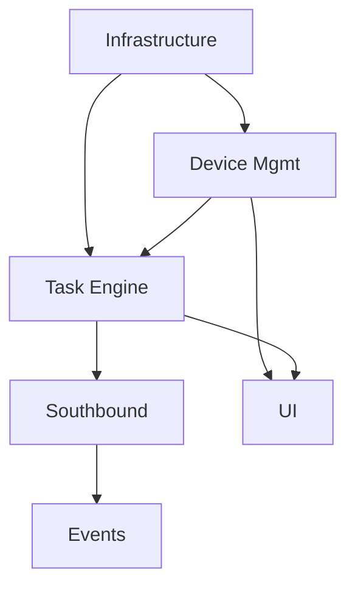

# 3.3.0 WES 核心基础平台 (WES Core Foundation Platform) - 任务分解文档 (Task Breakdown)

**版本**: v1.0 | **日期**: 2025-12-24
**来源**: `docs/design/3.3.0-wes-core-foundation-platform.md`

## 1. 概述 (Overview)
**团队分工**: 
- **WES Backend**: Python (FastAPI) 核心逻辑, 数据库, 调度算法
- **WES Frontend**: Vue 3 + TypeScript 管理界面 (ElementPlus, Pinia, Alova)
- **QA**: 接口测试 (Vitest), 压力测试

**估算标准**: 
- Fibonacci 数列 (1, 2, 3, 5, 8, 13, 21)
- **1 点**: ~2 小时 (理想开发时间)
- **Buffer 系数**: 3.0 (包含沟通、测试、Code Review、部署)

**容量计算**:
- **团队规模**: 2 人
- **迭代周期**: 2 周 (10 工作日)
- **总容量**: 2 * 10 * 8 = 160 小时
- **有效率**: 65% (扣除会议、杂项) -> **104 有效小时**
- **开发速率 (Velocity)**: 104 / (2 * 3.0) ≈ **17 故事点 / Sprint**

**总体规模**: 
- **6 个 Epic**
- **共计 ~92 故事点**
- **预计耗时**: ~5.5 个 Sprint (约 11 周)

## 2. Epic 汇总 (Epic Summary)

| ID | 名称 | 负责团队 | 故事点 | 优先级 | 说明 |
|----|------|----------|--------|--------|------|
| **E1** | **基础设施与核心架构** | WES Backend/Frontend | 13 | P0 | 项目骨架, DB, Redis, 前端脚手架 |
| **E2** | **设备管理与健康监控** | WES Backend/Frontend | 18 | P0 | 设备主数据, 状态轮询, 告警 |
| **E3** | **任务调度引擎** | WES Backend | 24 | P0 | 状态机, 优先级队列, 调度器, 并发控制 |
| **E4** | **南向接口与可靠性** | WES Backend | 16 | P0 | ECS 客户端, 重试机制, 幂等性, 回调处理 |
| **E5** | **北向接口与事件处理** | WES Backend | 10 | P1 | WMS 交互, 事件分发, 业务触发 |
| **E6** | **管理监控界面** | WES Frontend | 11 | P1 | 任务监控, 日志查询, 系统配置 |

## 3. 详细分解 (Detailed Breakdown)

### Epic 1: 基础设施与核心架构 (Infrastructure & Core Architecture)
**描述**: 搭建 WES 项目的基础骨架，配置数据库和中间件连接，建立统一的错误处理和日志机制。

#### US-E1-01: 项目初始化与前后端环境搭建
- **用户故事**: 作为开发人员，我需要配置好的 FastAPI 后端和 Vue 3 前端项目环境，以便开始开发。
- **验收标准**:
  - [ ] **后端**: 提交 `docker-compose.yml`，包含 FastAPI, PostgreSQL, Redis。
  - [ ] **前端**: 初始化 Vue 3 + Vite + TS 项目，集成 ElementPlus, Pinia, Alova。
  - [ ] **规范**: 配置 Eslint + Prettier + Husky 代码规范检查。
  - [ ] **测试**: 配置 Vitest 单元测试环境。
  - [ ] `make run` 可启动前后端服务，基础页面可访问。
- **技术要点**: FastAPI, Vue 3, Vite, TypeScript, Eslint, Prettier.
- **详细设计参考**: `docs/design/3.3.0-wes-core-foundation-platform.md` §开发技术架构
- **故事点**: 3 (前后端脚手架搭建)

#### US-E1-02: 数据库模型与迁移框架
- **用户故事**: 作为开发人员，我需要建立 Task, Device, Event 的数据库模型，并配置好迁移工具。
- **验收标准**:
  - [ ] 集成 SQLAlchemy 2.0 (Async) 和 Alembic。
  - [ ] 实现 `Task`, `Device`, `DeviceEvent` 的 ORM 模型 (参考设计文档数据要点)。
  - [ ] 能够成功运行 `alembic upgrade head` 创建表结构。
  - [ ] 字段类型、主键、索引与设计文档一致。
- **技术要点**: SQLAlchemy AsyncSession, Alembic.
- **详细设计参考**: `docs/design/3.3.0-wes-core-foundation-platform.md` §数据要点
- **故事点**: 5 (涉及核心数据模型设计，需严谨)

#### US-E1-03: Redis 基础设施封装
- **用户故事**: 作为开发人员，我需要封装 Redis 客户端，以便统一管理缓存和队列。
- **验收标准**:
  - [ ] 封装 `RedisClient`，支持连接池管理。
  - [ ] 实现基础 Cache `get/set` 方法。
  - [ ] 实现 Sorted Set 操作封装（用于优先级队列）。
  - [ ] 编写单元测试验证 Redis 连接和操作。
- **技术要点**: aioredis (或 redis-py async).
- **详细设计参考**: `docs/design/3.3.0-wes-core-foundation-platform.md` §数据要点 - Redis 缓存结构
- **故事点**: 2 (标准封装)

#### US-E1-04: 统一日志与异常处理
- **用户故事**: 作为运维人员，我需要系统输出结构化的 JSON 日志，并有统一的异常响应格式。
- **验收标准**:
  - [ ] 集成 `structlog`，输出 JSON 格式日志。
  - [ ] 定义全局异常处理器，捕获 HTTP异常和系统异常。
  - [ ] 统一 API 响应格式 `{"code": 200, "message": "...", "data": ...}`。
  - [ ] Request ID 中间件，确保日志链路追踪。
- **技术要点**: structlog, FastAPI ExceptionHandler.
- **详细设计参考**: `docs/design/3.3.0-wes-core-foundation-platform.md` §技术选型说明
- **故事点**: 3 (影响全局，需细致)

---

### Epic 2: 设备管理与健康监控 (Device Management & Health Monitoring)
**描述**: 实现设备的注册、配置管理以及周期性的健康检查机制。

#### US-E2-01: 设备主数据管理 API
- **用户故事**: 作为管理员，我想要通过 API 增删改查设备信息，以便维护现场设备清单。
- **验收标准**:
  - [ ] 提供 `POST /devices` 注册设备。
  - [ ] 提供 `GET /devices` 查询设备列表（支持按 Zone/Type 筛选）。
  - [ ] 校验 `device_id` 唯一性。
  - [ ] 数据持久化到 PostgreSQL `devices` 表。
- **技术要点**: Pydantic Schema, CRUD Service.
- **详细设计参考**: `docs/design/3.3.0-wes-core-foundation-platform.md` §子功能流程 - 设备注册与配置
- **故事点**: 3 (标准 CRUD)

#### US-E2-02: 设备健康监控服务 (后台任务)
- **用户故事**: 作为系统，我需要定期轮询设备状态，以便及时发现设备离线或故障。
- **验收标准**:
  - [ ] 实现 `HealthMonitor` 后台服务 (APScheduler 或类似)。
  - [ ] 每 30s (可配) 调用设备的 `Health_Check` 接口。
  - [ ] 根据响应更新 DB 和 Redis 中的设备状态。
  - [ ] 连续 3 次失败标记为 `OFFLINE`。
  - [ ] 状态变更时记录日志。
- **技术要点**: Background Task, HTTP Client, Redis TTL.
- **详细设计参考**: `docs/design/3.3.0-wes-core-foundation-platform.md` §子功能流程 - 设备健康监控
- **故事点**: 8 (核心高可用逻辑，涉及并发轮询)

#### US-E2-03: 设备状态缓存机制
- **用户故事**: 作为系统，我需要从 Redis 快速获取设备状态，以便调度器快速决策。
- **验收标准**:
  - [ ] 健康检查成功后，更新 Redis `device:status:{id}`。
  - [ ] 设置合理的 TTL (如 2 * interval)。
  - [ ] 提供 `check_device_availability(device_id)` 方法供调度器调用。
- **技术要点**: Redis Strategy.
- **详细设计参考**: `docs/design/3.3.0-wes-core-foundation-platform.md` §数据要点 - Redis 缓存结构
- **故事点**: 2 (依赖 E1-03)

#### US-E2-04: 设备管理前端页面
- **用户故事**: 作为管理员，我想要在界面上查看设备列表和实时状态，以便运维监控。
- **验收标准**:
  - [ ] 基于 ElementPlus 搭建设备列表表格。
  - [ ] 状态列用颜色区分 (绿-IDLE, 蓝-RUNNING, 红-ERROR, 灰-OFFLINE)。
  - [ ] 使用 Alova 调用后端接口获取实时状态。
  - [ ] 支持“手动刷新”按钮触发健康检查。
  - [ ] 简单的添加/编辑设备弹窗。
- **技术要点**: Vue 3, TypeScript, ElementPlus, Alova.
- **详细设计参考**: `docs/design/3.3.0-wes-core-foundation-platform.md` §功能页面设计 - 设备管理页面
- **故事点**: 5 (UI 开发 + 联调)

---

### Epic 3: 任务调度引擎 (Task Scheduling Engine)
**描述**: 实现核心的任务队列、状态机管理、并发控制和调度分发逻辑。

#### US-E3-01: 任务状态机与领域模型
- **用户故事**: 作为开发人员，我需要一个健壮的任务状态机，确保任务状态流转合法且可追溯。
- **验收标准**:
  - [ ] 实现 `Task` 领域模型，包含 status, priority, type 等字段。
  - [ ] 实现 `TaskStateMachine`，限制非法流转 (如 PENDING -> COMPLETED 不允许)。
  - [ ] 状态变更时自动记录 `updated_at` 和历史日志。
  - [ ] 单元测试覆盖所有状态转换路径。
- **技术要点**: State Pattern, Enum.
- **详细设计参考**: `docs/design/3.3.0-wes-core-foundation-platform.md` §核心模块设计 - 任务状态机
- **故事点**: 5 (核心逻辑)

#### US-E3-02: 北向任务创建 API
- **用户故事**: 作为 WMS 开发人员，我需要通过标准 API 向 WES 提交任务。
- **验收标准**:
  - [ ] 提供 `POST /api/v1/tasks` 接口。
  - [ ] 参数校验 (DeviceID 必须存在，Priority 1-10)。
  - [ ] 生成全局唯一 `task_id` 和 `command_id`。
  - [ ] 任务创建后自动存入 Redis 优先级队列。
- **技术要点**: FastAPI Pydantic, Redis ZADD.
- **详细设计参考**: `docs/design/3.3.0-wes-core-foundation-platform.md` §API 接口设计
- **故事点**: 3

#### US-E3-03: 基于 Redis 的优先级队列
- **用户故事**: 作为系统，我需要按优先级和提交时间调度任务，确保高优先级任务先执行。
- **验收标准**:
  - [ ] 使用 Redis Sorted Set 实现队列。
  - [ ] Score 算法: `priority * 10^9 + (MaxTimestamp - CreateTimestamp)` (或类似保证 FIFO 的逻辑)。
  - [ ] 提供 `enqueue`, `dequeue`, `remove` 方法。
  - [ ] 单元测试验证优先级排序正确性。
- **技术要点**: Redis Sorted Set.
- **详细设计参考**: `docs/design/3.3.0-wes-core-foundation-platform.md` §核心模块 - 任务调度器
- **故事点**: 5

#### US-E3-04: 任务调度器 Worker
- **用户故事**: 作为系统，我需要后台 Worker 不断从队列取出任务并分发给设备。
- **验收标准**:
  - [ ] 实现循环调度 Loop。
  - [ ] 检查目标设备状态 (必须 IDLE) 和并发数限制。
  - [ ] 成功调度后，调用 `TaskExecutor` 下发指令。
  - [ ] 若设备忙，任务保留在队列或稍后重试（不阻塞其他设备任务）。
- **技术要点**: Async Worker, Concurrency Logic.
- **详细设计参考**: `docs/design/3.3.0-wes-core-foundation-platform.md` §核心模块 - 任务调度器
- **故事点**: 8 (核心复杂逻辑)

#### US-E3-05: 并发控制机制
- **用户故事**: 作为运维人员，我需要限制单设备的并发任务数，防止设备过载。
- **验收标准**:
  - [ ] 在 Redis 中维护设备当前运行任务计数 `device:concurrency:{id}`。
  - [ ] 调度前检查 `current < max_limit`。
  - [ ] 任务完成/失败后释放计数。
  - [ ] 支持配置默认并发限制 (默认为 1)。
- **技术要点**: Redis Atomic Incr/Decr.
- **详细设计参考**: `docs/design/3.3.0-wes-core-foundation-platform.md` §特殊机制 - 并发控制
- **故事点**: 3

---

### Epic 4: 南向接口与可靠性 (Southbound Reliability)
**描述**: 封装与 ECS 设备的通讯，实现重试、幂等性和回调处理。

#### US-E4-01: ECS 客户端与协议适配
- **用户故事**: 作为系统，我需要通过标准 HTTP 协议向 ECS 下发指令。
- **验收标准**:
  - [ ] 封装 `ECSClient`，使用 `httpx`。
  - [ ] 实现 `send_command`, `cancel_command`, `health_check`。
  - [ ] 统一处理网络异常和 HTTP 错误码。
  - [ ] 记录详细的 Request/Response 日志。
- **技术要点**: httpx, logging.
- **详细设计参考**: `docs/design/3.3.0-wes-core-foundation-platform.md` §核心模块 - ECS 客户端
- **故事点**: 5

#### US-E4-02: 重试管理器 (指数退避)
- **用户故事**: 作为系统，当指令下发失败时，我需要自动重试以提高成功率。
- **验收标准**:
  - [ ] 实现 `RetryManager`。
  - [ ] 策略: 间隔 1s, 2s, 4s，最多 3 次。
  - [ ] 重试时必须使用相同的 `command_id`。
  - [ ] 超过次数后标记任务 FAILED 并告警。
- **技术要点**: Backoff Algorithm.
- **详细设计参考**: `docs/design/3.3.0-wes-core-foundation-platform.md` §核心模块 - 重试管理器
- **故事点**: 5

#### US-E4-03: 回调接收 API
- **用户故事**: 作为系统，我需要接收 ECS 的异步结果回调，以更新任务状态。
- **验收标准**:
  - [ ] 提供 `POST /api/v1/callback/result` 接口。
  - [ ] 校验 Bearer Token。
  - [ ] 根据 `command_id` 找到对应任务并更新结果。
  - [ ] 处理重复回调 (幂等性)。
- **技术要点**: API, Authentication.
- **详细设计参考**: `docs/design/3.3.0-wes-core-foundation-platform.md` §API 接口设计
- **故事点**: 3

#### US-E4-04: 幂等性保障机制
- **用户故事**: 作为系统，我需要确保同一指令不被重复执行。
- **验收标准**:
  - [ ] 确保生成唯一的 `command_id`。
  - [ ] 在 Redis 中缓存已处理的 callback (TTL 1小时)。
  - [ ] 收到重复 callback 时直接返回成功但不处理业务。
- **技术要点**: Redis Cache.
- **详细设计参考**: `docs/design/3.3.0-wes-core-foundation-platform.md` §特殊机制 - 幂等性
- **故事点**: 3

---

### Epic 5: 北向接口与事件处理 (Northbound & Events)
**描述**: 处理设备主动上报的事件，以及与 WMS 的业务交互。

#### US-E5-01: 设备事件分发器
- **用户故事**: 作为系统，我需要接收设备事件并触发相应的业务逻辑。
- **验收标准**:
  - [ ] 提供 `POST /api/v1/callback/event` 接口。
  - [ ] 实现 `EventHandler`，根据 `event_type` 分发。
  - [ ] 实现 `ESTOP` 处理：暂停设备，告警。
  - [ ] 实现 `OFFLINE` 处理：更新状态，告警。
- **技术要点**: Strategy Pattern.
- **详细设计参考**: `docs/design/3.3.0-wes-core-foundation-platform.md` §子功能流程 - 设备事件处理
- **故事点**: 5

#### US-E5-02: 任务取消流程
- **用户故事**: 作为 WMS，我需要能够取消已下发但未完成的任务。
- **验收标准**:
  - [ ] 提供 `POST /tasks/{id}/cancel` 接口。
  - [ ] 若 PENDING：直接移出队列。
  - [ ] 若 RUNNING：调用 ECS `Cancel_Command`。
  - [ ] 更新状态为 CANCELLED。
- **详细设计参考**: `docs/design/3.3.0-wes-core-foundation-platform.md` §子功能流程 - 任务取消
- **故事点**: 3

---

### Epic 6: 管理监控界面 (Management UI)
**描述**: 提供可视化的运维管理能力。

#### US-E6-01: 任务监控看板
- **用户故事**: 作为运维，我需要看到实时的任务统计和列表。
- **验收标准**:
  - [ ] 使用 Pinia 进行任务状态的实时存储管理。
  - [ ] 统计卡片：待执行/执行中/今日完成/今日失败。
  - [ ] 任务列表：支持按状态、设备筛选。
  - [ ] 进度条显示（基于超时时间）。
  - [ ] 支持手动“取消”和“重试”操作。
- **技术要点**: Vue 3, Pinia, ElementPlus, Alova.
- **详细设计参考**: `docs/design/3.3.0-wes-core-foundation-platform.md` §功能页面设计
- **故事点**: 5

#### US-E6-02: 事件日志与审计
- **用户故事**: 作为运维，我需要查询设备的历史事件日志。
- **验收标准**:
  - [ ] 事件日志表格（分页显示）。
  - [ ] 支持 JSON 数据展开查看。
  - [ ] 支持导出日志 (CSV/JSON)。
- **技术要点**: Vue 3, ElementPlus, Alova.
- **详细设计参考**: `docs/design/3.3.0-wes-core-foundation-platform.md` §功能页面设计
- **故事点**: 3

#### US-E6-03: 系统配置页面
- **用户故事**: 作为管理员，我需要动态修改系统参数（如超时时间、重试次数）。
- **验收标准**:
  - [ ] 配置表单页面，使用 ElementPlus Form 组件。
  - [ ] 保存后通过 Alova 提交后端并触发配置刷新。
  - [ ] 简单的操作审计记录。
- **技术要点**: Vue 3, ElementPlus, Alova.
- **详细设计参考**: `docs/design/3.3.0-wes-core-foundation-platform.md` §功能页面设计
- **故事点**: 3

## 4. 按团队分组视图 (Team-Based View)

### WES Backend 团队工作范围 (71 故事点)

| Epic | 用户故事 | 故事点 | 优先级 | 依赖 |
|------|---------|--------|--------|------|
| **E1: 基础设施与核心架构** | | **13** | P0 | 无 |
| | US-E1-01: 项目初始化与前后端环境搭建 | 3 | P0 | - |
| | US-E1-02: 数据库模型与迁移框架 | 5 | P0 | E1-01 |
| | US-E1-03: Redis 基础设施封装 | 2 | P0 | E1-01 |
| | US-E1-04: 统一日志与异常处理 | 3 | P0 | E1-01 |
| **E2: 设备管理与健康监控** | | **13** | P0 | E1 |
| | US-E2-01: 设备主数据管理 API | 3 | P0 | E1-02 |
| | US-E2-02: 设备健康监控服务 (后台任务) | 8 | P0 | E2-01 |
| | US-E2-03: 设备状态缓存机制 | 2 | P0 | E1-03, E2-02 |
| **E3: 任务调度引擎** | | **24** | P0 | E1, E2 |
| | US-E3-01: 任务状态机与领域模型 | 5 | P0 | E1-02 |
| | US-E3-02: 北向任务创建 API | 3 | P0 | E3-01 |
| | US-E3-03: 基于 Redis 的优先级队列 | 5 | P0 | E1-03, E3-01 |
| | US-E3-04: 任务调度器 Worker | 8 | P0 | E3-03, E2-03 |
| | US-E3-05: 并发控制机制 | 3 | P0 | E3-04 |
| **E4: 南向接口与可靠性** | | **16** | P0 | E3 |
| | US-E4-01: ECS 客户端与协议适配 | 5 | P0 | E3-04 |
| | US-E4-02: 重试管理器 (指数退避) | 5 | P0 | E4-01 |
| | US-E4-03: 回调接收 API | 3 | P0 | E4-01 |
| | US-E4-04: 幂等性保障机制 | 3 | P0 | E4-03 |
| **E5: 北向接口与事件处理** | | **5** | P1 | E4 |
| | US-E5-01: 设备事件分发器 | 5 | P1 | E4-03 |
| | US-E5-02: 任务取消流程 | 3 | P1 | E3-04 |

### WES Frontend 团队工作范围 (21 故事点)

| Epic | 用户故事 | 故事点 | 优先级 | 依赖 |
|------|---------|--------|--------|------|
| **E1: 基础设施与核心架构** | | **3** | P0 | 无 |
| | US-E1-01: 项目初始化与前后端环境搭建 (前端部分) | 3 | P0 | - |
| **E2: 设备管理与健康监控** | | **5** | P0 | Backend E2 |
| | US-E2-04: 设备管理前端页面 | 5 | P0 | Backend E2-01 |
| **E6: 管理监控界面** | | **11** | P1 | Backend E3, E5 |
| | US-E6-01: 任务监控看板 | 5 | P1 | Backend E3-02 |
| | US-E6-02: 事件日志与审计 | 3 | P1 | Backend E5-01 |
| | US-E6-03: 系统配置页面 | 3 | P1 | Backend E1-04 |

### 外部团队协助范围

**ECS 团队**:
- 设备接口文档提供 (Week 1)
- Mock ECS Server 搭建 (Week 3-4)
- 联调支持 (Week 4-5)

**QA 团队**:
- 接口测试用例编写 (Week 2-6)
- 压力测试执行 (Week 5)
- 稳定性测试 (Week 6)

## 5. 迭代计划 (Sprint Plan)

基于 **17 故事点/Sprint** 的速率，制定以下 6 个 Sprint 的计划。

### Sprint 1: 基础设施与设备接入基础
**目标**: 搭建项目骨架，完成数据库设计，实现设备主数据的增删改查。
- **任务列表**:
  - US-E1-01: 项目初始化与 Docker 环境 (3)
  - US-E1-02: 数据库模型与迁移 (5)
  - US-E1-03: Redis 封装 (2)
  - US-E1-04: 统一日志与异常 (3)
  - US-E2-01: 设备主数据 CRUD API (3)
- **总分**: 16 点
- **交付物**: 可运行的 Docker 容器，设备管理 API 可用。

### Sprint 2: 设备监控与任务入口
**目标**: 实现设备健康心跳监控，提供可视化管理界面，并开放任务创建接口。
- **任务列表**:
  - US-E2-02: 设备健康监控服务 (8)
  - US-E2-03: 设备状态缓存 (2)
  - US-E2-04: 设备管理前端页面 (5)
  - US-E3-02: 北向任务创建 API (3)
- **总分**: 18 点
- **交付物**: 设备状态实时监控面板，后台自动轮询，任务 API 可接收请求。

### Sprint 3: 任务调度核心引擎
**目标**: 实现任务状态机、优先级队列和核心调度器，完成“大脑”部分的逻辑。
- **任务列表**:
  - US-E3-01: 任务状态机与模型 (5)
  - US-E3-03: Redis 优先级队列 (5)
  - US-E3-04: 任务调度器 Worker (8)
- **总分**: 18 点
- **交付物**: 任务提交后可进入队列，并被调度器取出（日志可见）。

### Sprint 4: 南向连接与可靠性
**目标**: 打通与 ECS 的连接，实现指令下发、重试机制和结果回调。
- **任务列表**:
  - US-E3-05: 并发控制机制 (3)
  - US-E4-01: ECS 客户端 (5)
  - US-E4-02: 重试管理器 (5)
  - US-E4-03: 回调接收 API (3)
- **总分**: 16 点
- **交付物**: 完整的指令下发-执行-回调闭环，支持模拟 ECS 的交互。

### Sprint 5: 事件驱动与监控看板
**目标**: 处理设备主动上报事件，完善幂等性，并提供任务可视化监控。
- **任务列表**:
  - US-E4-04: 幂等性保障 (3)
  - US-E5-01: 设备事件分发器 (5)
  - US-E6-01: 任务监控看板 (5)
  - US-E5-02: 北向事件/取消流程 (4) (合并原 E5-02, E5-03)
- **总分**: 17 点
- **交付物**: 任务监控大屏，事件处理逻辑生效，取消流程可用。

### Sprint 6: 收尾与系统配置
**目标**: 完成剩余 UI 功能，进行集成测试和文档完善。
- **任务列表**:
  - US-E6-02: 事件日志 UI (3)
  - US-E6-03: 系统配置页面 (3)
  - **Buffer**: 集成测试与 Bug 修复 (5)
- **总分**: 11 点
- **交付物**: 完整可发布的 WES Core Platform v1.0。

## 5. 附录 (Appendices)

### 依赖关系图 (Dependency Graph)

### 风险与缓解 (Risks & Mitigation)
1. **ECS 接口联调延迟**:
   - *风险*: 硬件设备未就绪，无法联调。
   - *缓解*: Sprint 4 开发 Mock ECS Server，模拟标准接口响应。
2. **高并发性能瓶颈**:
   - *风险*: 大量任务导致 Redis 队列延迟。
   - *缓解*: 在 Sprint 3 进行基准测试，必要时优化 Redis 结构或增加 Sharding。
3. **状态不一致**:
   - *风险*: 网络异常导致 WES 与 ECS 状态不同步。
   - *缓解*: 严格的健康检查 (Sprint 2) 和重试/幂等机制 (Sprint 4)。

### 验收标准总览 (Checklist)
- [ ] 所有 API 遵循 RESTful 规范并有 Swagger 文档。
- [ ] 核心业务逻辑 (调度、状态机) 单元测试覆盖率 > 85%。
- [ ] 通过 1000 QPS 压力测试 (Mock 环境)。
- [ ] 能够长时间稳定运行 (7x24h 稳定性测试)。
