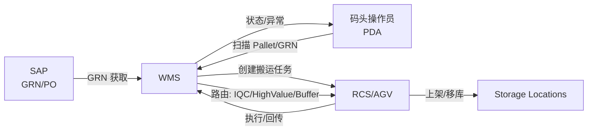
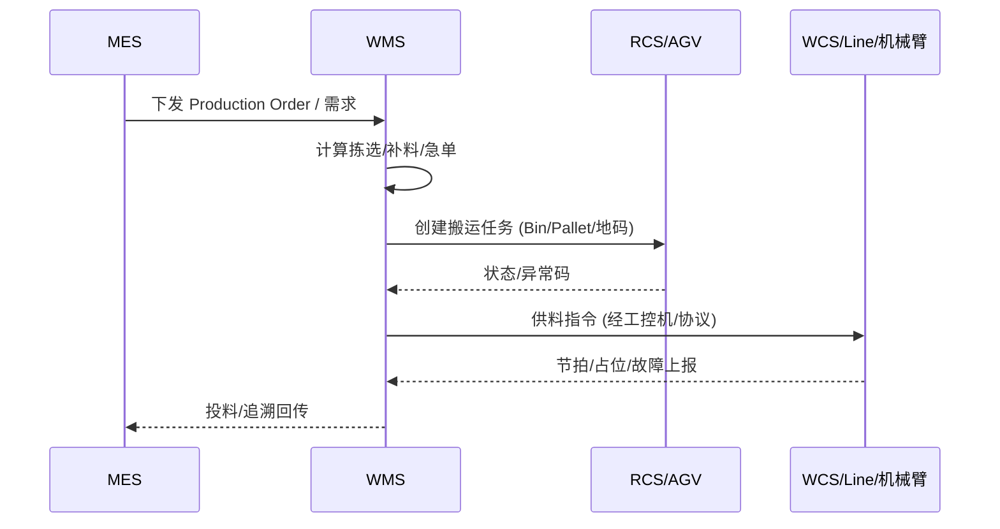

# US1 Flows & Responsibility Map

> Traceability: docs/SRS.md §3.2 收货入库；§3.3.1~3.3.3 SMT 收货/存储/发料；§3.4 特殊物料；§3.5 机构件物流。  
> Origin: docs/origin/休斯顿P9自动化仓库功能分解清单_202511021.xlsx Sheet: 功能分解清单（入库/存储/SMT/机构段，行号待补充）。

## Inbound → IQC → Storage (E2E)

## SMT Issue/Return (Auto-Line)

## Responsibility Map (Modules)

| 模块 | 职责 | 上游 | 下游 | 关键接口 |
| ---- | ---- | ---- | ---- | -------- |
| Inbound | GRN/收货、IQC 路由、上架任务 | SAP, Operator | RCS, Storage | SAP 接口，RCS Task |
| Storage | 库容/锁定、移库 | Inbound | RCS | RCS Task |
| SMT Supply | 发料/补料/退料/急单 | MES | RCS, WCS/Line | MES 接口，RCS/WCS |
| Orchestration | 调度中台编排、异常处理 | All | All | Modbus/MQTT/SSE/WebSocket/HTTP |

## Notes
- WMS 不做 PLC/IO；设备交互通过工控机及协议。
- TraceID/CorrelationID 贯穿 SAP/MES/RCS/WCS/设备报文。
- 责任分界：WMS 负责指令/状态汇聚与任务编排；设备侧负责执行与点表/状态上报；供应商需提供点表与模拟器。*** End Patch
