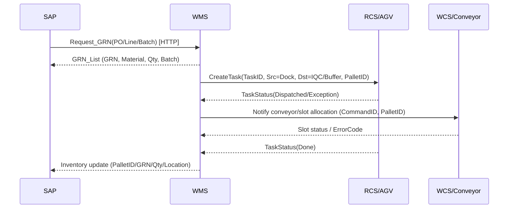
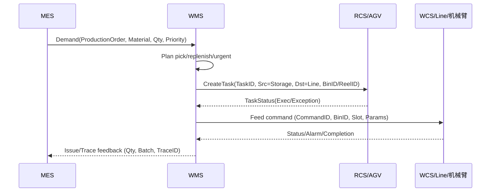
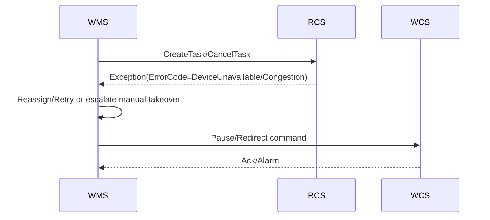

# US2 Sequence Diagrams — 接口契约与时序

> Traceability: Spec FR-003 / US2；docs/SRS.md §3.2/§3.3 流程接口描述，§3.7.5 接口可靠性保障；Origin: docs/origin/休斯顿P9自动化仓库功能分解清单_202511021.xlsx Sheet: 接口/系统分解（行号待补充）。

## 收货→上架 (SAP/MES/RCS/WCS)

## SMT 发料 (MES/RCS/WCS/设备)

## 异常/兜底 (接口超时/设备不可用)

## Payload & Keys (摘要)

| System | Keys | Payload Highlights | Error/Retry |
| ------ | ---- | ------------------ | ----------- |
| SAP | PO, LineItem, GRN, Batch | Material, Qty, Vendor, Timestamps | 4xx manual fix; 5xx retry+alert |
| MES | ProductionOrder, LineItem | Material, Qty, Priority, BatchConstraints | 4xx manual; 5xx retry+alert |
| RCS | TaskID, MapVersion | Source/Target, DeviceType, Priority, Status, ErrorCode | Retry/redirect, manual takeover |
| WCS/设备 | CommandID, DeviceID | Action, PalletID/BinID, Sensors, AlarmCode | Recoverable flag, manual fallback |
